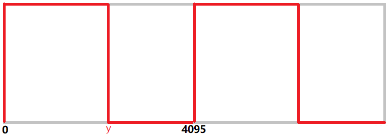
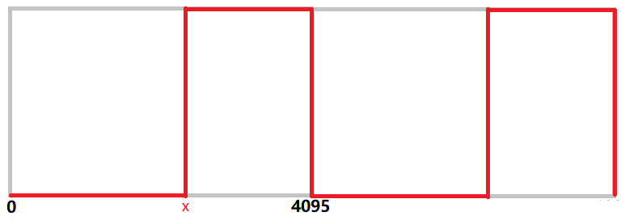
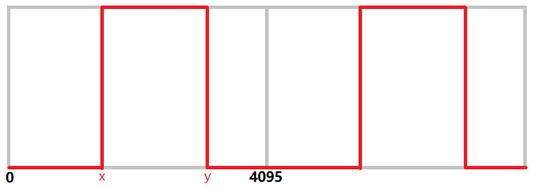

# PCA9685芯片的PWM调速

## 简述PCA9685芯片

PCA9685是一款基于I²C总线通信的12位精度16通道PWM波输出的芯片，该芯片最初由NXP推出时主要面向LED开关调光，同样可用于控制舵机、电机等任何可以适用PWM控制的电气设备。

利用I²C总线通信的功能特性，使其常用于拓展主控芯片的控制能力，因为其仅需两根线同主机芯片建立I²C通信，即可替代主控芯片的GPIO引脚来输出PWM波，节省主控芯片资源，这项特点在需要控制的设备数量超过主控芯片的可用GPIO引脚数量时将尤为突出。

> 想要深入了解即需要参考[PCA9685芯片数据手册](https://www.nxp.com.cn/docs/en/data-sheet/PCA9685.pdf)

## 简述I²C

I²C（Inter-Integrated Circuit）字面上的意思是集成电路之间，它其实是I²C Bus简称，所以中文应该叫集成电路总线，它是一种串行通信总线，使用多主从架构，由飞利浦公司在1980年代为了让主板、嵌入式系统或手机用以连接低速周边设备而发展。

I²C只使用两条双向漏极开路（Open Drain）线，其中一条线为传输数据的串行数据线（SDA），另一条线是启动或停止传输以及发送时钟序列的串行时钟线（SCL），这两条线上都有上拉电阻。I²C允许相当大的工作电压范围，但典型的电压准位为+3.3V或+5v。

I²C的参考设计使用一个7比特长度的地址空间(2^7＝128)，但保留了16个地址，所以在一组总线最多可和112个节点通信。虽然最大的节点数目是被地址空间所限制住，但实际上也会被总线上的总电容所限制住，一般而言为400 pF，这限制了实际通信时的线路长度只有几米。

> 可以继续参考[百度百科：I²C](https://baike.baidu.com/item/I2C%E6%80%BB%E7%BA%BF/918424?fr=aladdin)与[维基百科：I²C](https://zh.wikipedia.org/wiki/I%C2%B2C)中的内容或是其他相关的文献资料，也可直接参考 [I2C总线规范和用户手册](https://www.nxp.com.cn/docs/en/user-guide/UM10204.pdf) 来更深入的了解其原理。

## 在Q-Car上与PCA9685连接应用

micro:bit I²C总线的串行时钟线（SCL）由P19引脚引出，串行资料线（SDA）由P20引脚引出。当我们将 micro:bit 与 Q-Car 连接，PCA9685芯片也就与 micro:bit 的I²C总线建立了连接。

在MakeCode编辑器中，可以搜素并添加PCA9685扩展积木：

### 例程

[在Github上的例程项目文件](https://github.com/Wind-stormger/Makecode/blob/master/microbit-Q-Car_Motor_control_module.hex)

> 项目文件下载到本地后可导入MakeCode中查看和再编辑，也可直接通过USB烧录到Micro:Bit中运行。

### 设计说明

在例程中主要应用了PCA9685扩展积木中的三个积木。

init [1][2] 积木用于初始化PCA9685芯片，设置I²C从机的地址与工作频率。

chip adddress[ ] 积木 中填入的是16进制的I²C从机的地址，不用这个积木的话直接填在
init [1][2] 积木的[1]空格中的是10进制的。

set pin pulse range[1][2][3][4]积木中[1]选项栏选择PCA9685芯片的引脚编号，[2]空格中填入的是PWM波起始位值，[3]空格中填入的是PWM波终止位值，因为精度为12位，所以[2][3]可填入数值范围为0-4095，[4]空格填入10进制的I²C从机的地址，插入chip adddress[ ] 积木即可填入16进制的。

若设定在[2][3]空格中依次填入x、y值，则大致会有以下四种PWM波形

1. x=0, 0 < y < 4095 时，占空比为y/4095 
2. 0 < x < 4095,y=4095 时，占空比为(4095-x)/4095 
3. x < y,0 < x < 4095,0 < y < 4095时，占空比为(y-x)/4095 
3. y < x,0 < x < 4095,0 < y < 4095时，占空比为(4095-x+y)/4095 

在Q-Car上对电机调速需要的就是对控制电机的PWM波的占空比进行调整，而例程中采取的即是第1种波形来控制占空比。

连接右电机正极的是PCA9685的P0，负极是P1，左电机正极是P3，负极是P2。

所以在例程中，按一下A按钮，左右电机将同时正转2s，同时反转2s，右电机单独正转2s，左电机单独正转2s，最后两电机都停转。

