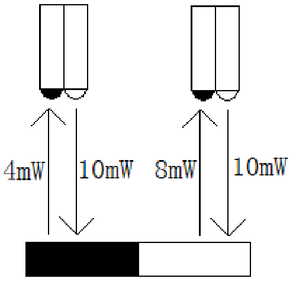

# 巡线行驶（综合应用）

## 红外对管与白纸上的黑色线路

在Q-Car前轮左右侧各有一个 ITR20001/T24 红外对管。

关于红外对管的特性，在前文“设计光电计数器”章节中已经提到过，红外对管一侧发射红外光，一侧接收红外光，接收端将反射回的光线强弱的信息转化为电压高低的信号。

除了利用编码盘的凸块与凹槽相对红外对管距离的不同来改变电压，也可以利用不同颜色或材质的物体表面对红外光反射率的不同来改变电压。

例如，一张纯白色的纸，其红外光反射率相对较高，用纯黑色油墨印刷上一条黑线，这条黑线的红外光反射率则相对白纸而言较低了。

利用这样的关系，我们可以通过不断收集两个红外对管的电压高低信息来判断Q-Car相对线路偏左还是偏右，进而不断修正方向达到巡线行驶的目的。

> 关于红外光反射率绝非肉眼在可见光谱中看见的颜色深浅能简单决定的，更深入的相关学科知识可以继续参考[维基百科：吸收光谱学](https://zh.wikipedia.org/wiki/%E5%90%B8%E6%94%B6%E5%85%89%E8%B0%B1%E5%AD%A6)中的内容或是其他相关的文献资料。

## 例程1 简单的控制Q-Car巡线

