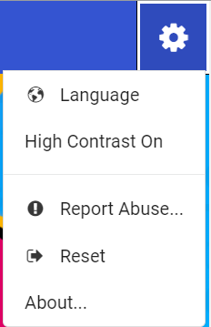
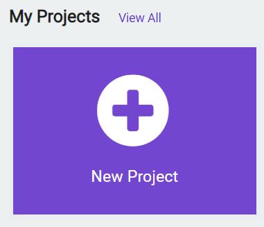
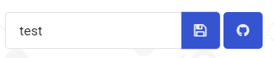

# 创建MakeCode项目

1.打开网页链接：

[micro:bit-MakeCode 网页链接](https://makecode.microbit.org/#)

2.可以选择点击网页右上角的齿轮图标，再点击Language即可切换简体中文。但此处还是建议尽量直接使用**英文**，MakeCode 中绝大部分积木名称都与由英文字符组成的程序代码中的各种基础语法单词相对应,这将有利于未来过渡到使用代码编程。

3.点击 New Projects 新建项目，随后给项目取个名字即可创建项目。

4.除了将项目保存为一个文件，还可以作为一个Github项目保存。

> 这需要准备一个[Github](https://github.com/)账户