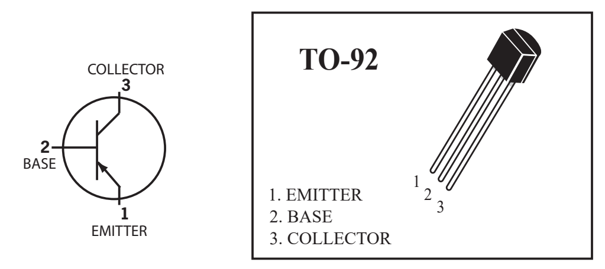
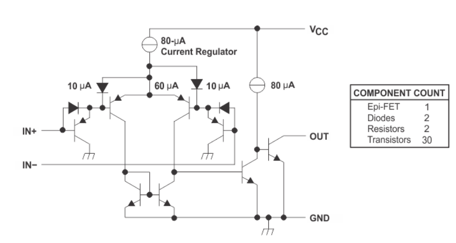

# Hardware analysis and calibration

## Drive circuit

This is a basic circuit:

Battery, diode, inductor and manual switch are connected in series,two loads are connected in parallel. 

One load is a motor and the other load is a light-emitting diode. 

In order to protect the light-emitting diode, a resistor for voltage division is connected in series.

In this circuit, the only one that can control the two loads is a manual switch.

A **bipolar junction transistor (BJT)** is a type of transistor that uses both electrons and electron holes as charge carriers. In contrast, a unipolar transistor, such as a field-effect transistor, uses only one kind of charge carrier. A bipolar transistor allows a small current injected at one of its terminals to control a much larger current flowing between two other terminals, making the device capable of amplification or switching.

A BJT consists of three differently doped semiconductor regions: the emitter region, the base region and the collector region. These regions are, respectively, p type, n type and p type in a PNP transistor, and n type, p type and n type in an NPN transistor. Each semiconductor region is connected to a terminal, appropriately labeled: emitter (E), base (B) and collector (C).

PNP transistor：

* pin 1 Emitter
* pin 2 Base
* pin 3 Collector

> For more detailed information, you can continue to refer to[Wikipedia：Bipolar junction transistor](https://en.wikipedia.org/wiki/Bipolar_junction_transistor)

Add a PNP transistor to the circuit:

As shown in figure design circuit may control the PNP transistor of the Base, Base terminal level signal is given, the PNP transistor can be used as a switch.
The conduction condition of Emitter and Collector is Base low level, and turn off when Base is high level. 
In this way, the two loads can be controlled by the level signal received by the Base, and this level signal is provided by the output of the voltage comparator.Another button can also be used to switch to micro:bit or web:bit development boards to provide level signals. 

> For more detailed information about "high & low level" and "level signal", please refer to [Wikipedia：Logic level](https://en.wikipedia.org/wiki/Logic_level)

## Line tracking circuit

At the bottom of the Triode-Car, there are two line tracking circuits, each of which contains a photoresistor and an LED. When the light of the LED shines on the black and white materials, the resistance value of the photoresistor will change significantly due to the difference in reflectivity. 

On Triode-Car, the photoresistor used is GL5506. The resistance of this model will decrease with the increase of light. The light resistance (10 Lux illumination) is 2-5KΩ, and the dark resistance is 0.2MΩ.

Light resistance: The resistance value measured under 10 Lux illumination with a standard light source (color temperature of 2854K) after being irradiated with 400-600 Lux illumination for 2 hours.

Dark resistance: the resistance value measured at 10 seconds after turning off the 10 Lux illumination. 

Design a circuit like this: 

In addition to the capacitance and resistance used for protection, an adjustable resistor is connected in series on the line where the two photoresistors are located. According to the principle of series voltage division, the two node voltages are calibrated by adjusting the resistance of the adjustable resistor. For the subsequent application of the voltage comparator. 

## Voltage comparator 

This is the schematic diagram of the LM393 voltage comparator: 

Two voltage comparators are integrated inside. When the positive input (IN+) of the voltage comparator is greater than the negative input (IN-) voltage, the output is high. Otherwise, the output is low.

The internal schematic diagram of its voltage comparator is like this: 

This shows,the realization of such a relatively complex function is also designed and packaged based on basic components such as semiconductor diode and BJT. 

> If you are interested, you can refer to [Wikipedia：Comparator](https://en.wikipedia.org/wiki/Comparator)

Add LM393 voltage comparator to the circuit, and complement the drive circuit and line tracking circuit：

U1A is the first voltage comparator in LM393, and U1B is its second. 

Connect the LL node of the line tracking circuit to the positive input pin 3 of U1A, connect the LR node to the negative input pin 2 of U1A, connect the LL node to the negative input pin 6 of U1B, and connect the LR node to the positive input pin 5 of U1B.

This design can make U1A output high level and U1B output low level when LL node voltage > LR node voltage, and U1A output low level and U1B output high level when LL node voltage < LR node voltage. 

Since the LM393 voltage comparator uses an open collector output, it is necessary to add pull-up resistors R8 and R7 to the output terminals U1A  pin 1 and U1B pin 7. 

U1A pin 1 is connected to Q2 pin 2 Base, and the M2 it controls is the right-wheel motor. 

U1A pin 7 is connected to Q1 pin 2 Base, and the M1 it controls is the left-wheel motor. 

At this point, we have basically constructed an automatic control system.

Under ideal working conditions, it can collect light and dark information on the left and right sides of the line through the photoresistor within a certain range.

The voltage comparator continuously controls the start and stop of the two wheels during the information change to correct the driving direction and achieve the purpose of automatic line tracking.

## State relation table 

| Car lean Direction | Left LDR(R5) | Right LDR(R6) | LL Potential | LR Potential | P3 Input | P2 Input | P1 Output | P5 Input | P6 Input | P7 Output | M1 Left Motor | M2 Right Motor | Car Move Direction |
|:---:|:---:|:---:|:---:|:---:|:---:|:---:|:---:|:---:|:---:|:---:|:---:|:---:|:---:|
| Left | Bright | Dark | 0 | 1 | 1 | 0 | 1 | 0 | 1 | 0 | 1 | 0 | Right |
| Right | Dark | Bright | 1 | 0 | 0 | 1 | 0 | 1 | 0 | 1 | 0 | 1 | Left |

> Conditions are black lines and white roads 

When the car deviates from the line to the left, the photoresistor on the right will come to the top of the black line, the resistance of the photoresistor will become higher, and the photoresistor on the left will be on the white ground. At this time, the voltage at point LL will be lower than the voltage at point LR . The forward voltage of the comparator U1A is higher than the reverse voltage, and pin 1 outputs a high level.

In the same way, the positive input voltage of U1B is lower than the negative input voltage, and the output is low.

In this way, the left motor is controlled to rotate forward, the car turns right, R6 and D2 leave the black line, until the sensor on the left detects the black line.

When the trolley deviates from the line to the right, the principle is the same.

The trolley repeats the above actions continuously in the process of advancing, so as to achieve the purpose of advancing along the black line. 

## Line tracking circuit calibration 

In order to make the line tracking circuit have higher sensitivity to light and dark changes under the control of the LM393 chip alone, and to reduce the potential difference under the same illumination brightness, it is necessary to manually adjust the adjustable resistance for calibration. 

The calibration steps are as follows: 

1. use a small object to lift up the back wheels slightly to prevent contact,point a stable light source towards the photoresistors.
2. Adjust either side of potentiometers until both motors are operating simultaneously.
3. After adjustments, put the car on the track to test the results.
4. If the car is still likely to run out of the track, place the car on a white paper, repeat steps 2~3 for fine-tuning, and try to make the Line tracking circuit more sensitive to light and dark changes. 

