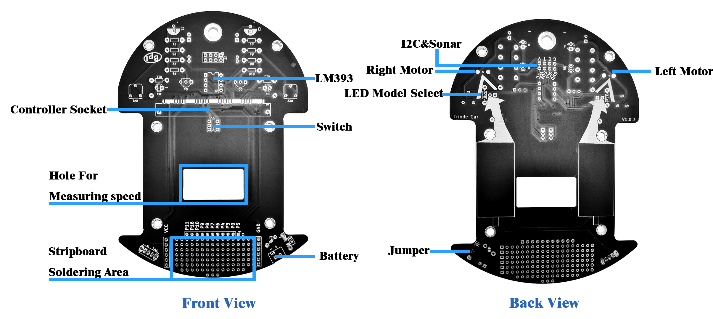
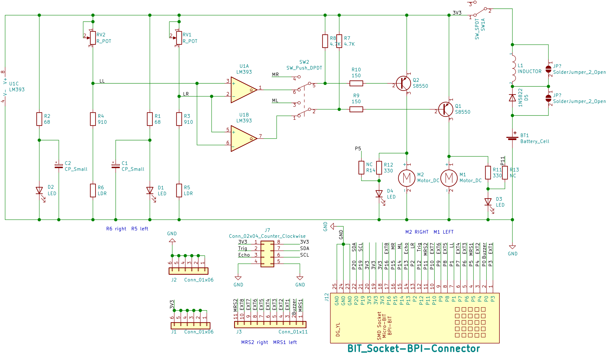

# Hardware

## Hardware information

* Power: 3.6V~3.7V Batteries
* Photoresistor(analog) * 2
* SR04, SR04P ultrasonic sensor interface(5V) * 1
* I2C interface(3.3V) * 1
* IO extension port * 2(P5 P0 P3 P4 P6 P7 P8 P9 P10 P16 P11)
* TT Motor * 2 (P14 P15)
* Motors max speed: 90 rpm
* Motors driving mode: PWM
* M3 Lego extension hole * 6

## Interface diagram

On the Triode-Car, there are many special designs:

1. In the front of Triode-Car, there are two screw holes, which can be used to fix sensors such as obstacle avoidance sensors or line-following sensors.
2. Next to the adjustable resistor, there are two pairs of special resistors, R11 and R13, R12 and R14. If you choose to weld R11 and R12, the LED will automatically display the state of the motor, whether it is forward or stopped. If you choose to weld R13 and R14, The LED will become a programmable LED light, P11 controls the left LED (D3), and P5 controls the right light (D4).
3. Triode-Car has specially designed pads for manual soldering (Controller Socket marked position). Through this design, it is more convenient to manually solder the Bit Socket, and if you want to quickly confirm the position of the Pin during use, you don’t need to confirm repeatedly. Schematic diagram and pin number.
4. Behind the Bit Socket, there is a switch that can switch between two control methods: IC switch and Bit switch.
5. Behind the switch, there is a 30*15mm square hole, which is used to leave room for the speed sensor. After adding the speed sensor, the position of the battery box may be occupied. At this time, we recommend that you use copper pillars, plastic plates, etc. to elevate the battery box. [Recommended speed sensor](https://www.adafruit.com/product/3986)
6. Just below the Triode-Car, there are some holes that can be welded at will. The leftmost one of the holes is connected to the positive pole of the power supply, the rightmost one is connected to the negative pole, Some IOs are placed in the upper row for use. You can add some sensors or buzzers in this area to make your car more versatile. Of course, there may be insufficient power supply after adding, it is recommended to use a lithium battery with a stronger current.

## GPIO PIN define

| Function | web:bit GPIO |
| :----: | :----: |
| Wheel(Left) | P14 |
| Wheel(Right) | P15 |
| ultrasonic (Trig) | P12 |
| ultrasonic (Echo) | P13 |
| Line Detecting(Left) | P2 |
| Line Detecting(Right) | P1 |
| Speed Detection(Left) | P11 |
| Speed Detection(Right) | P5 |

## Product standard list

1. Triode-Car PCB * 1
2. Various resistors
3. Edge connector * 1
4. LM393 comparator * 1
5. TT motor * 2
6. Front wheel * 1
7. LED * 4
8. Potentiometer * 2
9. Capacitor * 2
10. Triode * 2
11. Switch * 2
12. User Manual * 1
13. Various screws

## Resources

### Schematic 

[Schematic Download](https://github.com/BPI-STEAM/Triode-Car/blob/main/HardWare/Sch/BPi-BIT-Triode-Car-V1.0.3.pdf)

### Referenced document
* Triode Car #1 - A Beginning to Something Big 

<iframe width="560" height="315" src="https://www.youtube.com/embed/qcR-Haovyr4" title="YouTube video player" frameborder="0" allow="accelerometer; autoplay; clipboard-write; encrypted-media; gyroscope; picture-in-picture" allowfullscreen></iframe>

* Triode Car #2 - Installing Colorful Resistors! 

<iframe width="560" height="315" src="https://www.youtube.com/embed/z6adIa8id5Y" title="YouTube video player" frameborder="0" allow="accelerometer; autoplay; clipboard-write; encrypted-media; gyroscope; picture-in-picture" allowfullscreen></iframe>

* [Hackaday project](https://hackaday.io/project/178248-triode-car-line-follower)

### Code on github

[MakeCode extension for Micor:Bit](https://github.com/BPI-STEAM/pxt-triodecar)