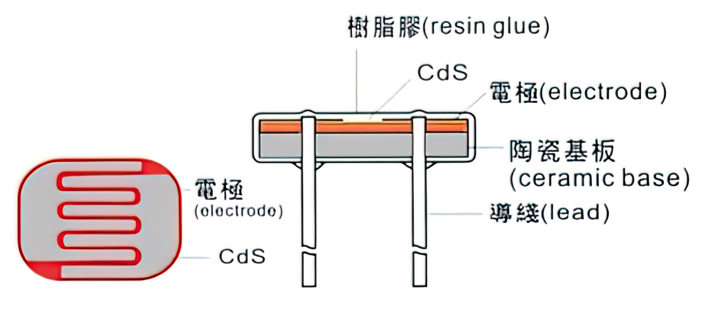
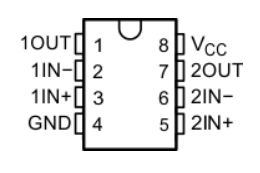

# 硬件的浅析与调试

## 驱动电路

1. 这是一个最基础的电路：

电池，二极管，电感，手动开关四者串联，两个负载并联接入，一个负载是电机，一个负载是发光二极管，作为对发光二极管的保护又给其串联了一个用于分压的电阻。

在这样的电路中唯一能控制两个负载的只有一个手动开关。

2. 这是PNP型三极管：

* 1脚 Emitter发射极
* 2脚 Base基极
* 3脚 Collector集电极
> 一般在原理图中三极管的E、B、C指的就是此三脚。

**双极性结型晶体管**（bipolar junction transistor, BJT），俗称**三极管**，是一种具有三个终端的电子器件。双极性晶体管是电子学历史上具有革命意义的一项发明，其发明者威廉·肖克利、约翰·巴丁和沃尔特·布喇顿被授予1956年的诺贝尔物理学奖。

双极性晶体管的一种类型即为PNP型，由两层P型掺杂区域和介于二者之间的一层N型掺杂半导体组成。流经 Base基极 的微小电流可以在 Emitter发射极 端得到放大。也就是说，当PNP型晶体管的 Base基极 电压低于 Emitter发射极 时，Collector集电极 电压低于 Base基极 ，晶体管处于正向放大区。

在双极性晶体管电学符号中， Base基极 和 Emitter发射极 之间的箭头指向电流的方向，这里的电流为电子流动的反方向。PNP型晶体管的箭头从 Emitter发射极 指向 Base基极 ，而NPN型与之相反。

> 想了解其更详尽的信息，可以继续参考[维基百科：双极性晶体管](https://zh.wikipedia.org/wiki/%E5%8F%8C%E6%9E%81%E6%80%A7%E6%99%B6%E4%BD%93%E7%AE%A1)，或者检索其他相关的文献资料，需要具备相应的 数理化 前置知识才能更好的理解。

3. 将一个PNP型三极管加入电路：

设计这样的电路可以控制PNP型三极管的2脚 Base基极 电压，给予2脚 Base基极 电平信号，这个PNP型三极管即可作为一个开关使用， 1脚 Emitter发射极 与 3脚 Collector集电极 **导通**条件为2脚 Base基极 低电平，而当2脚 Base基极 为高电平时则**关断**，两个负载即可被2脚 Base基极 所接收到的电平信号所控制，而此电平信号则由 电压比较器 的输出端提供，通过另一个开关还可切换至由 Micro:Bit 或 Web:Bit 开发板来提供。

> 有关“高低电平”、“电平信号”更详尽的信息可以参考[百度百科：逻辑电平](https://baike.baidu.com/item/%E9%80%BB%E8%BE%91%E7%94%B5%E5%B9%B3)，或者检索其他相关的文献资料。

## 巡线检测电路

1. 在Triode-Car的底部，有两个巡线检测电路，每一路包含了一个光敏电阻和一个LED。当LED的光照到黑色和白色的材料上面时，由于反射率的不同，光敏电阻的阻值会发生明显的变化。

在Triode-Car上，光敏电阻使用的是GL5506，这个型号的电阻会随着光照的加强而减小，亮电阻（10Lux）是2-5KΩ，暗电阻是0.2MΩ。（亮电阻：用400-600Lux光照射2小时后，在标准光源（色温2854K）10Lux光下的测试值。暗电阻：关闭10Lux光照后第10秒的阻值。）

2. 设计这样的电路：

除了用于保护作用的电容和电阻，在两个光敏电阻所在的线路上又各串联了一个可调电阻，根据串联分压的原理，通过调节可调电阻的阻值，可用于校准 LL 与 LR 两个节点的电压值，以便后续 电压比较器 的应用。

## 电压比较器

1. 这是LM393电压比较器的原理图:

可见其内部集成了两个电压比较器.
