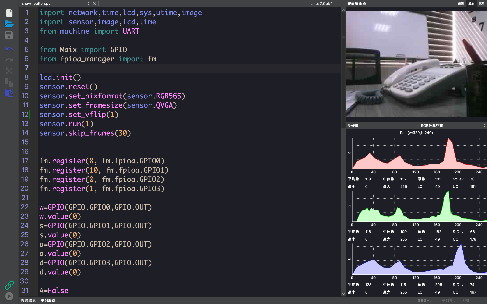
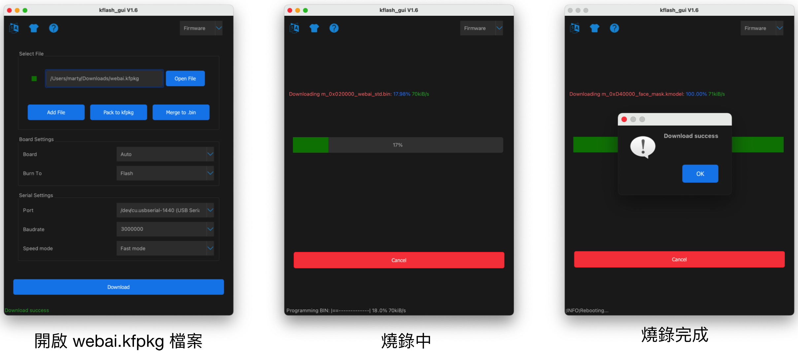
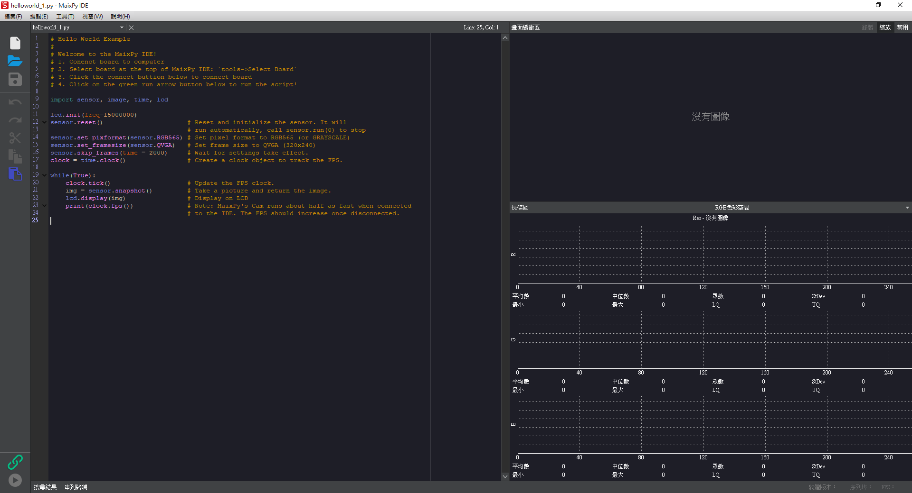
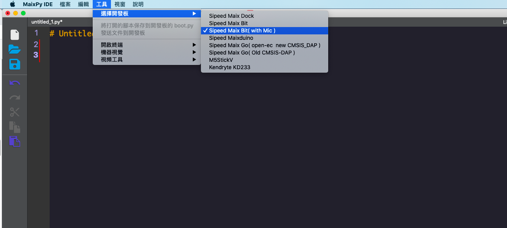

#### 回到 [`教學大綱`](https://md.kingkit.codes/s/siSKyknlU)

# 四、使用 IDE 開發 Web:AI

Web:AI 開發板除了可以用程式積木平台操作外，甚至也支援直接在 IDE 上撰寫 Python 程式，並透過開發板執行。

> IDE：Integrated Development Environment ( 整合開發環境 )，一種輔助開發軟體的應用程式，在工具內部就能夠編寫原始碼，並打包成可用的程式。


### 腳位定義


### 主晶片 ( K210 ) & Wi-Fi 晶片 ( ESP8285 )


## 開發環境介紹

Web:AI 開發板可配合 [Sipeed公司](https://maixpy.sipeed.com/) 推出的 MaixPy IDE 使用，該 IDE 雖然沒有開源，但提供了程式編寫整合開發環境，可以撰寫 MicroPython 並傳送到 Web:AI 開發板中執行，歡迎參考下方操作步驟。

開發環境畫面如下：



## 使用 kflash_gui 更新標準版韌體

需要先使用 kflash_gui 將 Web:AI 韌體檔案燒錄至開發板中，才能透過 MaixPy IDE 使用 Web:AI 功能。

> 燒錄前請先透過 USB 線將 Web:AI 開發板接上電腦。

### 使用 kflash_gui 燒錄

1. 下載 Web:AI 韌體檔案 [韌體檔案](https://drive.google.com/file/d/1c819ka2ng8UgqVvTEjVFMPiEBrzDYyxO/view?usp=sharing)。

2. 下載 [kflash_gui](https://github.com/sipeed/kflash_gui/releases/tag/v1.6.7)，點擊執行，開啟 webai.kfpkg 韌體檔，等待下載完畢後就燒錄完成了。

   

3. kflash_gui 參數設定畫面如下，如果燒錄異常，可嘗試調整燒錄的速度

   

## 使用 MaixPy IDE 執行指令

### 1. 下載 MaixPy IDE：

點擊 [MaixPy IDE](https://drive.google.com/drive/u/0/folders/1AhEgANgd8PxQOlZgmxWc8JhbpstaIXDS) 下載，安裝後開啟 MaixPy IDE 應用程式，進入開發環境畫面。



### 2. 新建檔案：

點擊左側側邊欄「新建檔案」按鈕 ( 白色資料圖示 )，在頁面中可以自行輸入 Python 程式碼。可以直接複製下方的程式碼範例，貼在編輯畫面中，執行範例展示。

### 3. 選擇開發板：

點擊上方「工具」>「選擇開發板」>「Sipeed Maix Bit ( with Mic )」，代表選擇控制 Web:AI 開發板。



### 4. 開啟終端

1. 點擊上方「工具」>「開啟終端」>「新終端」

   

2. 選擇「連線到序列埠」

   


### 5. 開啟 Web:AI

1. 開啟終端後，會看到如下畫面：

   

2. 在 IDE 中輸入程式碼，按下執行，即可在直接終端中查看執行結果。

## 程式範例

使用 Python 程式時，可以直接複製下方的程式碼範例，貼在編輯畫面中，執行範例展示。

## 感測器


### 範例：攝像頭 Sensor

- 程式內容：使用 Web:AI 內建的攝像頭捕捉畫面，即時顯示到 LCD 螢幕中。

```python
from webai import *

pic = webai.snapshot()
webai.show(img=pic)
```


## 螢幕 LCD 顯示


### 範例：顯示文字

- 程式內容：輸入指定的文字、位置、樣式，並顯示在 LCD 螢幕上。

- ==lcd.draw_string( x 座標 , y 座標 , " 文字 " , 文字顏色 , 背景顏色 )==

```python
from webai import *

webai.draw_string(30,10,"測試 OK",scale=2)
```


### 範例：畫線

- 程式內容：設定線段的 2 個端點位置、顏色、寬度，繪製在 LCD 螢幕上。也可同時繪製多條線段。

- ==img.draw_line( x 座標 , y 座標 , x 座標 , y 座標 , 顏色 , 線段寬度 )==

```python
from webai import *

webai.img = image.Image()
webai.img.draw_line(10,150,310,150,color=lcd.RED,thickness=20)
webai.show(img=webai.img)
```


## 按鈕

### 範例：按鈕控制

- 程式內容：按 L 按鈕顯示 A，按 R 按鈕顯示 B。

- ==webai.draw_string( x 座標 , y 座標 , " 英文數字 ", 文字縮放 )==

```python
from webai import *
# state=1:click_down , state=2:click_up , state=3:long_press 
def click(name,state):
    webai.img.clear()
    if name == 'btnL' and state == 1:
        webai.draw_string(60, 100, "A", scale=4)    
    if name == 'btnR' and state == 1:
        webai.draw_string(280, 100, "B", scale=4)    

webai.img = image.Image()
webai.addBtnListener(click)
```


### 範例：按鈕控制 - 監聽所有按鈕事件

按鍵事件總共有 7 種事件

L(左鍵):  name=='btnL' , state==1:按下 , state==2:放開 , state==3:長按超過2秒
R(右鍵):  name=='btnR' , state==1:按下 , state==2:放開 , state==3:長按超過2秒
L + R : state == 4 (左右按鍵一起按)
```python
from webai import *
# state=1:click_down , state=2:click_up , state=3:long_press 
def click(name,state):
    webai.img.clear()
    # 按下左鍵
    if name == 'btnL' and state == 1:
        webai.draw_string(60, 100, "A", scale=4)
    # 放開左鍵
    if name == 'btnL' and state == 2:
        webai.draw_string(60, 100, " ", scale=4)
    # 長按左鍵超過2秒
    if name == 'btnL' and state == 3:
        webai.draw_string(50, 100, "A!", scale=4)

    # 按下右鍵
    if name == 'btnR' and state == 1:
        webai.draw_string(220, 100, "B ", scale=4)
    # 按下右鍵
    if name == 'btnR' and state == 2:
        webai.draw_string(220, 100, " ", scale=4)
    # 長按右鍵超過2秒
    if name == 'btnR' and state == 3:
        webai.draw_string(210, 100, "B!", scale=4)  
        
    # 左鍵+右鍵一起按
    if state == 4:
        webai.draw_string(50, 100, "A  +  B", scale=4)        
        
webai.img = image.Image()
webai.addBtnListener(click)
```


### 範例：按鈕拍照顯示照片

- 範例程式：
    1. 按下 L 按鈕進行拍照並寫檔
    2. 長按 R 按鈕將照片顯示在 LCD 螢幕上
    3. 再按一下 R 按鈕恢復拍攝模式

```python
from webai import *

def click(name,state):
    global show
    if name == 'btnL' and state == 2:
        webai.img = webai.snapshot()
        webai.img.save('myImg.jpg')
        print("save OK")
    if name == 'btnR' and state == 1:        
        show = False
    if name == 'btnR' and state == 3:
        show = True
        webai.show(file = 'myImg.jpg')

show = False
webai.addBtnListener(click)
while True:
    if not show:
        webai.img = webai.snapshot()
        webai.show(img = webai.img)
```


## 腳位控制

### 範例：讀取類比腳位


- 讀取 pin4 類比訊號，數值介於 0~1023 ，電壓是 0~1V。

- 程式內容：用手觸碰類比腳 ( pin4 )，就可以看到螢幕顯示數值上升到 1023。


```python
from webai import *
while True:
    val = webai.adc()
    img = image.Image()
    img.draw_string(120, 100, str(val), scale=4)
    lcd.display(img)
    time.sleep(0.1)
    lcd.clear()
```

## 外接喇叭、SD卡

### 使用喇叭播放音檔


- 程式內容：播放 wav 檔。

```python
from webai import *
webai.speaker.setVolume(100)
webai.speaker.play(filename='logo.wav',sample_rate=11025)
```

## Wi-Fi 設定

### 設定開發板連線 Wi-Fi

- 程式內容：透過 Wi-Fi 連上網路，如果試了三次都連不上，就顯示異常。
    - 第二行：設定 Wi-Fi 的 SSID 和 PWD
    - 第六行：儲存 Wi-Fi 設定
    - 第七行：開發板重開機

```python
from webai import *
wifi = {
'ssid':'webduino.io',
'pwd':'webduino'
}
webai.cfg.put('wifi', wifi)
webai.reset()
```

## MQTT

> 建議使用 Webduino 提供的程式庫，比較方便使用。

### MQTT 訂閱資料

- 程式內容：訂閱頻道 " subTest "。
    - 第三行：在螢幕上顯示廣播訊息

可透過Web:Bit範例程式發佈訊息進行測試
https://webbit.webduino.io/blockly/?demo=default#7qZr95m27k8qO
```python
from webai import *
def msg(topic, msg):
    webai.lcd.clear()
    webai.draw_string(130, 100, "%s"%msg, scale=2, x_spacing=10)
webai.mqtt.sub('subTest', msg)
```

### MQTT 發行資料

- 程式內容：向頻道 " subTest " 傳送 " Hello Web:AI "。
    - 第一行：完成 MQTT 連線
    - 第二行：傳送一筆資料

```python
from webai import *
webai.mqtt.pub('subTest','Hello Web:AI')
```


## 下載檔案(模型檔案、SPIFFS..等) 燒錄到指定的 flash address

下面這範例程式是更新webAI檔案系統
```python
url = 'http://share.webduino.io/storage/download/0605_143342.696_m_0x400000_maixpy_spiffs.img'
webai.cloud.download(url,address=0x400000,redirect=False,showProgress=True)
```
## 透過 UART 和 Arduino溝通

Arduino 可以透過 UART 和 Web:AI 連線傳送資料，下面程式範例是讓 ESP8266 傳送字元給 Web:AI 進行顯示

<iframe src="https://www.youtube.com/embed/c9VH46zGpps" allowfullscreen width="100%" style="aspect-ratio:728/410;border:none " ></iframe>

```python
from machine import UART
import sensor, image, time, lcd
from fpioa_manager import fm
from Maix import GPIO


fm.register(24, fm.fpioa.UART1_TX, force=True)
fm.register(25, fm.fpioa.UART1_RX, force=True)
uart = UART(UART.UART1, 57600, timeout=5000,read_buf_len=2048)
lcd.init()
img = image.Image()
img.draw_string(100,100,'Go',scale=3)
lcd.display(img)
while True:
    while uart.any():
        myLine = uart.readline()
        img.draw_string(100,100,myLine,scale=3)
        lcd.display(img)
        img.clear()
```

Arduino

```c
void setup() {
  Serial.begin(57600);
  pinMode(15, OUTPUT);
}

void loop() {
  Serial.println('A');
  digitalWrite(15, HIGH);
  delay(500);
  Serial.println('B');
  digitalWrite(15, LOW);
  delay(500);
}
```
