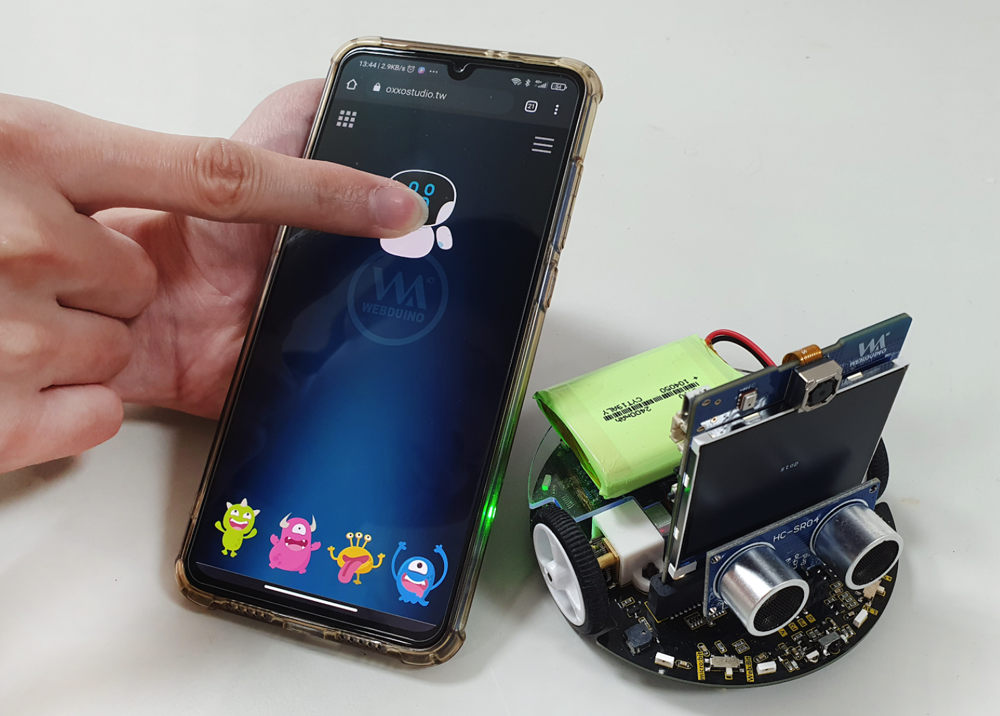

#### 回到 [`教學大綱`](https://md.kingkit.codes/s/siSKyknlU)

# 五、操控 MoonCar


 

## 顏色偵測

這個例子顏色偵測使用的是 MoonCar 上面的 TCS34725 感測器，可用來偵測顏色。
先使用 class TCS34725 驅動感測器，進行打光和讀取顏色值。

   

```python
from webai_blockly import TCS34725
from webai import *
from machine import I2C

i2c = I2C(id=3, freq=100000, scl=17, sda=15) #1920

pinB=16 # light
fm.fpioa.set_function(pinB,fm.fpioa.GPIO6)
gpioB=GPIO(GPIO.GPIO6,GPIO.OUT)
gpioB.value(0)

s = TCS34725(i2c)
img = webai.snapshot()
img.clear()
v = 100
while True:
   time.sleep_ms(200)
   try:
      data = s.read(raw=True)
      data = (data[0]+v,data[1]+v,data[2]+v)
      print(data)
      img.draw_string(2,2, "Color", color=data, scale=11)
      lcd.display(img)
   except Exception as e:
      print(e)
```

## 循跡自走

小車沿著黑線移動。

<iframe src="https://www.youtube.com/embed/D6cet80DZvM" allowfullscreen width="100%" style="aspect-ratio:728/410;border:none " ></iframe>

```python
from webai import *

speed = 60
carType = 1

def tracking(pin):
    global carType,speed

    left = p15.value()
    right = p16.value()
    msg = str(left)+" : "+str(right)

    if left == 0 and right == 0:
        if carType == 1:
            mcar.forward(speed)
        elif carType == 2:
            mcar.move(0,speed)
        elif carType == 3:
            mcar.move(speed,0)

    if left == 1 and right == 1:
        carType = 1
        mcar.forward(speed)
    
    if left == 1 and right == 0:
        carType = 2
        mcar.move(0,speed)
    
    if left == 0 and right == 1:
        carType = 3
        mcar.move(speed,0)

p15 = webai.io.pin(15,pull_mode=webai.io.PULL_NONE)
p15.irq(tracking,GPIO.IRQ_BOTH)
p16 = webai.io.pin(16,pull_mode=webai.io.PULL_NONE)
p16.irq(tracking,GPIO.IRQ_BOTH)
```

## 循跡 + 物件追蹤

沿著黑線移動，看見紅色小怪獸停車，看見綠色小怪獸繼續前進。

<iframe src="https://www.youtube.com/embed/PNbYPFdmBk0" allowfullscreen width="100%" style="aspect-ratio:728/410;border:none " ></iframe>

- 第 58 行 ～ 第 61 行：判斷處

```python
from webai import *

speed = 60
carType = 1

def tracking(pin):
    global carType,speed
 
    left = p15.value()
    right = p16.value()
    msg = str(left)+" : "+str(right)

    if left == 0 and right == 0:
        if carType == 1:
            mcar.forward(speed)
        elif carType == 2:
            mcar.move(0,speed)
        elif carType == 3:
            mcar.move(speed,0)

    if left == 1 and right == 1:
        carType = 1
        mcar.forward(speed)
    
    if left == 1 and right == 0:
        carType = 2
        mcar.move(0,speed)
    
    if left == 0 and right == 1:
        carType = 3
        mcar.move(speed,0)
    
    #webai.draw_string(140,100,msg,scale=2)

p15 = webai.io.pin(15,pull_mode=webai.io.PULL_NONE)
p15.irq(tracking,GPIO.IRQ_BOTH)
p16 = webai.io.pin(16,pull_mode=webai.io.PULL_NONE)
p16.irq(tracking,GPIO.IRQ_BOTH)


from webai_blockly import ObjectTracking
from time import sleep
from webai_blockly import Lcd

objGroup = None
obj = None

view = Lcd()

_deviceID = '6e5596'


otb = ObjectTracking(flip=1, model='monster', classes=['green','red','yellow','blue'], threshold=0.1, w=320, h=224)
while True:
  otb.checkObjects()
  green = otb.getObjects('green')
  red = otb.getObjects('red')
  if (len(red)) >= 1:
    mcar.stop()
  if (len(green)) >= 1:
    tracking(None)

  sleep(0.001)
```

## 馬達控制

### 前進

```python
mcar.forward() # 100% 動力前進

mcar.forward(100) # 100% 動力前進

mcar.forward(50) # 50% 動力前進
```

### 後退

```python
mcar.backward() # 100% 動力後退

mcar.backward(100) # 100% 動力後退
```

### 停止

```python
mcar.stop() # 停止

mcar.forward(0) # 停止

mcar.backward(0) # 停止
```

### 左轉

```python
mcar.left(100) # 100% 動力左轉

mcar.left(30)  # 30% 動力左轉
```

### 右轉

```python
mcar.right(100) # 100% 動力右轉

mcar.right(30)  # 30% 動力右轉
```
### 左右輪

- ==mcar.move( 左輪 , 右輪 )==
- 數值區間：-100 ~ 100

```python
from webai import *
mcar.move( 100 , 100) # 100% 前進
```

#### 參考設定

```python
mcar.move( -100 , -100) # 100% 後退

mcar.move( 45 , -45 ) # 向右轉

mcar.move( -45 , 45 ) # 向左轉

mcar.move(0,0) # 停止
```

## 相關感測器

### 超音波：距離偵測

利用發送超音波碰撞物體之後反射回來的時間差，來得出感測器與物體之間的距離。

> 使用前請記得先接上超音波感測器！

```python
from fpioa_manager import *
from modules import hcsr04
import time
fm.register(6, fm.fpioa.GPIO0, force = True)
fm.register(11, fm.fpioa.GPIO1, force = True)

device = hcsr04(fm.fpioa.GPIO0,fm.fpioa.GPIO1)

while True:
    try:
        print(device.measure(hcsr04.UNIT_CM,100000))
        time.sleep(0.05)
    #except IDE interrupt
    except Exception as e:
        print(e)
        if(str(e)=="IDE interrupt"):
            break
```

### 紅外線：無線控制


接收遙控器發射的紅外線訊號，並顯示到螢幕上。

```python
import lcd, image, utime
from Maix import GPIO
from fpioa_manager import fm

img = image.Image()
fm.register(25, fm.fpioa.GPIOHS1)
pin=GPIO(GPIO.GPIOHS1,GPIO.IN,GPIO.PULL_UP)

def read_data():
   a = []
   while pin.value() == 1:
       pass
   utime.sleep_us(13560)
   for i in range(1000):
       v = pin.value()
       a.append(v)
       utime.sleep_us(56)
   a_c = []
   count = 0
   for i in a:
       if i == 1:
           count += 1

       elif i == 0:
           if count > 0 :
               a_c.append(count)
           count =0
   for i in range(len(a_c)):
       if a_c[i] > 10:
           a_c[i] = "1"
       else:
           a_c[i] = "0"
   B1 = "".join(a_c)
   if(len(B1)==33):
       print(B1[1:len(B1)])
       hstr = '%0*X' % ((len(B1[1:len(B1)]) + 3) // 4, int(B1[1:len(B1)], 2))
       print(hstr)
       print("=====")
       img.clear()
       img.draw_string(50, 100, hstr, scale=5)
       lcd.display(img)
   return B1

while True:
   f = read_data()
```


### 控制 LED 燈：魔幻 LED

 
 


- MoonCar 的 ws2812 Pin 腳為編號 22，總共有 8 顆燈
- 程式內容：魔幻 LED 範例。
    - 第 4 行：設定 Pin 腳為 22、LED 數量為 8 顆燈。

```python
from modules import ws2812
import time

class_ws2812 = ws2812(led_pin=22,led_num=8)
color = [(30,0,0),(0,30,0),(0,0,30),(30,30,0),(30,0,30),(0,30,30),(30,30,30),(0,0,0)]
while True:
    for x in color :
        for i in [0,1,2,3,4,5,6,7] :
            class_ws2812.set_led(i,x)
            class_ws2812.display()
            time.sleep(0.05)
```

### 蜂鳴器：播放音樂

- MoonCar 的蜂鳴器 Pin 腳為編號 24。
- 程式內容：播放 3 個音符。
    - 第 3 行：設定發音頻率
    - 第 4 行：設定發音時間 ( 秒 )

```python
from webai_ext import Buzzer
buzzer = Buzzer()
tune = [392,692,440]
sec = [0.25,0.25,0.5]
for i in [0,1,2] :
    buzzer.bee(tune[i],sec[i])
```

## 萬用遙控器控制登月小車

執行程式後開發板螢幕會顯示 QRcode，使用手機掃描後即可用 Webduino 萬用遙控器控制小車。

> 萬用遙控器的使用方式可以參考：[萬用遙控器控制登月小車](https://md.kingkit.codes/s/TASyDY-Eo#F-%E8%90%AC%E7%94%A8%E9%81%99%E6%8E%A7%E5%99%A8%E6%8E%A7%E5%88%B6%E7%99%BB%E6%9C%88%E5%B0%8F%E8%BB%8A)。



```python
from webai import *
import machine , ubinascii , os , time , gc , sensor

mcar.init()
def cmd(name,msg):
    webai.cmdProcess.sub(name,msg)
    if msg == 'up':
        webai.show(file='mrun.jpg')
        mcar.forward(50)
    if msg == 'down':
        webai.show(file='m02.jpg')
        mcar.backward(50)
    if msg == 'left':
        webai.show(file='mleft.jpg')
        mcar.left(50)
    if msg == 'right':
        webai.show(file='mright.jpg')
        mcar.right(50)
    if msg == 'reset':
        webai.show(file='m01.jpg')
        mcar.stop()
    if msg == '開心':
        webai.speaker.play(filename="logo.wav")

webai.show(file='mooncar.jpg')
webai.mqtt.sub('PING',cmd,includeID=True)
```
