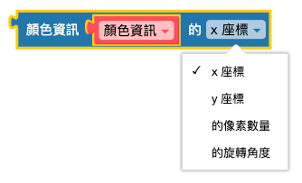

# 顏色追蹤

駕駛看到紅燈就知道要停、看到綠燈知道要前進，這是因為人類能夠透過眼睛大腦感測並判別顏色，進一步根據看到的顏色做出反應，而 Web:AI 開發板也有一樣的能力。

我們可以使用 [Webduino 選色器](https://ai-blockly.webduino.io/pickerLABColor.html) 取出拍攝到的指定顏色，告訴程式偵測到此顏色時，需要做出什麼樣的互動，讓 Web:AI 能夠像駕駛一樣對不同顏色做出反應。

## 照相畫面

「拍攝照片」積木可以使用鏡頭拍攝一次畫面，配合「無限重複」積木就可以達成照相鏡頭的效果。

另外也可以使用「變數」積木替拍攝照片命名，透過命名來做出更多變化。

> 以上兩種積木組合方式執行後會達到相同的結果，差別在於若是要做出更多應用變化，就需要搭配「變數」積木的命名。

### 畫面上畫文字

Web:AI 能夠在螢幕畫面或圖片上顯示文字，這時就需要搭配「圖片上畫文字」積木。

> 請特別注意，「圖片上畫文字」積木需要放在「LCD 顯示圖片」積木之前！

## 偵測圖片顏色資訊

「偵測圖片顏色資訊」積木可以輸入指定的 LAB 色碼，當 Web:AI 鏡頭拍攝到顏色時，就會將顏色區塊框起來。

> 有關 LAB 色彩空間的原理，請參考：[CIELAB色彩空間維基百科](https://zh.wikipedia.org/wiki/CIELAB%E8%89%B2%E5%BD%A9%E7%A9%BA%E9%97%B4)。

## Webduino 選色器

### A. 進入 Webduino 選色器

對著「偵測圖片顏色資訊」積木按下右鍵，點擊「小工具」即可進入 [Webduino 選色器](https://ai-blockly-staging.webduino.io/pickerLABColor.html)。

### B. 使用方式

Webduino 選色器的介面及使用方式如下：

1. 視訊畫面：左側畫面為電腦視訊鏡頭拍攝到的畫面，將被取色的物品放置在電腦鏡頭前方拍攝。( 記得開啟電腦攝影機權限！ )

2. 選取顏色：右側畫面為選取到的顏色。
    - 白色：選取的顏色
    - 黑色：被過濾掉的顏色

3. 調色拉桿：調動 6 個拉桿，讓 " 選取顏色 " 中僅剩選取的色塊是白色。( 拉桿分別控制：亮度、紅綠、藍黃 )

4.  貼上色碼：當顏色選取完成後，下方色碼複製，貼到「偵測圖片顏色資訊」積木，即可完成顏色追蹤設定。

    

5. 查詢色碼：未來需要查詢特定色碼是何種顏色時，可以將色碼貼在 " 查詢色碼 " 欄位中，按下送出即可查看 " 選取顏色 "。

## 顏色資訊

「顏色資訊」積木可以針對偵測的顏色，回報色塊的資訊，包含 x、y 座標、像素數量 ( 面積 )、旋轉角度。

## 範例：追蹤紅色

1. 先使用「變數」積木將拍攝照片命名為「畫面」，做出鏡頭畫面。

    

2. 取出「偵測圖片顏色資訊」積木，按下右鍵，點選選單中的「小工具」，進入 [Webduino 選色器](https://ai-blockly.webduino.io/pickerLABColor.html)。

   

3. 使用選色器選取顏色，再將色碼貼到「偵測圖片顏色資訊」積木。

    

    

4. 完成如下圖程式，執行後會將偵測到的紅色色塊用方框框起。

    

5. 為了讓程式多一些互動，我們再設計讓開發板偵測到紅色時會告知「紅色」。

> 設定 " 像素素量 > 10 " 是為了減少背景顏色的干擾，避免螢幕不斷顯示「紅色」。

