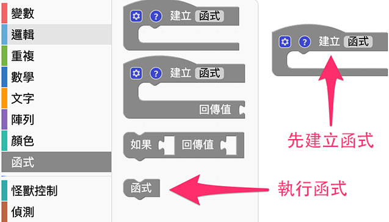
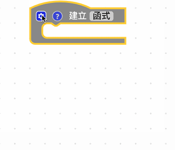
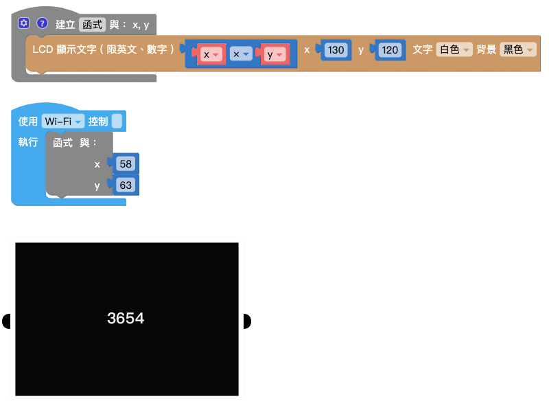
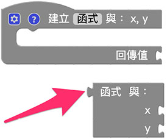
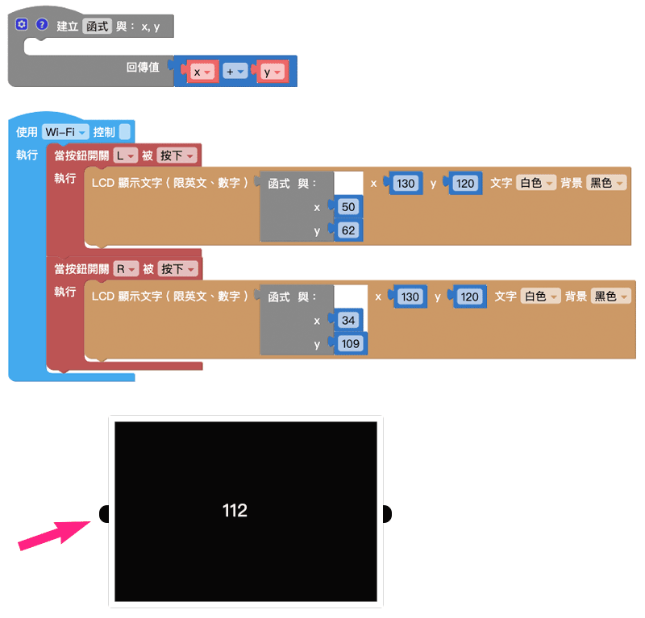
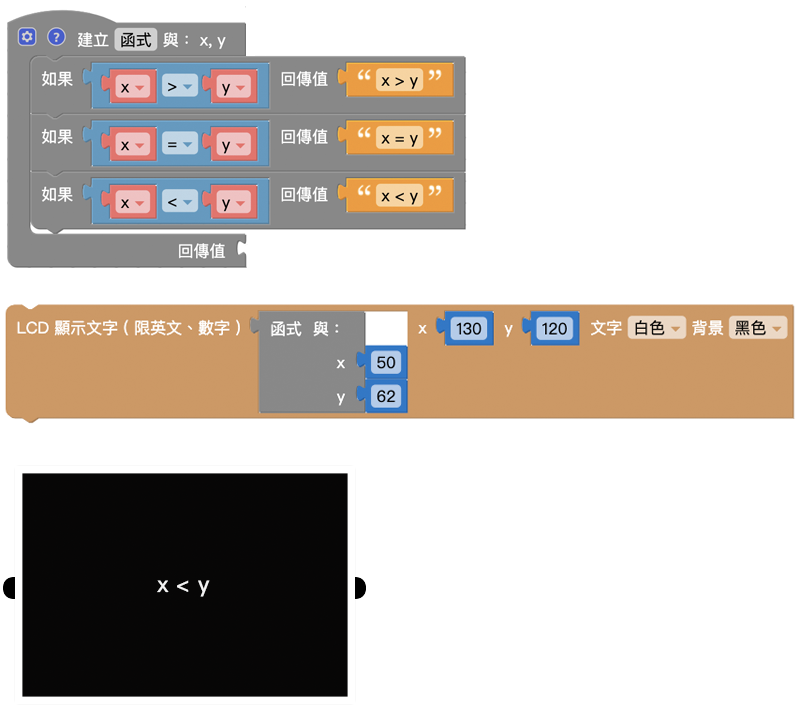
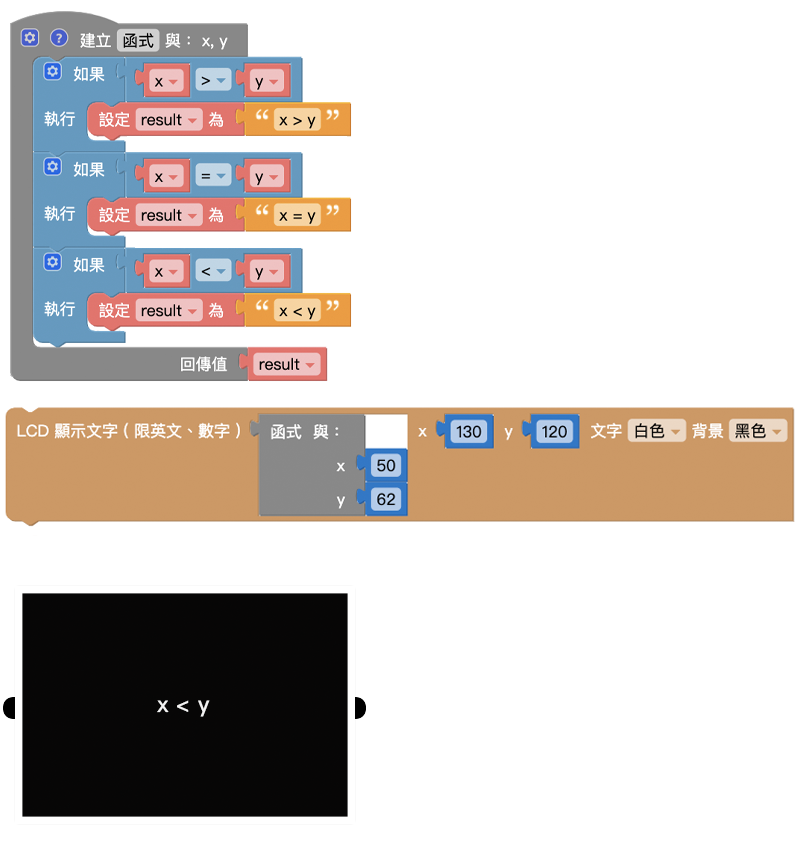

#### 回到 [`教學大綱`](https://md.kingkit.codes/s/siSKyknlU) / [`Web:AI 程式積木`](https://md.kingkit.codes/s/X4vMmbtp_)

# 函式

函式積木可以幫助我們簡化或管理較為複雜的程式邏輯，因為在寫程式的時候，常會遇到需要重複撰寫並執行的程式碼，如果每重複一次都得重寫一次，勢必會造成整份程式邏輯的複雜度，透過函式，將這些重複的程式集中管理，需要使用的時候再去呼叫函式，就可以執行對應的內容。

## 建立函式

「建立函式」積木可以將許多重複會用到的程式積木包裝成函式。

### 「函式」積木使用流程

使用建立函式積木並不會執行函式，因為函式是定義「需要執行的內容」，建立完成函式積木內容後，在函式積木的目錄裡，就會出現對應的執行函式積木，使用這塊積木才表示執行這個函式。

函式流程：

1. 建立函式
2. 執行函式

### 範例：建立並執行函式

1. 使用「建立函式」積木，放入「LCD 顯示文字」積木
2. 使用「函式」積木
3. 按下執行，可以看到 Web:AI 螢幕顯示 **Hello World**。

### 函式內變數

除了單純的使用函式，我們也可以建立「函式內的變數」，點選函式積木前方的小齒輪，就可以新增變數。

新增函式內的變數後，執行函式時也會看到放入變數數值的缺口。( 有幾個函式內的變數就會有幾個缺口 )

也會看到在「變數」積木列表同時新增了 x、y 變數。

### 範例：使用函式內變數作運算

1. 使用「建立函式」積木，放入「LCD 顯示文字」積木，顯示 **x 和 y 相乘** 的結果。
2. 使用「函式」積木，放入 **變數 x、y**。
3. 輸入 x = 58、y = 63。
4. 按下執行，可以看到 Web:AI 螢幕顯示 3654。

## 建立回傳值函式

「建立回傳的函式」積木可以讓執行的函式，變成單純的**數值**。

使用「建立回傳值函式」，會發現執行函式時積木前方多了一個作為組合用的形狀。
( 下圖是延伸前一段建立函式內數的函式 )

### 範例：x、y 不同的運算結果

1. 使用「建立回傳值函式」積木，回傳值為 **x 和 y 相加**。
2. 使用「按鈕開關」積木和「LCD 顯示文字」積木，分別用來顯示不同的運算結果。
3. 放入「函式」積木，設定不同的 x、y 值。
4. 執行後，按下 L、R 按鈕，可以看到 Web:AI 螢幕顯示不同的運算結果。

## 函式內判斷並回傳值

「函式內判斷並回傳值」積木必須和「建立回傳值函式」的積木搭配，主要作為判斷要回傳什麼數值。

> 「函式內判斷並回傳值」積木必須放在「建立函式」積木內才能正常運作。

### 範例：判斷 x、y 大小 ( 1 )

透過這個積木，搭配函式內的變數，就可以透過傳入的變數數值，最後回傳 x 和 y 哪個比較大的結果。

### 範例：判斷 x、y 大小 ( 2 )

因為「函式內判斷並回傳值」積木具備邏輯判斷的功能，所以也可以使用邏輯積木加上一個變數來做判斷，就能做出一模一樣的效果。

