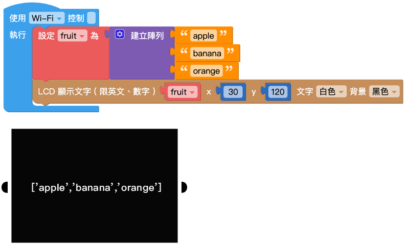
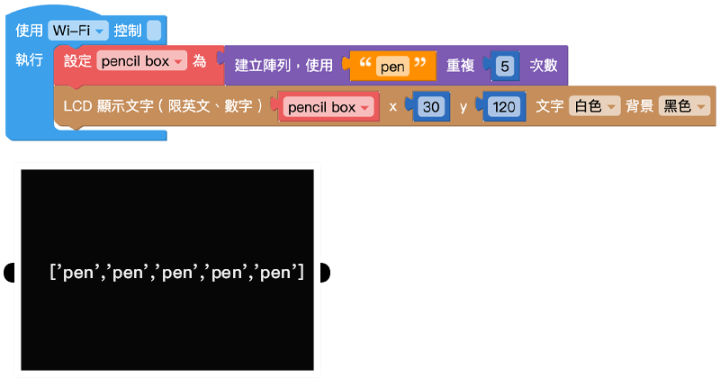
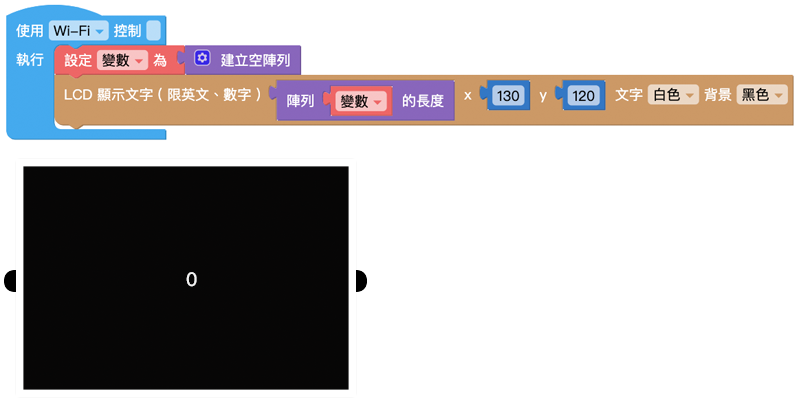
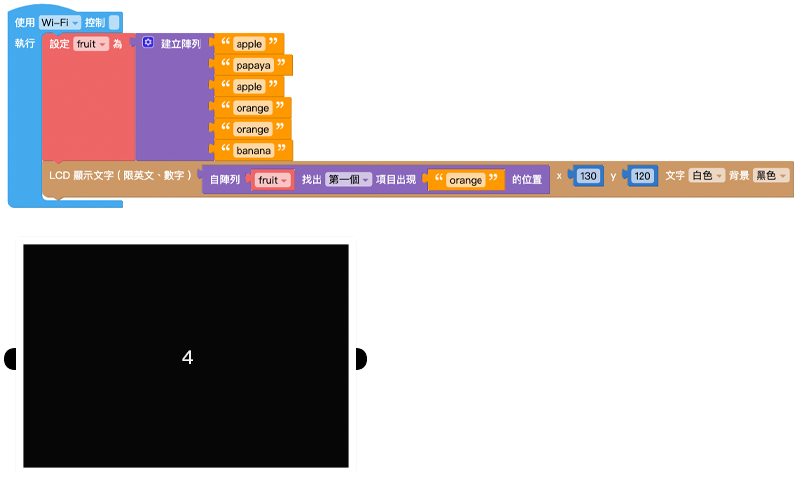
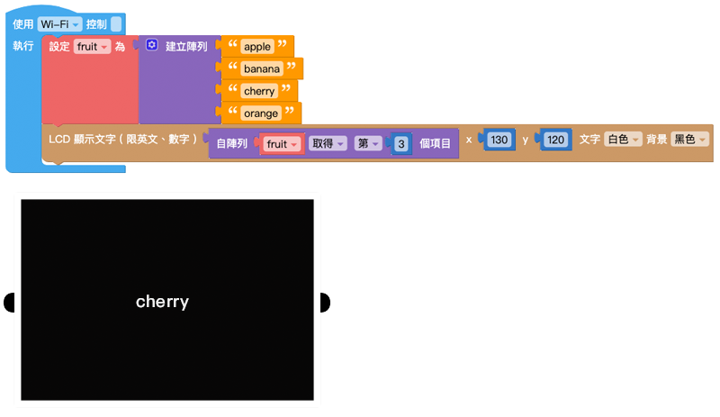
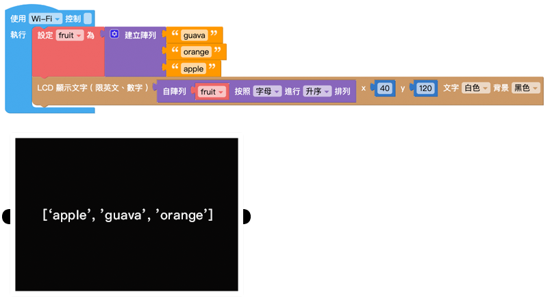

# 陣列

陣列可以將數字、文字、列表或變數，按照順序組合起來，這些按序排列資料集合就稱作陣列。一個陣列可以再細分為多個項目，或是一個陣列內還包含其他陣列。在進行比較複雜的運算時，也會透過陣列的操作來實現。

## 建立陣列、空陣列

- 「建立陣列」積木可以透過指定位置放入對應的內容，建立一個帶有數值的陣列。
- 「空陣列」積木會建立一個陣列容器，也就是裡面沒有包含任何項目的陣列。

點擊積木的「設定」按鈕，可以改變陣列內的項目數量，當數量為 0，積木就會變成空陣列，可以藉由後續操作改變陣列內的項目內容。

### 範例：展示陣列內的所有水果

1. 將「變數 fruit」設定為陣列，並在陣列項目中放入各種水果名稱。
2. 使用「LCD 顯示文字」積木顯示「變數 fruit」。
3. 避免文字顯示超出螢幕，調整 x 成 50。
4. 按下執行，可以看到 Web:AI 螢幕顯示 **['apple', 'orange', 'banana']**。

   

## 重複陣列內項目

「重複陣列內項目」積木可以建立一個陣列，並讓陣列內的項目重複特定數量。當陣列內需要填入大量重複的項目時，就只需要設定一次。

### 範例：鉛筆盒內有 5 支筆

1. 使用「變數 pencil box」，後面放入「重複陣列內項目」積木。
2. 將「文字」積木放入陣列中，並輸入「pen」。
3. 使用「LCD 顯示文字」積木顯示「變數 pencil box」。
4. 避免文字顯示超出螢幕，調整 x 成 50。
5. 按下執行，可以看到 Web:AI 螢幕顯示 **['pen', 'pen', 'pen', 'pen', 'pen']**。

   

## 陣列長度

「陣列長度」積木可以取得個陣列的項目總數。

如果是空陣列則陣列長度為 0。

### 範例：查看陣列中有多少水果欄位？

1. 將「變數 fruit」設定為陣列，並在陣列項目中放入各種水果名稱。
2. 使用「變數 number」作為水果欄位的數量，放入「陣列長度」積木，後方放入「變數 fruit」。
3. 使用「LCD 顯示文字」積木顯示「變數 number」。
4. 按下執行，可以看到 Web:AI 螢幕顯示 **6**。

   

5. 因為「陣列長度」積木讀取的是陣列的項目數量 ( 水果欄位數量 )，所以即使項目中沒有放入水果，螢幕也會顯示相同的數字。

   

## 索引項目位置

「索引項目位置」積木能在一個陣列中，從最前面或最後面，找到特定項目所在的位置，並回傳該位置的順序號碼。

### 範例：水果陣列中，第一顆橘子出現在什麼位置？

1. 使用「變數 fruit」和「陣列」積木，並在陣列項目中放入各種水果名稱。
2. 設定「變數 order」，後方放入「索引項目位置」積木，從「fruit」陣列最前面索引項目「orange」。
3. 使用「LCD 顯示文字」積木顯示「變數 order」。
4. 按下執行，可以看到 Web:AI 螢幕顯示 **4**，代表第一顆橘子出現在 **第 4 個位置**。

   

## 取得陣列內容

「取得陣列內容」積木可以取得陣列中某個項目的值、或是取得某個項目的值之後，同時移除該項目。( 項目取得方式包含：第幾個、倒數第幾個、第一個、最後一個和隨機 )

### 範例：找到第 3 個水果

1. 使用「變數 fruit」和「陣列」積木，並在陣列項目中放入各種水果名稱。
2. 使用「LCD 顯示文字」積木，顯示「取得陣列」積木取得陣列中的第 3 項。
3. 按下執行，可以看到 Web:AI 螢幕顯示 **cherry**，代表陣列中的第 3 個項目是 cherry。

   

### 範例：移除第 3 個水果，並說出後來的第 3 個水果

1. 接續上一個範例，完成建立陣列。
2. 在陣列後面使用自「陣列 fruit」移除第 3 個項目。
3. 使用「LCD 顯示文字」積木，顯示「取得陣列」積木取得陣列中的第 3 項。
4. 按下執行，可以看到 Web:AI 螢幕顯示 **orange**，代表原本陣列中的第 3 個項目 cherry 被移除，改由原本的第 4 個項目 orange 遞補。

   

## 設定陣列內容

「設定陣列內容」積木可以針對陣列的項目進行設定或移除。( 項目取得方式包含：第幾個、倒數第幾個、第一個、最後一個和隨機 )

### 範例：將第 3 個水果改為 cherry

1. 使用「變數 fruit」和「陣列」積木，並在陣列項目中放入各種水果名稱。
2. 下方使用自「陣列 fruit」中設定第 3 個項目為 cherry。
3. 使用「LCD 顯示文字」積木，顯示「陣列 fruit」，並設定 x 為 40，避免文字超出螢幕。
4. 按下執行，可以看到 Web:AI 螢幕顯示 **[‘apple’, ‘banana’, ‘cherry’]**，代表第 3 個水果已經被改為 **cherry**。

   

<!-- ## 取得指定區間的項目

「取得指定區間的項目」積木會取出一段指定區間內的項目，並將這些項目建立成一個子陣列。

> 請注意第一個空格的數字需要比第二個空格內的數字小！

### 範例：取得第 2 個水果 ~ 倒數第 2 個水果

1. 使用「變數 fruit」和「陣列」積木，並在陣列項目中放入各種水果名稱。
2. 加入另一個變數「變數 list」，在後方使用：自「陣列 fruit」中取得第 2 個項目至倒數第 2 個項目。
3. 使用「LCD 顯示文字」積木，顯示「陣列 list」，並設定 x 為 40，避免文字超出螢幕。
4. 按下執行，可以看到 Web:AI 螢幕顯示 **[‘banana’, ‘orange’, ‘cherry’]**。

 -->

## 文字與陣列轉換

「文字與陣列轉換」積木可以將帶有「分隔符」( 類似空白、逗號、分號...等分隔符號 ) 的文字轉換為陣列，或是將陣列合併為一串文字。

- 從文本製作陣列：文字 → 陣列
- 從陣列拆出文本：陣列 → 文字

### 範例：用文字展示水果陣列，並用逗號分開

1. 使用「變數 fruit」和「陣列」積木，並在陣列項目中放入各種水果名稱。
2. 使用「把陣列合併為文字」，將陣列變成文字形式。
3. 使用「LCD 顯示文字」積木，並設定 x 為 40，避免文字超出螢幕。
4. 按下執行，可以看到 Web:AI 螢幕顯示 **apple,banana,orange,cherry,guava**。
 
   

5. 如果將「分隔符」改成「/」符號，可以看到 Web:AI 螢幕顯示 **apple/banana/orange/cherry/guava**。

    

## 陣列排序

「陣列排序」積木會將指定的陣列做數字、字母的排序，排序後會形成一個新的陣列，不會影響原本陣列的排序。

>- 依英文升序：a ~ z
>- 依英文降序：z ~ a
>- 依數字升序：小 ~ 大
>- 依數字降序：大 ~ 小

### 範例：讓水果依英文字母順序排列

1. 使用「變數 fruit」和「陣列」積木，並在陣列項目中放入各種水果名稱。
2. 加入另一個變數「變數 text」，使用「陣列排序」積木讓陣列依照英文字母排序。
3. 使用「LCD 顯示文字」積木，顯示「order」，並設定 x 為 40，避免文字超出螢幕。
4. 按下執行，可以看到 Web:AI 螢幕顯示 **[‘apple’, ‘guava’, ‘orange’]**，陣列中的項目依照 a~z 的順序排列。

   
