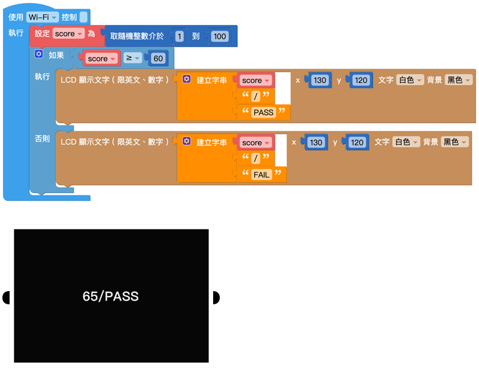
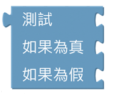

# 邏輯

在日常生活裡，不論是寫程式、算數學，法庭攻防，甚至是路上交通、買賣東西或要不要起床，都包含許多「邏輯」的成分。邏輯可做許多的條件和判斷，當滿足了某些條件就會執行某件事，例如聽見鬧鐘響就該起床、看到綠燈才可以行進...等狀況，就是一些簡單的邏輯判斷。

## 邏輯判斷

如果情況滿足判斷條件 ( 判斷回傳為「真」或「ture」)，就會執行對應的內容。

- 如果：接 **判斷條件**
- 執行：接 **執行內容**

### 增加條件

點選左上方的「藍色小齒輪」，可以新增邏輯判斷的條件，點一下可以打開，再點一下可以關閉。

### 判斷條件：如果、否則如果、否則

「否則」的判斷條件表示當「如果」和「否則如果」的條件都沒有滿足，就會執行「否則」的內容。

邏輯判斷條件位置：

- 「如果」：在第一層
- 「否則如果」：位在中間
- 「否則」：在最後

如果只有兩個條件，例如非 A 即 B，就可以單純使用「如果」和「否則」就可以，甚至可以不使用「否則」，這樣在條件外就不會進行任何動作。

## 判斷條件式

判斷條件式主要會放在邏輯的「判斷條件」缺口內，提供不同情境的邏輯判斷。
判斷的條件主要分為：等於 (=)、不等於 (≠)、小於 (<)、小於等於 (≦)、大於 (>)、大於等於 (≧)。

將「判斷條件式」放入「如果」、「否則如果」、「否則」積木後方，即可設定執行條件。

### 範例：判斷成績是否及格 ( 1 )

1. 以下方「判斷成績是否及格」為範例，設定「變數 score」為隨機 0~100 數值，並判斷是否及格。

    - 變數 score ≧ 60 ：顯示 PASS
    - 變數 score < 60 ：顯示 FAIL

2. 完成後按下執行。 

   

## 邏輯運算子

「邏輯運算子」積木為邏輯判斷提供了更彈性的判斷條件，當中包含了「和」與「或」。

- 和：必須 2 個判斷條件式都滿足，才會執行動作，
- 或：只要滿足其中一個判斷條件式，就會執行動作。

邏輯判斷出現「如果否則」的時候，常會用到邏輯運算子，而邏輯運算子可以搭配判斷條件的積木使用。

### 範例：判斷成績是否及格 ( 2 )

1. 這次的範例多增加一個項目是當成績是 100 時，讓螢幕顯示「PERFECT」。

2. 判斷條件如下：

    - 「變數 score」= 100：PERFECT
    - 100 >「變數 score」≧ 60：PASS
    - 60 ≧「變數 score」：FAIL

3. 在「否則如果」後方放入「邏輯運算子」，讓條件為 score 介在 60~100 之間。

   

4. 完成後按下執行，可以看到螢幕顯示成績與結果。

   

## 條件判斷不成立

使用「不成立」積木時，會使條件判斷不成立。當條件不成立時，會執行後續動作。

## 真/假

「真/假」積木主要表示 ture ( 真 ) 與 false ( 假 ) 兩個值，目的是在數字、文字之外多一些判斷的條件，同時也可以將 ture 和 false 提交給變數。

## 空

編輯程式的時候，會遇到某個變數或是某個數值變成空值 ( null ) 的情況，這時就可以使用空值的積木判斷，用法和「真/假」積木類似。

## 非

「非」積木表示「不是什麼」，通常會和「真/假」或「空值」的積木搭配使用。

如果把積木接在「非」的積木後面，狀態就會相反過來，例如空就會變成非空、真就會變假，假就會變真，依此類推。

## 三元邏輯運算子

「三元邏輯運算子」積木是針對只有「兩種條件」，並針對根據條件傳回「兩個運算式」的其中一個。

### 範例：判斷成績是否及格 ( 3 )

1. 使用相同的「判斷成績是否及格」範例，因為判斷結果只有「及格」、「不及格」2 種，所以可以使用「三元邏輯運算子」積木。

2. 設定「變數 result」儲存結果，

    - 測試：「變數 score」≧ 60
    - 如果為真：顯示 PASS
    - 如果為假：顯示 FAIL

3. 開始執行後，按下 L 按鈕，螢幕會顯示分數及結果。

   
.