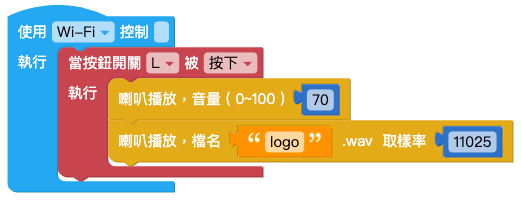
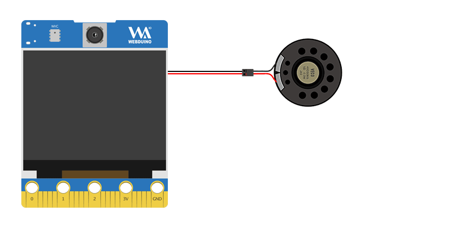

#### 回到 [`教學大綱`](https://md.kingkit.codes/s/siSKyknlU) / [`Web:AI 程式積木`](https://md.kingkit.codes/s/X4vMmbtp_)

# 喇叭

Web:AI 開發板能夠搭配外接喇叭及 SD 卡，將指定的音檔播放出來，並且藉由編輯各類積木程式控制觸發條件和音量，達成在任何情境下的聲音互動。

## 喇叭播放

「播放」積木代表執行播放的動作，輸入指定的名稱，就可以播放 SD 卡內的 wav 檔。

> 「播放」積木的音檔支援格式為 **.wav**。

## 播放音量

「音量」積木可以控制播放的音量，音量大小為 0~100，預設值為 5。因為程式是一行一行執行，所以「音量」積木必須放在「播放」積木之前。

> 請先設定音量，再播放音檔。

### 範例：按鈕播放音樂

1. 將存放音檔的 SD 卡插入 Web:AI 開發板中，並接上喇叭。

3. 設定「播放」積木內要播放的音檔名稱，範例中使用 logo 這個內建音檔。
4. 放入「音量」積木設定要播放的音量。
5. 在最外層加上「按鈕」積木，讓開發板能夠用按鈕播放音樂。
6. 執行後，按下 L 按鈕，可以聽到喇叭放出音樂。

