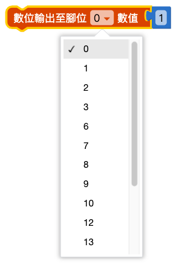

# I/O 引腳

在 Web:AI 開發板邊緣有一排有 25 個金屬接觸點，這些金屬接觸點稱為「引腳」，或通俗一點也可稱呼「金手指」。 引腳包含了 5 個標註 0、1、2、3V 和 GND 的大引腳，以及其他 20 個未標示號碼的小引腳。
除了可以使用鱷魚夾操作大引腳，也可以使用擴充板搭配杜邦線操作小引腳，透過引腳的搭配，就能靈活的操作各種外接元件與感測器。

## I/O 引腳對照表

有關 Web:AI 開發板的腳位規格，可以參考以下的對照表。

- P0 ~ P20：訊號腳位，負責輸入輸出訊號
- 3V3：供電 3.3V
- GND：電路接地 ( 電壓 0V )

## 讀取訊號 ( 數位輸入 )

使用「讀取數值」積木，讀取到的數值為數位訊號，會有 1 和 0 兩種數值，

- 輸入電壓 > 0V：數位數值為 1
- 輸入電壓 = 0V：數位數值為 0
- 完全沒有接感測器或電組：數位數值為 1

> 因為預設只會讀取一次訊號，所以要不斷讀取腳位訊號的話，需要搭配 **「無限重複」積木**。

### 範例：讀取腳位輸入訊號

1. 使用杜邦線、麵包板、電阻完成接線圖。( 電阻的一端接 GND、一端接 3V3 )
2. 使用「LCD 顯示文字」積木讓螢幕顯示讀取數值，這樣可以讀取 1 次輸入訊號。
3. 為了能讓腳位不斷讀取訊號，加入「無限重複」積木，讓螢幕可以隨時顯示改變的訊號數值。
4. 按下執行後，改變訊號腳位讀取的電路位置，可以看到螢幕的數位訊號改變。

## 輸出訊號 ( 數位輸出 )

輸出訊號的積木分成兩種 ( 數位輸出 0V 相當於 類比輸出 100V )：

- 數位輸出：輸出 **0** 或 **1V**
- 類比輸出 ( PWM )：輸出 **0～100V**

使用不同的輸出方式，可以適合在不同的場合，做出各種應用變化。

### 輸出訊號 ( 數位輸出 )

透過積木控制，從指定腳位傳遞出 0 或 1 的訊號。

1. 使用 LED 燈為例，LED 燈的一端接地、一端接訊號腳，完成接線。
2. 使用「數位輸出」積木，輸出至指定的腳位，選擇輸出 1。
3. 按下執行，可以看到 LED 燈亮起。

> 如果輸出訊號選擇 0，代表腳位電壓為 0V，因此 LED 燈的兩端皆為 0V，LED 燈不會亮起。

### 輸出訊號 ( 類比輸出 )

透過積木控制，從指定腳位傳遞出 0～100 的訊號。

1. 使用 LED 燈為例，LED 燈的一端接地、一端接訊號腳，完成接線。
2. 使用「類比輸出」積木，輸出至指定的腳位，選擇輸出 30。
3. 按下執行，可以看到 LED 燈微亮。

