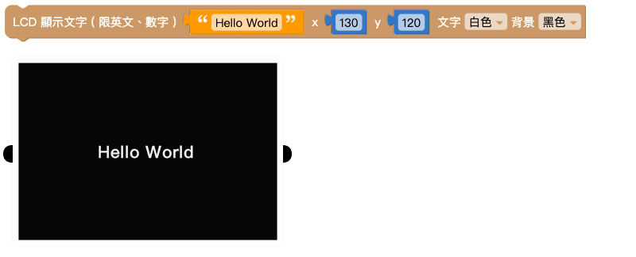
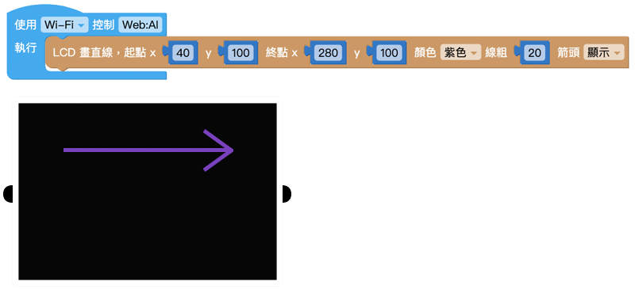
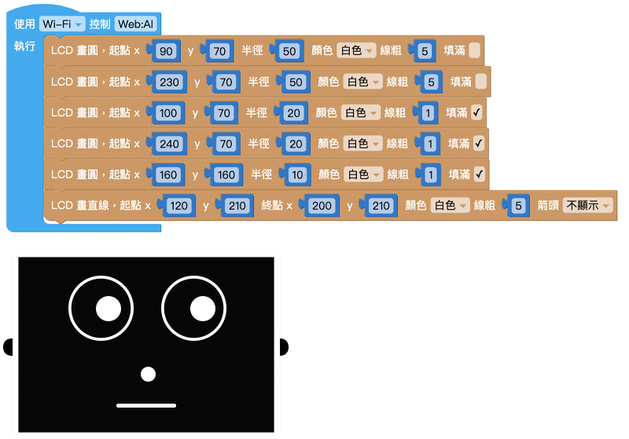
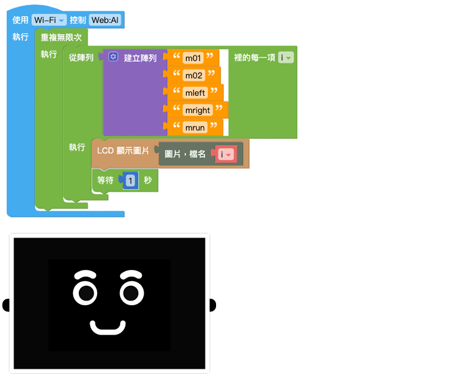

# LCD 螢幕

Web:AI 內建一塊 2.3 吋 LCD 螢幕，可以使用程式積木配合感測器、控制器、按鈕開關等物聯網相關硬體設備，將執行的結果顯示在螢幕上，達成各種跨領域應用。

## LCD 顯示文字

「LCD 顯示文字」積木能夠讓 Web:AI 的螢幕上顯示指定的英文字、數字，更可以搭配其它積木的互動，讓程式執行結果展示在 LCD 螢幕上。

## LCD 畫文字

「LCD 畫文字」積木是將 Web:AI 的螢幕以畫布的方式畫上指定的文字，更可以透過積木組合，讓文字顯示在圖片上面。

> 因為「LCD 畫文字」積木在程式邏輯是將螢幕設定一張畫布，所以如下方的積木會讓「LCD 顯示文字」積木的「ABCDE」被覆蓋。
> 
> 

## 清除 LCD 畫面

「清除 LCD 畫面」積木可以將 LCD 畫面原本的顯示的任何文字或執行結果清除，方便繼續執行後續步驟。

### 範例：3 秒後清除 LCD 畫面

1. 使用「LCD 顯示文字」積木讓 LCD 螢幕顯示 Hello World。
2. 下方放入「等待」積木設定 3 秒，並加入「清除 LCD 畫面」積木。
3. 按下執行，可以看到螢幕顯示 **Hello World**，等待 3 秒之後，螢幕畫面中的文字消失。

## LCD 畫直線

「LCD 畫直線」積木可以同時在螢幕中畫出 **多條** 直線，並可以設定線段的起點、終點、顏色、線粗、箭頭。

> 箭頭的端點位在終點位置。

### 範例：畫出紫色箭頭

1. 使用「LCD 畫直線」積木，設定起點、終點的 x、y 位置、顏色、線粗，箭頭選擇「顯示」。
2. 按下執行，可以看到 LCD 螢幕顯示紫色箭頭線段。

## LCD 畫圓

「LCD 畫直線」積木可以同時在螢幕中畫出 **多個** 圓形，並可以設定圓形的位置、半徑、顏色、線粗、是否填滿。

### 範例：畫一張臉

1. 如下方程式範例，使用「LCD 畫圓」積木設定座標、半徑及是否填滿，做出眼睛和鼻子。
2. 使用「LCD 畫直線」積木做出嘴巴。
3. 按下執行，可以看到完成一張臉在 LCD 螢幕上。

## LCD 畫矩形

「LCD 畫直線」積木可以同時在螢幕中畫出 **多個** 矩形，並可以設定矩形的位置、寬高、顏色、線粗、是否填滿。

> 矩形的起點 x、y 是依據矩形左上角的座標而定。

## LCD 顯示圖片

「LCD 顯示圖片」積木可以讓 LCD 螢幕顯示出拍攝的圖片，或是存放在 Web:AI 開發板中的圖片。

### 開發板預設的圖檔：
- logo：Webduino Logo
- m01：笑臉
- m02：閉眼
- mleft：向左看
- mright：向右看
- mrun：>o<
- red：紅色小怪獸
- blue：藍色小怪獸
- yellow：黃色小怪獸
- green：綠色小怪獸

### 範例：照相畫面

1. 使用「LCD 顯示圖片」積木，裡面放入「拍攝圖片」積木。
2. 因為這樣的程式設計只能顯示一次固定的畫面，因此需要讓程式不斷執行。
3. 在最外層放入「無限重複」積木。
4. 按下執行，可以看到開發板開啟照相鏡頭功能，顯示鏡頭拍攝的畫面。

> 關於照相畫面的更多應用變化，可以參考：[照相畫面](https://md.kingkit.codes/s/3KhHmkwBd#%E7%85%A7%E7%9B%B8%E7%95%AB%E9%9D%A2)。

### 範例：改變表情

1. 使用「建立陣列」積木放入各種圖檔名稱。
2. 在外層使用「取出陣列元素並執行」積木，讓程式會根據陣列中的元素逐項執行。

3. 放入「LCD 顯示圖片」積木，顯示圖片、檔名為「變數 i」
4. 讓表情每 1 秒改變一次，因此放入「等待 1 秒」積木。
5. 目前的程式執行到最後一個項目就會停止，並不會永久重複，所以在最外層放入「無限重複」積木。
6. 按下執行，可以看到螢幕不斷變換表情。

## 照相畫面

「拍攝照片」積木可以使用鏡頭拍攝一次畫面，配合「無限重複」積木就可以達成照相鏡頭的效果。

另外也可以使用「變數」積木替拍攝照片命名，透過命名來做出更多變化。

> 以上兩種積木組合方式執行後會達到相同的結果，差別在於若是要做出更多應用變化，就需要搭配「變數」積木的命名。

## LCD 畫圖片

「LCD 畫圖片」積木內建了各種使用積木畫出的範例圖案，可以直接選用並直接顯示在螢幕上，不需要使用大量積木來畫出。

### 範例：畫出人臉

1. 放入「LCD 畫圖片」積木，選單選擇人臉。
2. 按下執行，可以看到螢幕顯示人臉。

