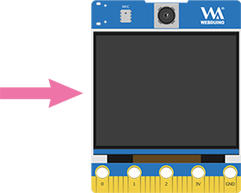

# 操作模式

當 Web:AI 做完 Wi-Fi 設定及韌體更新後，就可以開始執行各種 AIoT 應用了。
而使用 Web:AI 開發板時，有一些操作方式需要先了解，清楚之後可以盡情使用 Web:AI 了！

> 關於 Wi-Fi 設定及韌體更新，歡迎參考：[初始化設定 ( 第一次使用請看這裡 )](https://bpi-steam.com/WebAI/zh/Unboxing/Initialization.html)。

## 開機

1. 首先需要將 Web:AI 開發板接上電源，只要接上電源就會自動開機。
2. 一開機會顯示 Webduino Logo

    

3. 接著進入倒數畫面，這時可以選擇要進入 **主程式模式** 或是 **QRcode 模式**。

## 關機

拔掉電源後會自動斷電關機，最後執行過的程式也會被儲存在開發板中。
再次重新插上電源後，可以馬上執行上次部署的程式。

> 直接移除電源並不會導致開發板損壞，請安心使用！

## 重新開機

當撰寫了有問題的程式、網路訊號不穩導致開發板出現意外的狀況，或是想要重新執行程式時，就需要使用重新開機。

### 重新開機方式：

使用下列 2 種方式，都能夠讓開發板馬上重新啟動。

- 按下開發板背面的 Reset 按鈕

    

- 移除電源再重新插上

> 反覆重新開機並不會導致開發板損壞，請安心使用！

## 主程式模式

開機後會進入倒數的畫面，在這時候做出以下其中一種動作，就會進入主程式模式。

- **在倒數畫面不做任何動作，等待倒數結束**
- **在倒數畫面按下 " L 按鈕 "**

   

進入主程式後，就會直接執行上次部署過的程式。

## QRcode 模式

在使用安裝版設定 Wi-Fi 或使用教學範例小卡時，就需要用到 QRcode 模式。

### 步驟

開機後會進入倒數的畫面，這時候 **按下 " R 按鈕 "**，就會進入 QRcode 模式，即可開始掃描 QRcode。

>- [初始化設定 ( 第一次使用請看這裡 )](https://bpi-steam.com/WebAI/zh/Unboxing/Initialization.html)
>- [教學範例卡使用教學](https://bpi-steam.com/WebAI/zh-tw/Unboxing/Card.html)

## 回復預設狀態

回復預設狀態功能可以將 Web:AI 的部署程式和 Wi-Fi 設定回復到原廠狀態。

### 用途

當程式寫錯或遇到異常錯誤時 ( 如：使用大量錯誤迴圈積木 )，容易造成執行程式卡死，這時就需要使用回復預設狀態功能來讓開發板回到預設狀態，再重新執行程式或設定 Wi-Fi。

### 預設狀態

- Wi-Fi 狀態：無連線
- LCD 螢幕：顯示「請前往網址，設定 Wi-Fi」，畫面如下：

    

### 步驟

1. **" 按住 "** Web:AI 開發板 L 按鈕。
2. 按下 Reset 按鈕。
3. 當螢幕出現紅色全屏畫面，放開 L 按鈕
4. 開發板重新開機，完成回復預設狀態

> 回復預設狀態之後的設定，歡迎參考：[初始化設定 ( 第一次使用請看這裡 )](https://bpi-steam.com/WebAI/zh/Unboxing/Initialization.html)。

