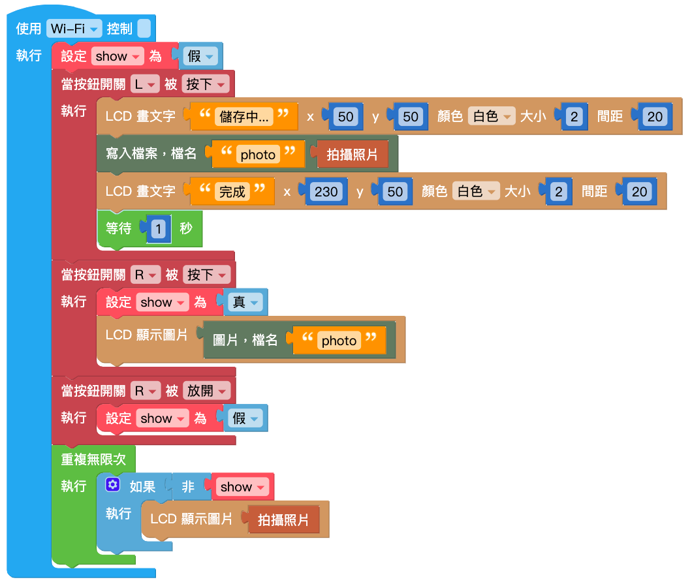

# 文件读写

Web:AI 文件读写功能能够将镜头拍摄的图片存入，并通过 LCD 屏幕显示的功能将储存的图片展示出来。通过文件读写功能，可以让 Web:AI 开发板实现拍照等影像应用。

> 更多相关应用，可以参考：[LCD 显示图片](https://md.kingkit.codes/s/3KhHmkwBd#LCD-%E9%A1%AF%E7%A4%BA%E5%9C%96% E7%89%87)。

## 写入文件

「写入文件」积木可以将镜头捕捉到的影像储存在开发板记忆体中，再配合其它积木展示。

## 图片 ( 文件 )

「图片 ( 文件 )」积木要使用的图片，能够根据图片的文件名称加以读取并使用。

## 示例：自拍照相

1. 先设定拍照状态，使用「无限循环」积木让开发板保持在拍照状态。

    

2. 使用「变量 show」来表示相机的状态，开发板一开始会保持在拍照状态。
 
   

    - 真：展示拍摄的照片
    - 假：拍照状态

3. 设定当 L 按钮按下，会拍摄照片，并同时显示「储存中...」和「完成」。

   

4. 设定当 R 按钮按下，会显示拍摄的照片。

    

5. 设定当 R 按钮放开，「变量 show」为**假**，回到拍照状态。

    

6. 完成后开始执行，按下开发板 L 按钮拍照，按下 R 按钮展示。

    

