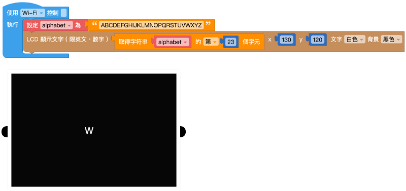
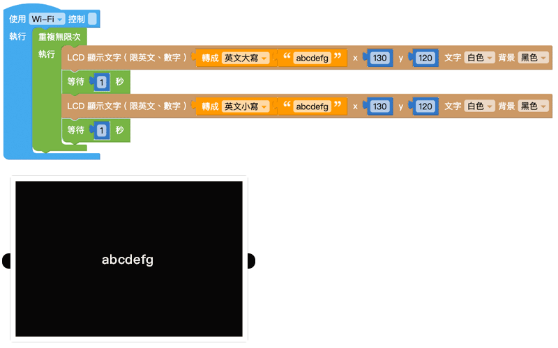

# 文本

文本积木除了可以显示有意义的词汇，也可以通过相加的方式把文字组合，或是在一段词汇中寻找对应的字词或字母，甚至也可显示语音辨识的内容或物联网串感器的状态。

## 指定文字 ( 英文、数字 )

「指定文字」积木可以输入指定的英文数字，​​通过 LCD 屏幕显示出来。

如下方程序，屏幕显示「Web:AI」。

## 字符串组合

「字符串组合」积木可以把不同的文本积木组合成一段文字。
点击紫色的「设定」按钮，将「项目」积木加入字符串组合中，可以增加文字的数量。

### 示例：显示 3 个字符串

在「字符串组合」积木中放入 3 个文本积木，输入 A、B、C，按下执行，可以看到 Web:AI 屏幕画面显示「ABC」。

## 在变量后方加入文字

「在变量后方加入文字」积木能够在原本变量的内容后方增加额外文字。

### 示例：在科目名称后面显示成绩

1. 设定「变量 score」，后方用「文本」积木放入科目名称「Math:」
2. 使用「在变量后加入文字」积木对「变量 score」加入科目分数「95」
3. 按下执行，就可以看到 Web:AI 屏幕显示「Math:95」

## 字符串长度

「字符串长度」积木可以取得一串文字的总字数。

> 英文字以「字母」为单位，且空白、标点符号也算是一个字符。

### 示例：算出有多少字符

1. 设定「变量 length」，复制一串英文字母或文章贴上
2. 使用「LCD 显示文字」积木显示「变量 length」
3. 按下执行，就可以看到全部的字符数量，如英文字母有 26 个。

## 文字为空

「文字为空」积木可以判断积木内是否存在文字，若不存在文字，返回「是 ( true )」，并执行后续动作。

### 示例：是否存在文字

1. 使用逻辑积木，判断是否存在文字
2. 如果文字为空，执行 LCD 屏幕显示「T」；如果存在文字，LCD 屏幕显示「N」

## 寻找文字出现位置

「寻找字符串出现位置」积木会返回指定文字在一段文字中出现的位置，可以选择第一个出现的位置或最后一个出现的位置。

### 示例：找出 W 是第几个字母？

1. 设定「变量」积木为字符串 A~Z
2. 设定「变量 W」并放入「寻找字符串出现位置」积木
3. 使用「LCD 显示」积木显示「变量 W」
4. 按下执行，可以看到 W 是第 23 个英文字母

## 取得指定位置的字符

「取得指定位置的字符」积木会取出指定位置的字符，下拉选单共有五种指定位置，分别是第几个、倒数第几个、第一个、最后一个和随机位置。

### 示例：寻找第 23 个英文字母

延续上面示例，找出第 23 英文字母，并用屏幕显示出来。

1. 设定「变量」积木为字符串 A~Z
2. 设定「变量 23」并放入「取得指定位置的字符」积木
3. 使用「LCD 显示」积木显示「变量 23」
4. 按下执行，可以看到第 23 个英文字母是 W

## 取得指定区间的文字

「取得指定区间的文字」积木会取出一段指定区间内的文字，需注意的是**第一个空格的数字要比第二个空格内的数字小**。

### 示例：在句子中找出指定区间的字符

1. 使用「变量」积木和「文本」积木，并输入一段句子 **Let's try Web:AI!**
2. 设定取得第 10 字符 ~ 倒数第 2 字符
3. 执行后可以看到 LCD 屏幕显示 **Web:AI!**

## 转换大小写

「转换大小写」积木可以针对「英文字」进行大小写转换，包含全部转大写、全部转小写或是首字母大写。

### 示例：让英文字不断变换大小写

1. 使用 2 个「LCD 显示文字」积木，里面分别放入「转成英文大写」积木及「转成英文小写」积木
2. 在「转换大小写」积木内输入英文字
3. 使用「循环无限次」积木，并用「等待」积木设定间隔时间各 1 秒
4. 按下执行，可以在 Web:AI 屏幕看到 **ABCDEFG** 不断变换大小写

## 消除空格

「消除空格」积木可以消除一段文字中左边、右边或左右两边的空白字符。

