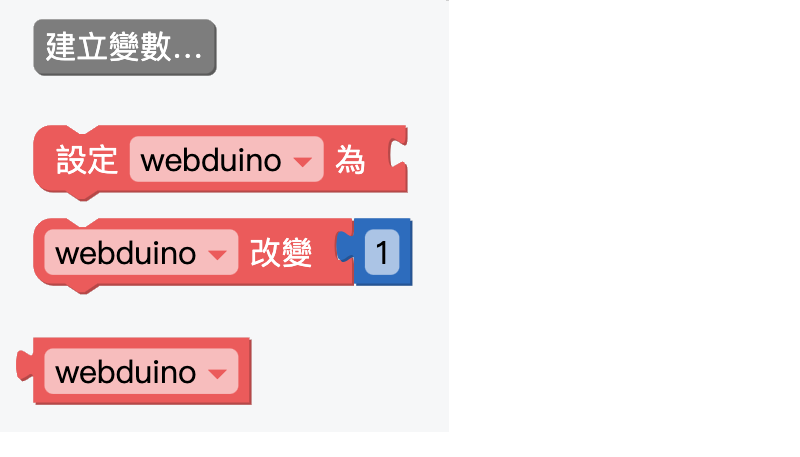
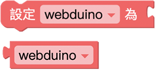
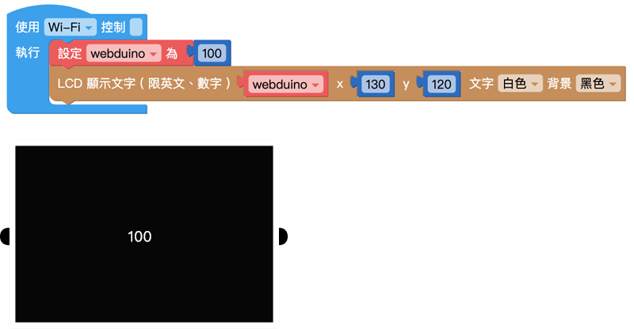

# 变量

变量，是所有程序都会用到的基本元素，使用前会赋予变量一个名称，可以用这个变量来表示文字、数字、数组、颜色或逻辑。

为什么要使用变量呢？因为在编程时往往会遇到许多「重复」的部分，如果用变量或函数装载这些重复的部分，就能很简单的进行「一次性」新增、删除或修改动作。

举例来说，如果一段文章出现了50次「A」，要把「A」修改为「B」，若不使用变量则得要手动修改50次才办得到，使用变量的话就能够一次将全部的「A」同时改为「B」。

## 建立变量

要使用「变量」积木前需要先建立变量(将变量命名)，点击灰色的「建立变量」积木，跳出「新变量名称窗口」，输入想命名的变量名称，按下确定，就可以看到新建立的变量了。

## 设定变量

设定变量表示赋予变量一个值，可以将变量设定为一串英文字或数字。

为了要在Web:AI开发板的屏幕上显示结果，我们需要搭配「LCD显示文字」积木。在设定完变量后，下方放入「LCD显示文字」积木，再将变量积木放入里面，按下执行，就可以看到屏幕上显示「100」了。

## 变量覆盖特性

由于程序语言有「后面覆盖前面」的特性，所以如果变量名称相同，后面设定的值会覆盖掉前面设定的值。

以下方的积木为例子，将「变量Webduino」设定3次值，搭配「LCD显示文字」积木，按下执行，可以看到LCD屏幕最后呈现的结果为「Web:AI」

## 变量增加

变量增加表示「让变量的值增加多少」，假设原本变量的值为1，使用变量增加1之后，这个变量就会变成2；同理，如果使用变量增加-1，那么这个变量就会变成0。

设定变量的值为100，使用「变量增加」积木将变量增加1，可以看到屏幕显示101。

