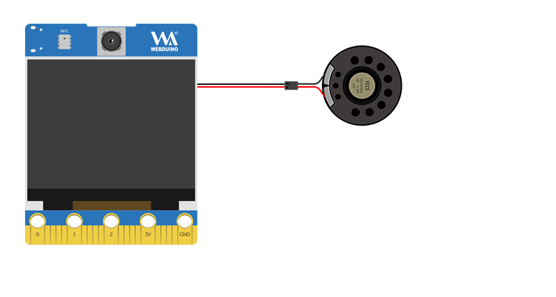

# 扬声器

Web:AI 开发板能够搭配外接扬声器及 T-Flash存储卡，将指定的音频文件播放出来，并且藉由编辑各类积木程序控制触发条件和音量，达成在任何情境下的声音互动。

## 扬声器播放

「播放」积木代表执行播放的动作，输入指定的名称，就可以播放 T-Flash存储卡内的 wav 文件。

> 「播放」积木的音频文件支持格式为 **.wav**。

## 播放音量

「音量」积木可以控制播放的音量，音量大小为 0~100，预设值为 5。因为程序是顺序执行，所以「音量」积木必须放在「播放」积木之前。

> 请先设定音量，再播放音频文件。

### 示例：按钮播放音乐

1. 将存放音频文件的 T-Flash存储卡插入 Web:AI 开发板中，并接上扬声器。

3. 设定「播放」积木内要播放的音频文件名称，示例中使用 logo 这个内建音频文件。
4. 放入「音量」积木设定要播放的音量。
5. 在最外层加上「按钮」积木，让开发板能够用按钮播放音乐。
6. 执行后，按下 L 按钮，可以听到扬声器放出音乐。

