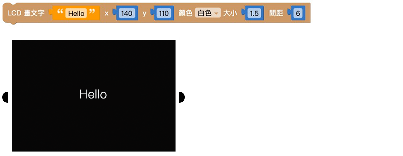
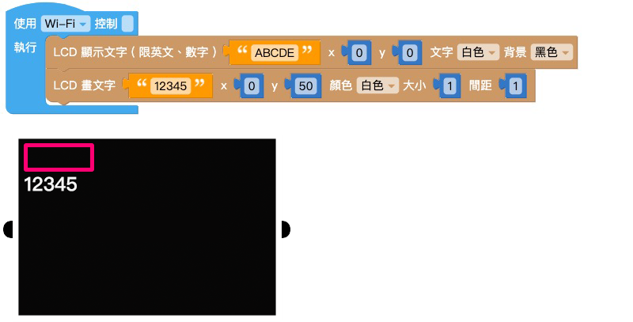
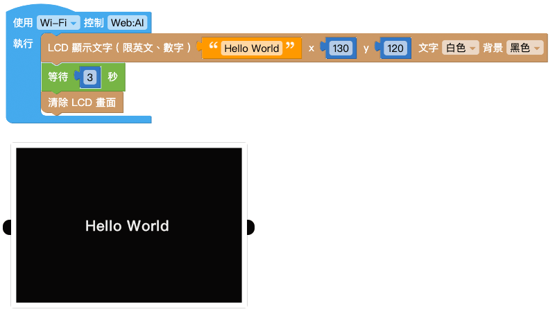
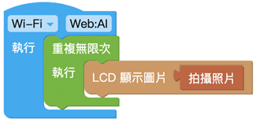
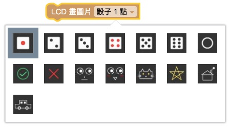
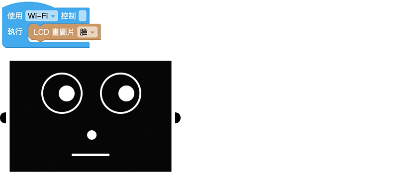

# LCD 屏幕

Web:AI 内建一块 2.3 吋 LCD 屏幕，可以使用积木配合传感器、控制器、按钮开关等物联网相关硬体设备，将执行的结果显示在屏幕上，达成各种跨领域应用。

## LCD 显示文字

「LCD 显示文字」积木能够让 Web:AI 的屏幕上显示指定的英文字、数字，更可以搭配其它积木的互动，让程序执行结果展示在 LCD 屏幕上。

## LCD 画文字

「LCD 画文字」积木是将 Web:AI 的屏幕以画布的方式画上指定的文字，更可以通过积木组合，让文字显示在图片上面。

> 因为「LCD 画文字」积木在程序逻辑是将屏幕设定一张画布，所以如下方的积木会让「LCD 显示文字」积木的「ABCDE」被覆盖。
>
> 

## 清除 LCD 画面

「清除 LCD 画面」积木可以将 LCD 画面原本的显示的任何文字或执行结果清除，方便继续执行后续步骤。

### 示例：3 秒后清除 LCD 画面

1. 使用「LCD 显示文字」积木让 LCD 屏幕显示 Hello World。
2. 下方放入「等待」积木设定 3 秒，并加入「清除 LCD 画面」积木。
3. 按下执行，可以看到屏幕显示 **Hello World**，等待 3 秒之后，屏幕画面中的文字消失。

## LCD 画直线

「LCD 画直线」积木可以同时在屏幕中画出 **多条** 直线，并可以设定线段的起点、终点、颜色、线粗、箭头。

> 箭头的端点位在终点位置。

### 示例：画出紫色箭头

1. 使用「LCD 画直线」积木，设定起点、终点的 x、y 位置、颜色、线粗，箭头选择「显示」。
2. 按下执行，可以看到 LCD 屏幕显示紫色箭头线段。

## LCD 画圆

「LCD 画直线」积木可以同时在屏幕中画出 **多个** 圆形，并可以设定圆形的位置、半径、颜色、线粗、是否填满。

### 示例：画一张脸

1. 如下方程序示例，使用「LCD 画圆」积木设定座标、半径及是否填满，做出眼睛和鼻子。
2. 使用「LCD 画直线」积木做出嘴巴。
3. 按下执行，可以看到完成一张脸在 LCD 屏幕上。

## LCD 画矩形

「LCD 画直线」积木可以同时在屏幕中画出 **多个** 矩形，并可以设定矩形的位置、宽高、颜色、线粗、是否填满。

> 矩形的起点 x、y 是依据矩形左上角的座标而定。

## LCD 显示图片

「LCD 显示图片」积木可以让 LCD 屏幕显示出拍摄的图片，或是存放在 Web:AI 开发板中的图片。

### 开发板预设的图片：
- logo：Webduino Logo
- m01：笑脸
- m02：闭眼
- mleft：向左看
- mright：向右看
- mrun：>o<
- red：红色小怪兽
- blue：蓝色小怪兽
- yellow：黄色小怪兽
- green：绿色小怪兽

### 示例：照相画面

1. 使用「LCD 显示图片」积木，里面放入「拍摄图片」积木。
2. 因为这样的程序设计只能显示一次固定的画面，因此需要让程序不断执行。
3. 在最外层放入「无限循环」积木。
4. 按下执行，可以看到开发板开启照相镜头功能，显示镜头拍摄的画面。

> 关于照相画面的更多应用变化，可以参考：[照相画面](https://md.kingkit.codes/s/3KhHmkwBd#%E7%85%A7%E7%9B%B8%E7%95%AB %E9%9D%A2)。

### 示例：改变表情

1. 使用「建立数组」积木放入各种图片名称。
2. 在外层使用「取出数组元素并执行」积木，让程序会根据数组中的元素逐项执行。

3. 放入「LCD 显示图片」积木，显示图片、图片名为「变量 i」
4. 让表情每 1 秒改变一次，因此放入「等待 1 秒」积木。
5. 目前的程序执行到最后一个项目就会停止，并不会永久重复，所以在最外层放入「无限循环」积木。
6. 按下执行，可以看到屏幕不断变换表情。

## 照相画面

「拍摄照片」积木可以使用镜头拍摄一次画面，配合「无限循环」积木就可以达成相机取景器的效果。

另外也可以使用「变量」积木替拍摄照片命名，通过命名来做出更多变化。

> 以上两种积木组合方式执行后会达到相同的结果，差别在于若是要做出更多应用变化，就需要搭配「变量」积木的命名。

## LCD 画图片

「LCD 画图片」积木内建了各种使用积木画出的示例图案，可以直接选用并直接显示在屏幕上，不需要使用大量积木来画出。

### 示例：画出人脸

1. 放入「LCD 画图片」积木，选单选择人脸。
2. 按下执行，可以看到屏幕显示人脸。

