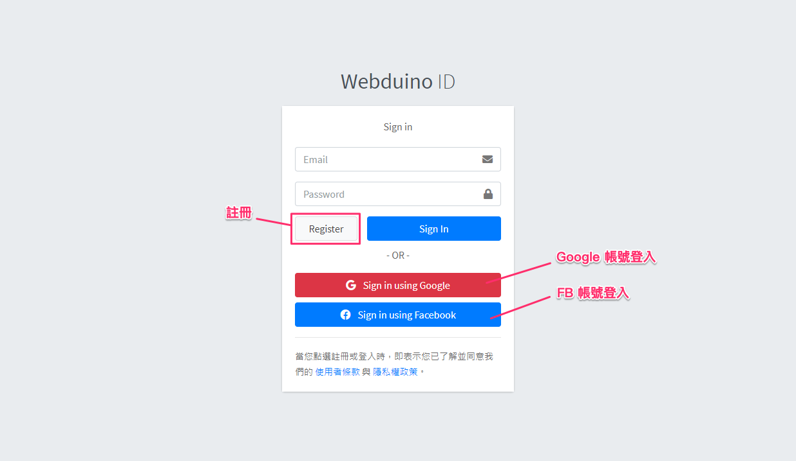
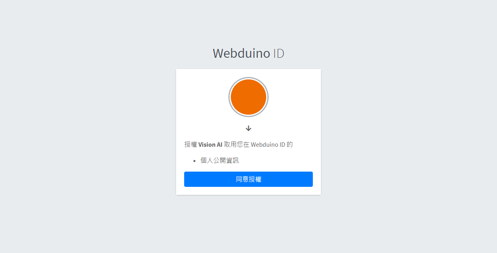
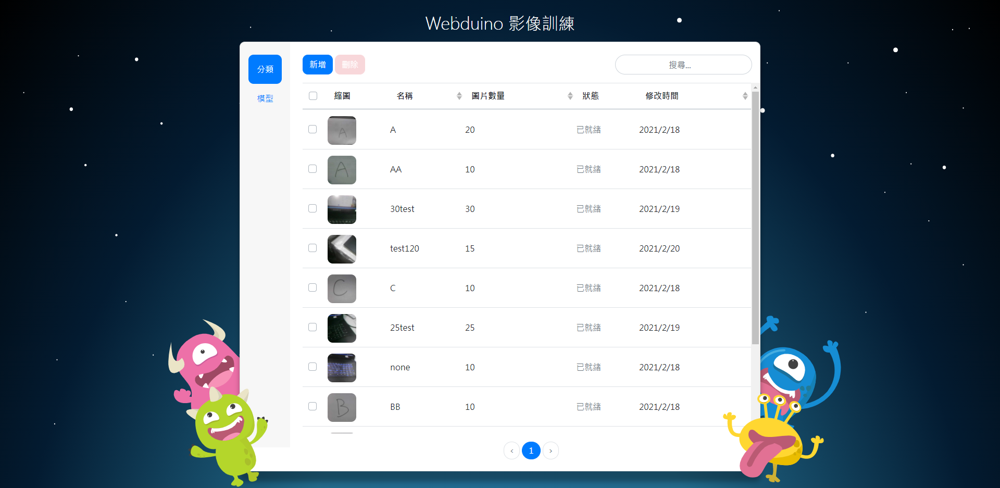
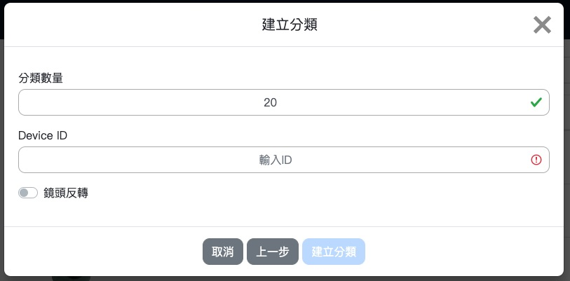
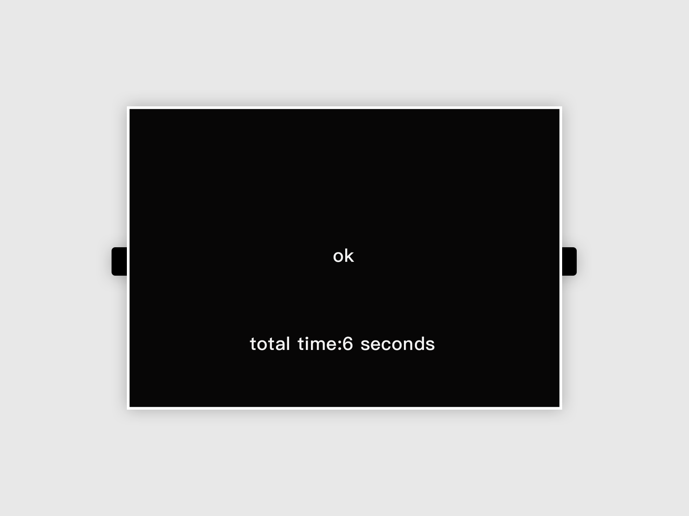
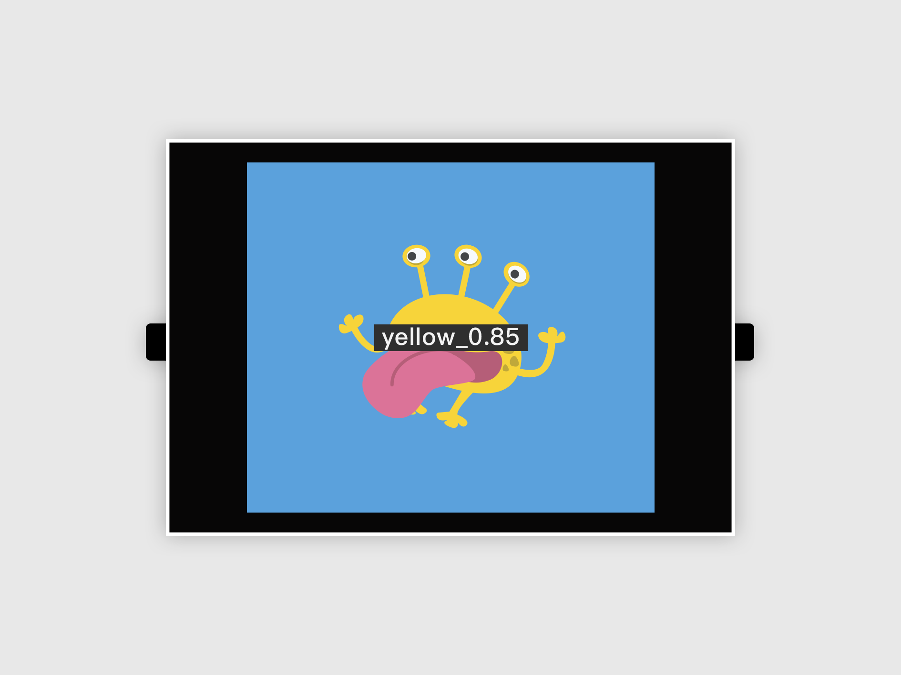
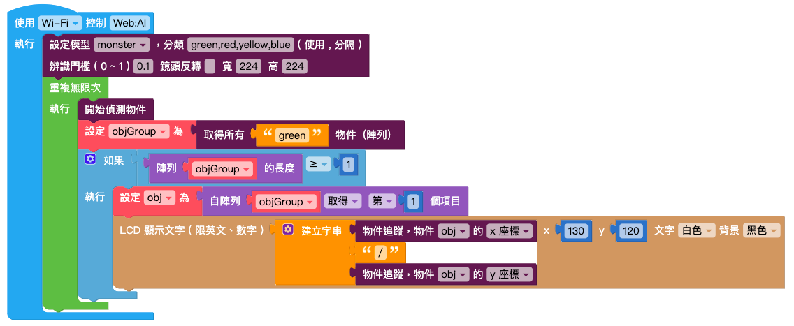

# 三、影像训练

Web:AI 影像辨识分为**影像分类** 以及**物件追踪**，可以使用Web:AI 开发板拍摄影像上传至Webduino 影像训练平台进行影像训练，将训练完成的模型下载，再应用图形编程设计程序来执行影像辨识。

## 影像辨识流程

进行影像辨识的流程中，需要先分别建立影像分类，接着选择要建立的模型种类 ( 影像分类、物件追踪 )，并将分类放入模型中，就可以使用模型来进行影像辨识了。

## A. 登录影像训练平台

1. 点击此链接进入 [Webduino 影像训练平台](https://vision.webduino.io)。

   

2. 点击「Register」按钮注册帐号或使用 Google、FB 帐号直接登录。

   

3. 点击「同意授权」，进入 Webduino 影像训练平台。

## B. 建立分类

1. 在 Webduino 影像训练平台中可以看到左侧的侧边栏有「分类」和「模型」两个选项，点击「分类」进入分类列表。

   

2. 点击蓝色「新增」按钮，跳出「建立分类」视窗。

   

    - 输入分类名称，**请勿输入中文、空格、符号**
    - 选择分享状态
    - 影像上传方式点选「Web:AI」，进入下一步

   

    - 输入要拍照的数量
    - 输入 Web:AI 开发板的 DeviceID
    - 选择是否旋转镜头
        - 是：使用后镜头 ( 镜头在屏幕背面 )
        - 否：使用前镜头 ( 镜头和屏幕在同一侧 )
     > 目前因为镜头旋转功能外壳尚未上市，因此旋转镜头选项**不需勾选**，敬请期待！

3. 点击「建立分类」按钮

   

4. 看到「传送指令成功」讯息，就可以开始使用 Web:AI 开发板拍照。

## C. 使用开发板拍摄影像

传送指令成功后，开发板会重新启动，进入拍照模式。

### 拍照模式

- 左上角白色数字：目前拍照张数
- L 按钮：拍摄照片
- R 按钮：调整白框大小
- 中间白色方框：拍照时，让拍摄物件跟方框相当大小

  

让**拍摄物件跟方框相当大小**时按下 **L 按钮** 拍摄，并且稍微转动角度，拍摄不同角度影像。

### 上传影像

1. 拍完设定的照片数量后，画面会变全黑，开始上传图片。

   

2. 等待上传完成后，画面中央会显示白色 ok，正下方显示上传时间。

   

3. 点击视窗中的 ✕ 或「回到主画面」，将视窗关闭。

### 建立 2~4 个分类

进行影像辨识时，模型内需要放入 2~4 个分类才能进行辨识，
因此重复上述 **建立分类**、**使用开发板拍摄影像** 步骤，建立两个以上的分类。

## D. 建立模型

1. 建立完分类后，在左侧的侧边栏选择「模型」，进入模型列表。

   

2. 点击蓝色「新增」按钮，跳出「新增模型」视窗。

   

    - 输入模型名称，**请勿输入中文、空格、符号或使用过的名称**
    - 选择模型种类 ( 影像分类、物件追踪 )
        
    - 选择分享状态
    - 模型建立方式点选「挑选分类」

3. 从分类列表中点选 2~4 个要进行影像辨识的分类，点击「建立模型」。

   

4. 等待模型训练完成后，就可以在模型列表中找到建立的模型，并且可以看到模型内的**分类名称**以及**模型种类**。

   

   > 因为物件追踪的演算法较复杂，因此训练时间较久是正常的！

## E. 下载模型

1. 点击要进行影像辨识的模型，将弹出「模型选项」视窗。

    a. 点击下载模型。

      

    b. 输入开发板 Device ID。

    

    c. 点击「下载模型」后传送指令。

   

2. 点击「下载模型」按钮，出现「传送指令成功」时Web:AI 开发板开始下载模型。

   

3. 完成 100% 后，画面会显示 **ok** 字样代表完成下载，就可以开始进行影像辨识了。

## F. 应用图形编程设计程序以执行影像辨识

在图形编程平台中，可以分别使用影像分类和物件追踪积木，来达到不同的影像辨识功能。

> 有关更详细积木的使用，欢迎参考：
>- [影像分类](https://md.kingkit.codes/s/XsGqYu8lP)
>- [物件追踪](https://md.kingkit.codes/s/BrL3wxxd_)

### 影像分类

1. 先依照上面步骤，将训练过的影像分类模型下载到 Web:AI 开发板中。

2. 开启 Web:AI 图形编程平台。

3. 使用「设定模型」积木，输入模型名称，
在数组内放入和分类数量相同的积木，按照模型列表的**分类顺序**输入**分类名称**。
并将宽、高都输入 224。

   >- 使用 Webduino 影像训练平台训练的模型尺寸为 224*224。
   >- 自行使用其它工具训练，则需输入各别的尺寸。

   

4. 在下方加入「无限循环」积木，里面放入「开始辨识影像」积木和「LCD 显示文字」积木。

    

5. 「LCD 显示文字」积木内放入「字串组合」积木，后方放入「取得辨识到的影像( 名称)」积木、「文字」积木输入底线、「取得辨识到的影像( 信心度) 」积木。

    

6. 程序编辑完成后，按下右上角绿色「执行」按钮，出现「正在努力搬运Blockly 中...」和「正在组装积木...」，读取结束后Web:AI 开发板会自动开启辨识画面。

7. 使用镜头对准辨识物件就能看到文字显示辨识结果和信心度。

   

> 若要使用其它模型来进行影像辨识，需要回到步骤 **下载模型**，再次下载模型。
 
### 物件追踪

1. 先依照上面步骤，将训练过的物件追踪模型下载到 Web:AI 开发板中。

2. 开启 Web:AI 图形编程平台。

3. 使用「设定模型」积木，输入模型名称，
在数组内放入和分类数量相同的积木，按照模型列表的**分类顺序**输入**分类名称**。
并将宽、高都输入 224。

   >- 使用 Webduino 影像训练平台训练的模型尺寸为 224*224。
   >- 使用开发板预设的模型请输入 320*240。
   >- 自行使用其它工具训练，则需输入各别的尺寸。

   

4. 在下方加入「无限循环」积木，里面放入「开始侦测物件」积木和「LCD 显示文字」积木。

   

5. 编辑物件追踪的相关程序，让侦测时可以读取到模型 ( 数组 ) 内的分类，并且在屏幕上显示需要的数值，如下图设定：

   

6. 将编辑好的程序放在「开始侦测物件」积木下方。

   

7. 程序编辑完成后，按下右上角「执行」按钮，出现「正在努力搬运 Blockly 中…」和「正在组装积木…」，读取结束后 Web:AI 开发板会自动开启辨识画面。

8. 使用镜头对准辨识物件就能看到白框显示辨识结果和座标。

   