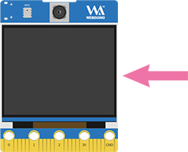

# 操作模式

当Web:AI做完Wi-Fi设定及固件更新后，就可以开始运行各种AIoT应用了。

而使用Web:AI开发板时，有一些操作方式需要先了解，清楚之后可以尽情使用Web:AI了!

>关于Wi-Fi设定及固件更新，欢迎参考：[初始化设定 ( 第一次使用请看这里 )](https://bpi-steam.com/WebAI/zh/Unboxing/Initialization.html)。

## 开机

1.首先需要将Web:AI开发板接上电源，只要接上电源就会自动开机。

2.一开机会显示Webduino Logo

3.接着进入倒数画面，这时可以选择要进入**主程序模式**或是**QRcode模式**。

## 关机

拔掉电源后会自动断电关机，最后运行过的程序也会被储存在开发板中。

再次重新插上电源后，可以马上运行已下载的程序。

>直接移除电源并不会导致开发板损坏，请安心使用!

## 重启

当编写了有问题的程序、网络信号不稳导致开发板出现意外的状况，或是想要重新运行程序时，就需要重启。

### 重启方式：

使用下列2种方式，都能够让开发板马上重新启动。

-按下开发板背面的Reset按钮

-移除电源再重新插上

>反复重启并不会导致开发板损坏，请安心使用!

## 主程序模式

开机后会进入倒数的画面，在这时候做出以下其中一种动作，就会进入主程序模式。

- **在倒数画面不做任何动作，等待倒数结束**

- **在倒数画面按下“L按钮”**

进入主程序后，就会直接运行已下载的程序。

## QRcode模式

在Wi-Fi设定或使用教学示例小卡时，需要用到QRcode模式。

###步骤

开机后会进入倒数的画面，这时候**按下“R按钮”**，就会进入QRcode模式，即可开始扫描QRcode。

>- [初始化设定 ( 第一次使用请看这里 )](https://bpi-steam.com/WebAI/zh/Unboxing/Initialization.html)

>- [教学示例使用教学](https://bpi-steam.com/WebAI/zh/Unboxing/Card.html)

##恢复预设状态

恢复预设状态功能可以将Web:AI的程序和Wi-Fi设定恢复到设备初始状态。

### 用途

当程序写错或遇到异常错误时(例如：使用大量错误的循环积木)，容易造成程序卡死，这时就需要使用恢复预设状态功能来让开发板回到预设状态。

### 预设状态

- Wi-Fi状态：无联机

- LCD屏幕：显示「请前往网址，设定Wi-Fi」，画面如下：

### 步骤

1. **“按住”** Web:AI开发板L按钮。

2.按下Reset按钮。

3.当屏幕出现红色全屏画面，放开L按钮。

4.开发板重启，完成恢复预设状态。

>恢复预设状态之后的设定，请参考：[初始化设定 ( 第一次使用请看这里 )](https://bpi-steam.com/WebAI/zh/Unboxing/Initialization.html)。
