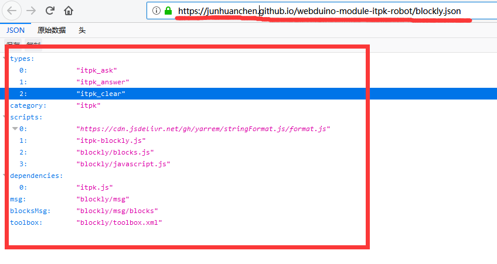
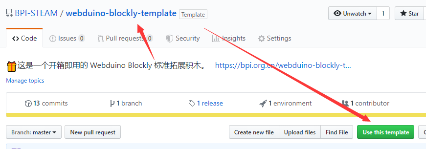
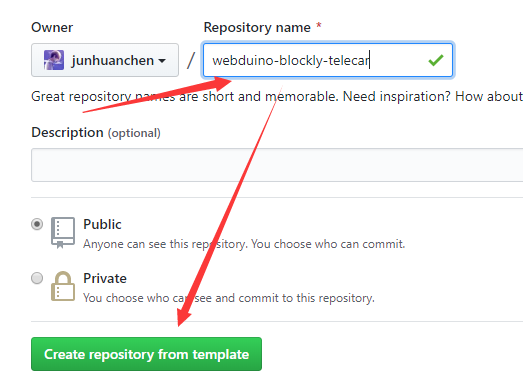
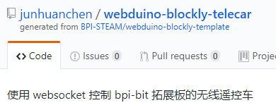
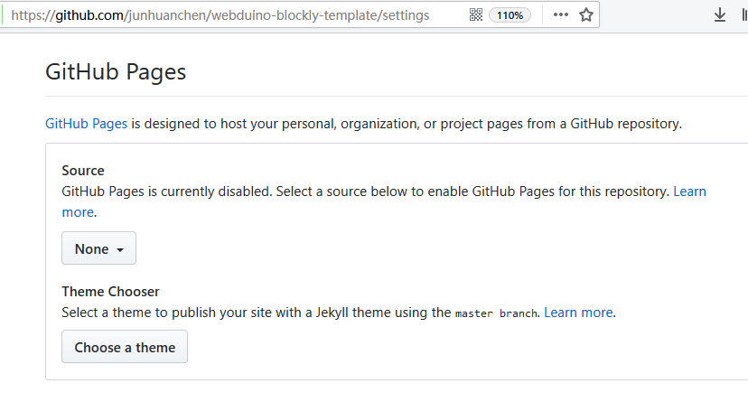
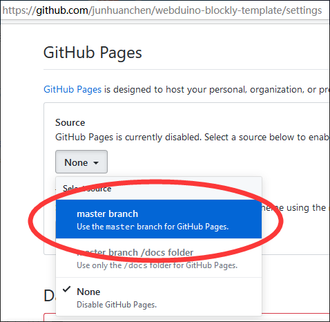
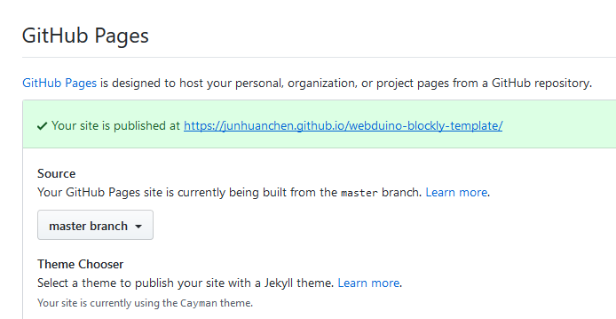
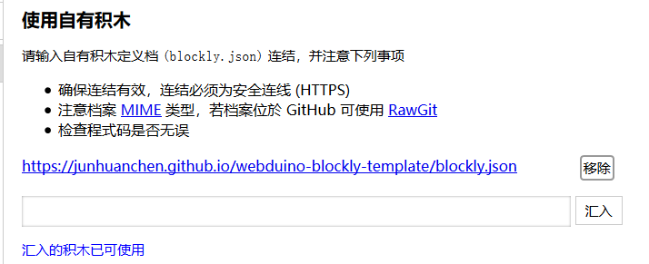

# 了解拓展积木模板

从先前的文档中得知什么是 Google Blockly 设计器，那我们就先从模仿一个通用的模板开始吧。

请先了解一下这个[webduino-blockly-template](https://bpi-steam.com/webduino-blockly-template)示例项目，并下载获得。

## 拓展积木的基本构成

先认识一下模板目录文件，如下一系列表格，稍后会详细介绍。

### webduino-blockly-template

| 文件路径 | 介绍与用途 |
| :----: | :----: |
| blockly | 积木资源文件夹，内容下述 |
| demes | 积木示例、设计文件夹，内容下述 |
| blockly.json | 积木类型、依赖、实现的定义 |
| itpk-blockly.js | 积木的代码生成函数实现 |
| itpk.html | 测试原始积木功能 API 页面 |
| itpk.js | 经典 JavaScript 接口实现 |
| README.md  | 积木的使用说明文档 |
| _config.yml | 由 Github Page 创建，并提供外链 |

### webduino-blockly-template\\blockly

| 文件路径 | 介绍与用途 |
| :----: | :----: |
| msg | 积木多语言资源文件夹，内容下述 |
| blocks.js | 由 积木设计器 自动生成的样式实现 |
| javascript.js | 由 积木设计器 自动生成的积木代码生成函数实现 |
| toolbox.xml | 由你提供左侧工具列积木样式设计 |

### webduino-blockly-template\\blockly\\msg

| 文件路径 | 介绍与用途 |
| :----: | :----: |
| blocks | 积木内部的相关的语言文件，内容下述 |
| en.js | 定义工具列的 英文 文字变量 |
| zh-hans.js | 定义工具列的 简体中文 文字变量 |
| zh-hant.js | 定义工具列的 繁体中文 文字变量 |

### webduino-blockly-template\\blockly\\msg\\blocks

| 文件路径 | 介绍与用途 |
| :----: | :----: |
| en.js | 定义积木内部的 英文 文字变量 |
| zh-hans.js | 定义积木内部的 简体中文 文字变量 |
| zh-hant.js  | 定义积木内部的 繁体中文 文字变量 |

### webduino-blockly-template\\demos

| 文件路径 | 介绍与用途 |
| :----: | :----: |
| blockly.xml | 积木的使用范例，可导入 webduino blockly |
| library.xml | 积木的设计库，可导回设计器中重新设计 |

这些基本的定义是便于修改模板积木过程中查阅其确切定义。

## 拓展积木的使用方法

如果是托管在 Github 上的积木，可以根据[拓展积木的使用说明](../../../WebBit_doc\zh\webduino\modules\basic.html) 可知插件地址外链类似这样：https://bpi-steam.com/webduino-blockly-template/blockly.json 的地址，又或者是这样 https://junhuanchen.github.io/webduino-module-itpk-robot/blockly.json 的地址，请确保在访问的时候，使用 https 访问且内容类似下图的 JSON 效果。

## 拓展积木的模板创建

请尝试使用该项目进行操作，如图点击绿色按钮（Use this template），这将 fork 到你的项目中，此时。

将它配置到你的积木名称和描述，可以随意。

类似这样的效果，注意上述所述的使用方法。

上图的积木插件地址应为：https://junhuanchen.github.io/webduino-blockly-telecar/blockly.json ，而模板插件地址则是 https://bpi-steam.com/webduino-blockly-template/blockly.json ，记得在 readme 里修改对应提供的地址，将插件托管到 Github 的方法请继续往下看。

## 拓展积木的托管配置

一般来说，我们会将积木托管在 Github 上，这样就不需要自己额外提供一个网络空间了，所以当我们 fork 项目的时候，会发现创建的模板项目，无法直接使用类似上述的插件外链使用，所以这时候需要你设置 Github Pages 的 Source，如下描述，这是因为它需要转换为该链接，以个人的 Github 为例，如下图是没有设置的情况。

选择了 Source 的 master branch 分支。

此时将会产生 Github 的外链，这就是在 Github 上提供积木的地址，积木地址务必提供 https 访问，防止被跳转回 http 。

使用这个刚生成的地址 https://junhuanchen.github.io/webduino-blockly-template/blockly.json ，在积木载入中确认一遍。

>注意 fork 的 readme 的内容并没有改变，所以发布的时候，别忘了修改积木地址。

现在，你通过 fork 就已经学会了如何创建一个动态积木，那接下来就从修改一个示例模板开始写积木吧。
