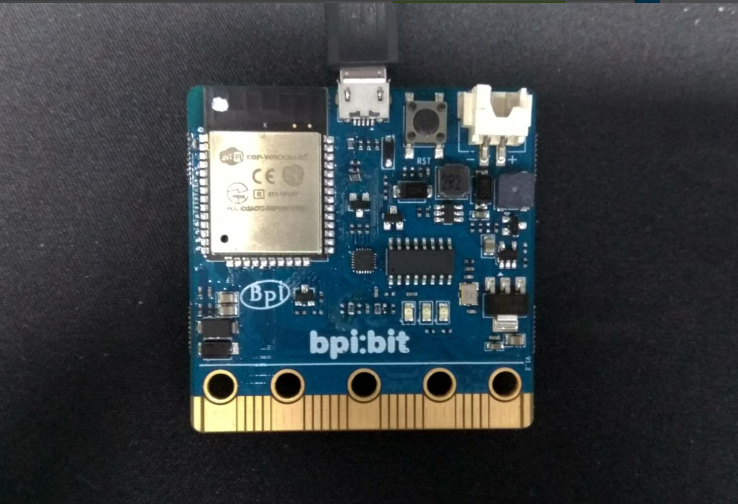
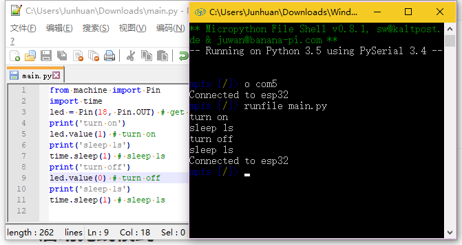

再次点亮 LED 灯
===============

如果说 Hello World
对软件程序员来说是一种宗教般的编程开始，那么对在硬件程序员的人来说，Blink
Led，亦如此，所有的硬件编程都是从点亮一盏灯开始的。因此我们讲究循序渐进，先是一盏灯，再是一排灯。



点亮 GPIO 上的 LED 灯
---------------------

### 进入 repl 模式


手动输入（也可以选取文本复制后，在黑框里右键粘贴）

```python
from machine import Pin
```

再次输入

```python
Pin(18, Pin.OUT).value(1)
```


按下确定键（Enter）后即可看到面板上的灯有一盏亮起


为了进一步确认它是我们控制的灯，输入

```python
Pin(18, Pin.OUT).value(0)
```


这时就可以看到它灭了


### 使用 mian.py 文件

准备以下代码到 main.py
文件中，与上一个不同的是，这个效果是连续的，它将让灯亮起来后，等待一秒钟后灭了，由于展现的效果是连续的，没有办法通过图示来说明情况，所以自己动手试一试吧。

```python
from machine import Pin
import time
led = Pin(18, Pin.OUT) # get a led on gpio 18.
print('turn on')
led.value(1) # turn on
print('sleep 1s')
time.sleep(1) # sleep 1s
print('turn off')
led.value(0) # turn off
```



若是效果不明显，可以写成死循环来查看效果，注意使用`Ctrl + C`停下来，否则无法继续操作。

```python
from machine import Pin
import time
led = Pin(18, Pin.OUT) # get a led on gpio 18.
while True:
      print('turn on')
      led.value(1) # turn on
      print('sleep 1s')
      time.sleep(1) # sleep 1s
      print('turn off')
      led.value(0) # turn off
      print('sleep 1s')
      time.sleep(1) # sleep 1s
```


点亮面板的 LED 阵列灯（NeoPixel）
---------------------------------

准备以下代码到 main.py 中

```python
from pixel import Pixel
View = Pixel()
RGB = (10, 10, 10)
View.LoadXY(2, 2, RGB)
View.Show()
```

使用 `runfile main.py` 执行即可。
