使用 Pycharm IDE 编程
=====================

是时候换一个顶级的 Python 专业 IDE 来编程了，你觉得呢？本文将教你如何在Pycharm 里写 MicroPython 并运行。

获取 intellij-MicroPython 插件
------------------------------

在此下载intellij-micropython \<https://github.com/BPI-STEAM/BPI-BIT-MicroPython/releases/tag/pycharm\>
。

可以在此查看，[项目主页](https://github.com/junhuanchen/intellij-micropython)。

安装 pycharm 社区版
-------------------

获取 [pycharm](https://www.jetbrains.com/pycharm/) 使用 windows 系统[点此下载 2019.1版本](https://download-cf.jetbrains.com/python/pycharm-community-2019.1.exe)(community 版免费使用)

安装完成打开即可，按 默认 的设置一路进入到以下界面即可。

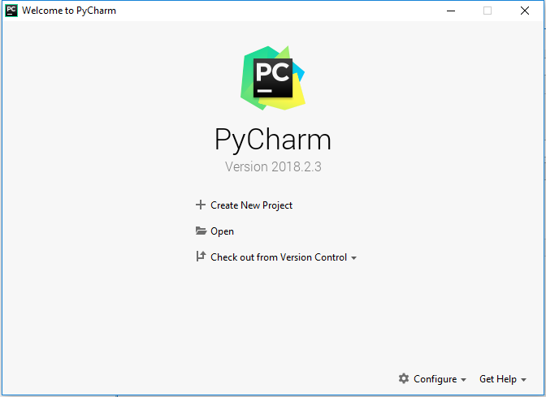

新建一个项目
------------

点击 Create New Project 弹出以下界面。

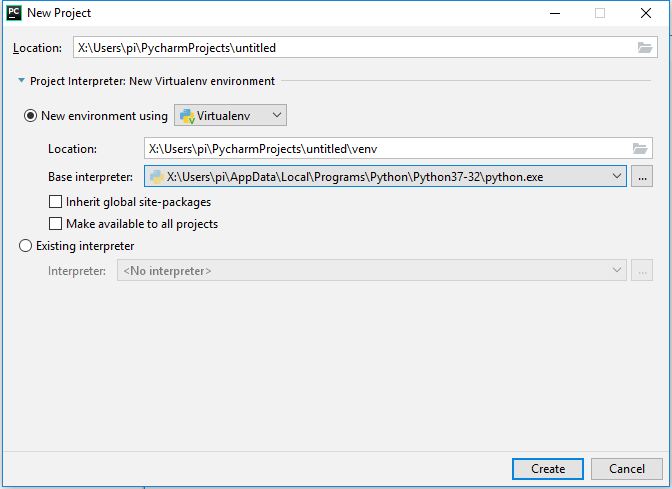

如果没有安装 Python 则是以下界面

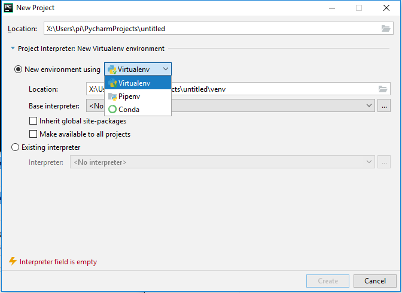

最后可以看到项目已经建立完成。

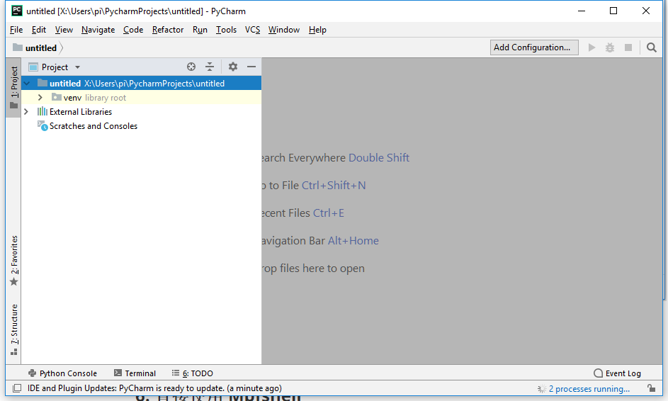

安装 intellij-MicroPython 插件
------------------------------

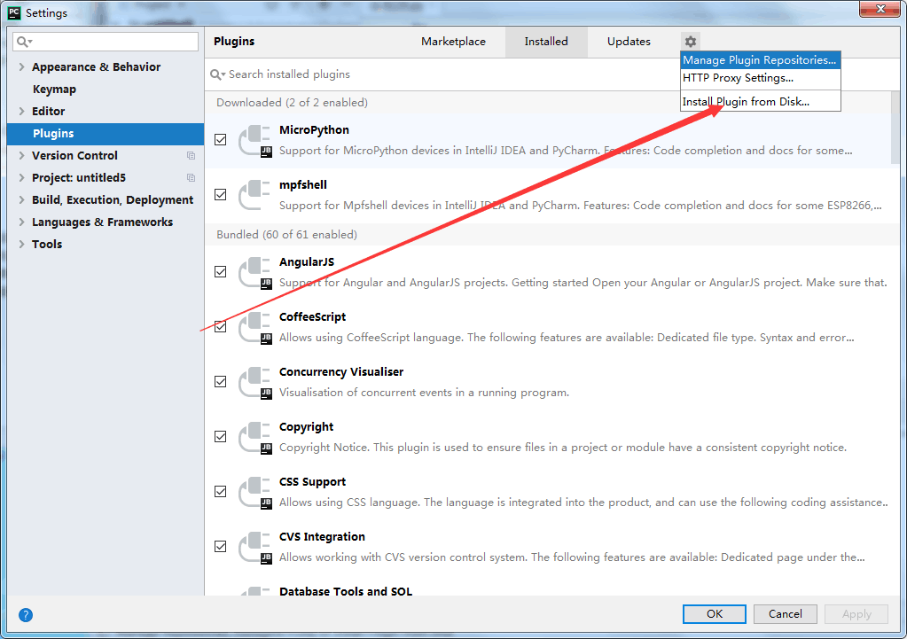

提示：该版本已经修改了底层为mpfshell，并没有完全整合到官方，所以仍和主仓的插件同名，因此 IDE 提示插件需要升级或是其他修复的时候，会被替换回原版，遇到这种情况的时候，忽视了就好。

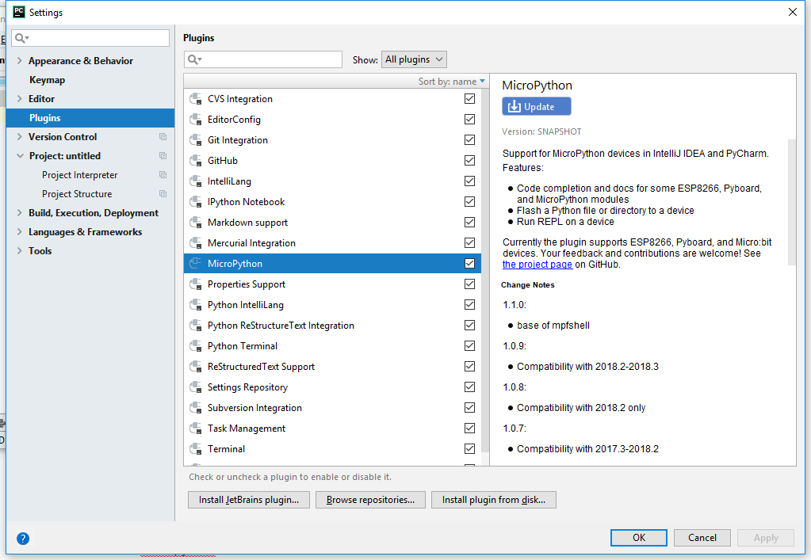

运行一个文件
------------

安装好插件后，在项目中启动它。

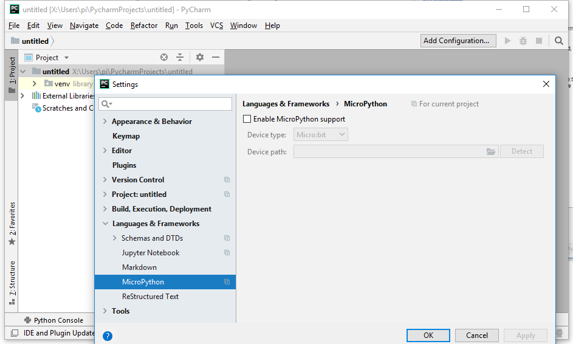

你可以在设置里搜索 `MicroPython`得到以上页面。

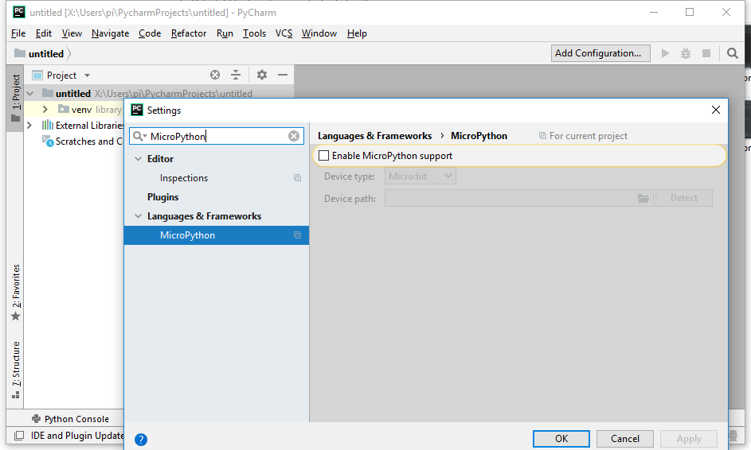

现在启动它，依次点开如图设置，Enable MicroPython support。

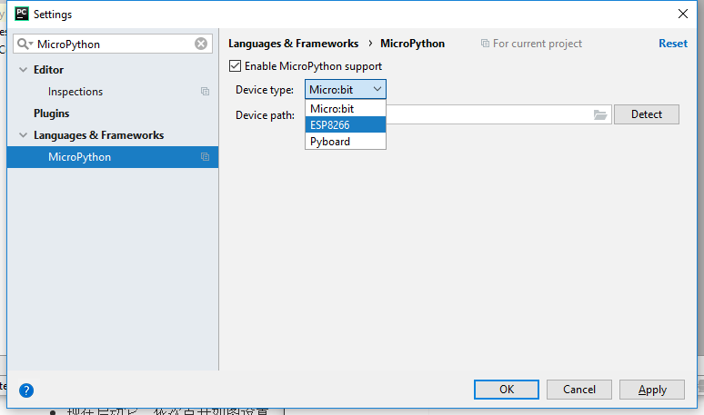

选择 ESP8266 （ESP32）配置设备类型，再点击 Detect可以自动判断你连接的板子的路径（或名称），此时的 Detect 一定会失败，因为关键的依赖还没安装。

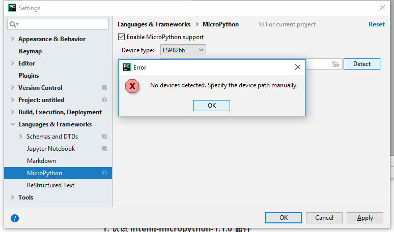

当出现自动识别串口失败，则需要你自己填入自己板子的串口名称（包括路径），或是其他连接参数，比如：ws:192.168.1.1,1234，这和 `mpfshell` 的 open 是一样的。

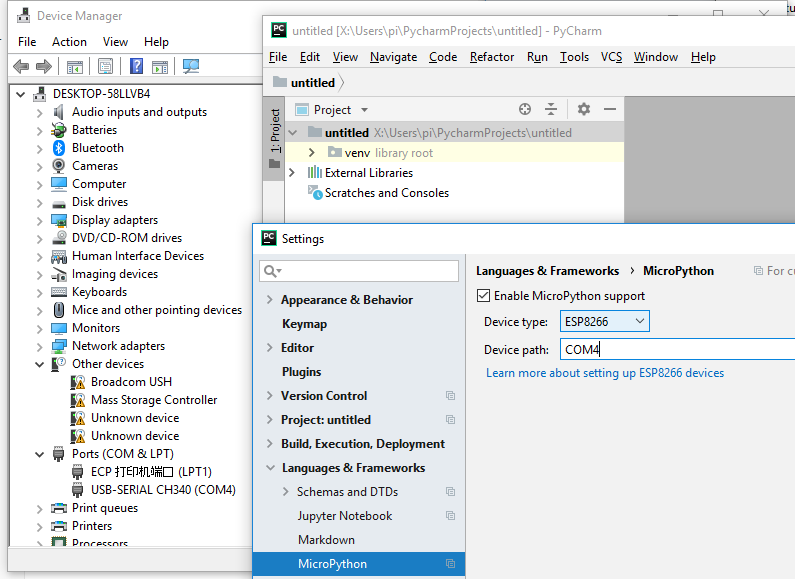

此时已经设定好板子的连接参数了，现在可以在 untitled 处右键新建一个python文件，第一次使用的时候，务必创建一个文件来触发安装依赖，安装完成后才能使用自动识别串口和 其他工具（菜单项中的 Tools）。

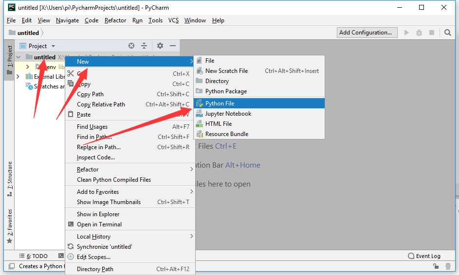

在右侧代码编辑框中写入一句`print(helloworld!)`。

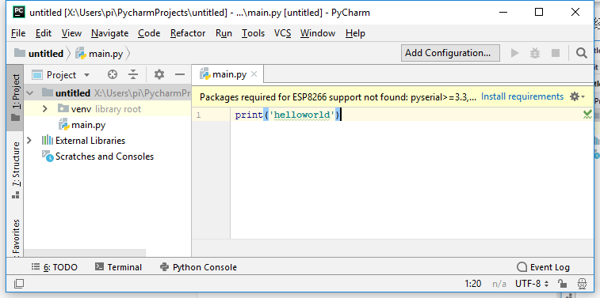

第一次使用的时候，会提示你需要安装依赖项，因此点击消息的 Install requirements 即可在后台自动下载安装。

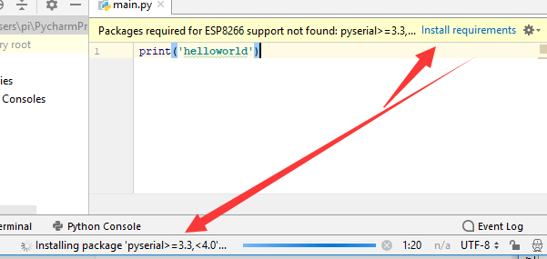

耐心等待一会就可以了。

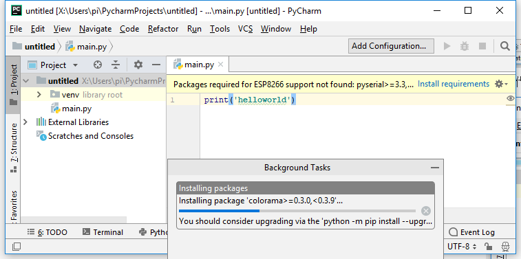

安装完成会提示。

现在我们可以运行 main.py 文件了，在编辑框的任意地方右键显示菜单选取 Run ‘Flash main.py’，即可自动生成运行文件配置并在板子中运行。

> 如果 Linux 系统出现串口连接不上，须核对串口是否对一般用户有权限，如果不确定，请核对这条指令`usermod -a -G dialout Username && sudo reboot`，Username 是指你的用户名，不是 Username 。

可以看到运行结果如下

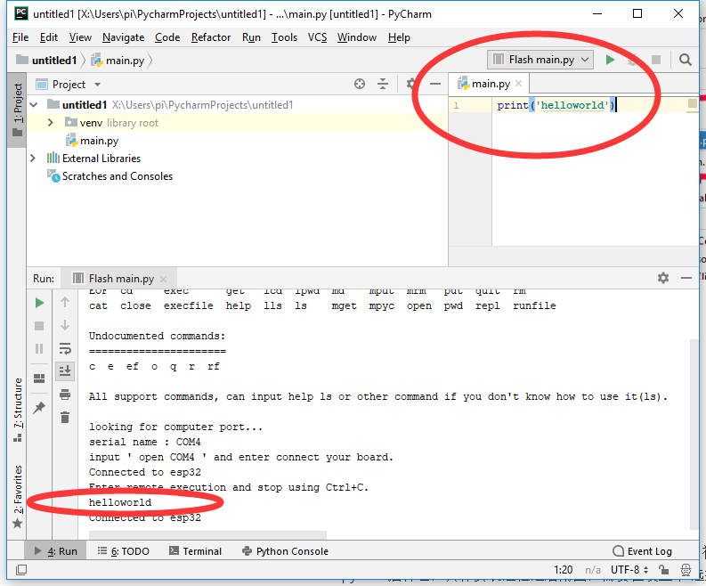

直接使用 Mpfshell
-----------------

在 MicroPython -\> Run Mpfshell Tools 中可以使用 REPL 和 Mpfshell 的快捷功能。

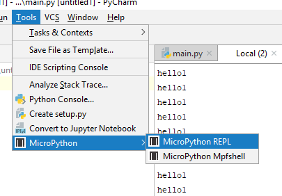
