让板子联上网
============

> 20190528 以后正式版的固件已经关闭了 debug
> 信息，所以你需要禁用下述代码，可在 boot.py 内容修改它。
>
> ```python
> import esp
> esp.osdebug(None)
> ```

连接 WIFI 热点
--------------

固件上电后，在面板 LED
灯滚动完毕后，默认就会尝试联网，你可以注意到，如果这时候被工具或人为的
Ctrl + C 停止后，将不会进行联网操作，需要使用以下代码

```python
import wifi # booy.py default enable
wifi.try_connect()
```

效果如下图，默认 boot.py 里会默认调用 `import wifi`，所以你也可以直接在
REPL 中调用 `wifi.try_connect()`。

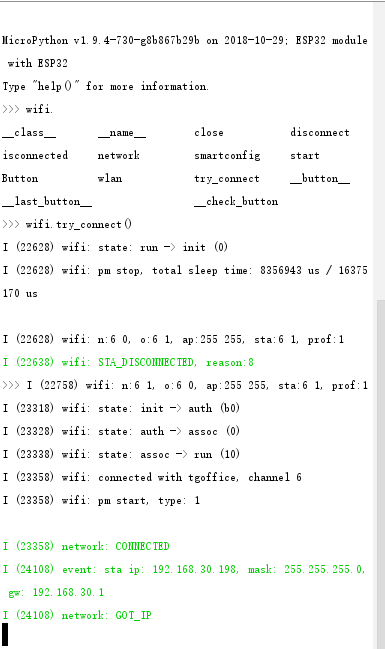

在默认的联网模式下，如果从来没有配网过，板子最初会自动连接 WIFI 名称
`webduino.io` 密码 `webduino` 的 WIFI 热点。

如果附近没有该热点，将会输出`no AP found`，而我的环境里提前准备了这个热点，因此会得到一个IP地址`192.168.10.185`（如图），否则将会反复输出连接存在的问题（这并不会影响你的输入和输出），如果不希望它继续连接网络，可以手动输入`wifi.close()`停止
WIFI 连接。

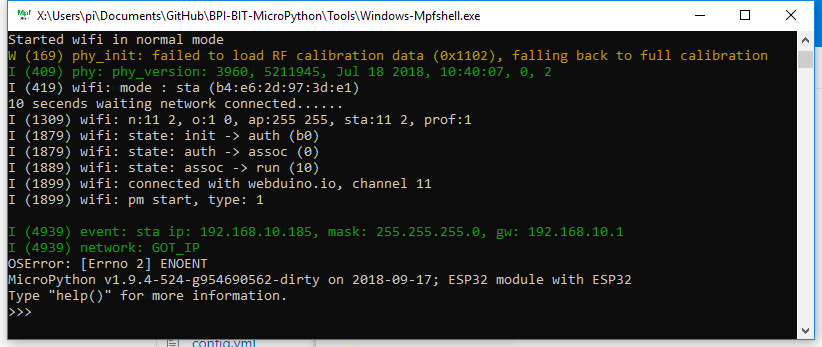

SmartConfig 配网
----------------

当然，你的 WIFI 热点不一定是这个，所以你现在可以在开机的 LED
滚动过程中按下 **A键**
并松开，会自动进入配网模式，重新给板子连入其他WIFI，帮助板子连上指定
WIFI，进入`SmartConfig` 的配网模式，LED（18）将会亮起，图例所示 LED 灯。

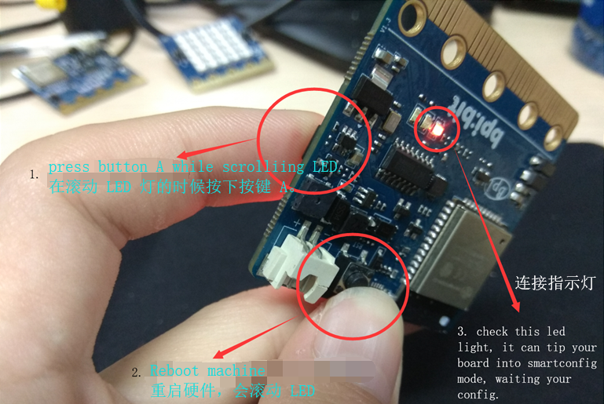

复位后看板子的 LED 灯长亮。

即可确认进入了配网模式，如果有必要，你也可以在此时的串口查看输出对应的信息。

> 在这个模式将无法正常使用 `Mpfshell` 的 open
> ，但可以使用其他串口工具进入，这是因为此时板子已经无法响应 REPL
> 操作了，当配网完成后 REPL 会继续运行。

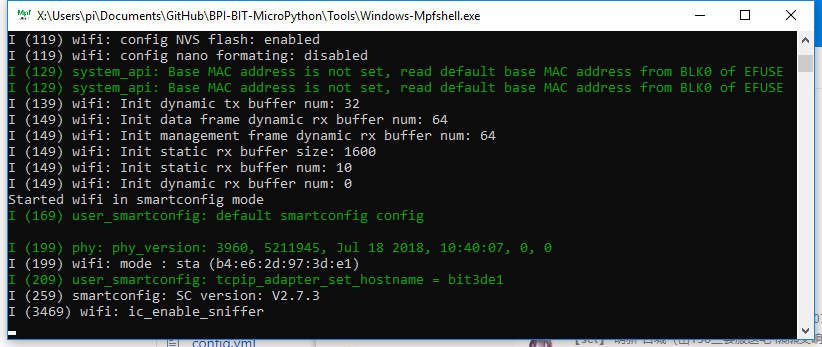

若运行期间工具软件出错，你也可以使用其他串口工具查看输出信息。

确认进入了配网模式后，此时你需要使用一台安卓手机来安装
[EspTouch](https://github.com/EspressifApp/EspRelease/raw/master/EspTouch/esptouch.apk)
的配网软件，你也可以在手机应用市场里搜索 SmartConfig 相关软件下载使用。

> 现在软件发展速度很快，下图中的软件 UI 界面已经改变，但功能不变，请下载
> EspTouch.APK 查看，支持在 Android 9+ 以后读取 WIFI 名称。
>
> 如果获取不到，请到社区中搜索获得。


以 `Android-SmartConfig.apk`
为例，先将手机连入WIFI，然后再将让板子也连入同一个WIFI，再到软件中输入所连WIFI的密码，这将告知板子，如何连接到该WIFI。

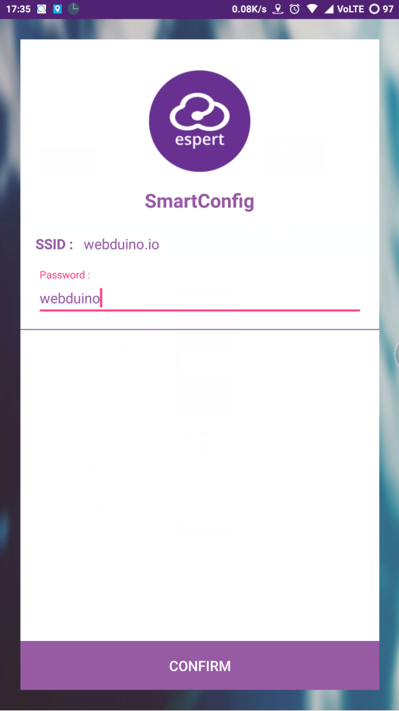

点击唯一的按钮启动配网，可以看到 REPL 有对应信息输出，同时板子的 LED
灯也会跟着变化。

等待一会，如果卡在了配网模式没有成功，则会在两分钟内会自动重启。而当配网成功后，LED
灯会变成 **微亮**，此时 REPL 会输出板子连上 WIFI 得到的 IP
地址，如下图为：`192.168.10.185`，并且 值得注意的是 3de1
就对应的是板子的名称，这个名称以后会用到。

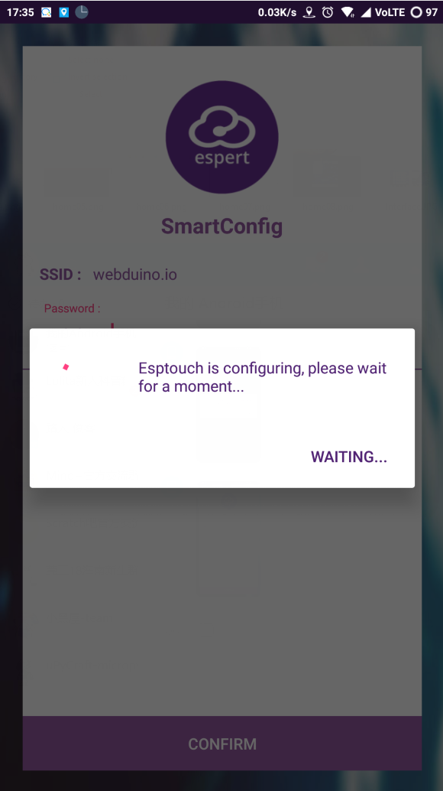

并且在手机上，也会看到板子的 IP 地址，此时板子已经完成了网络配置。

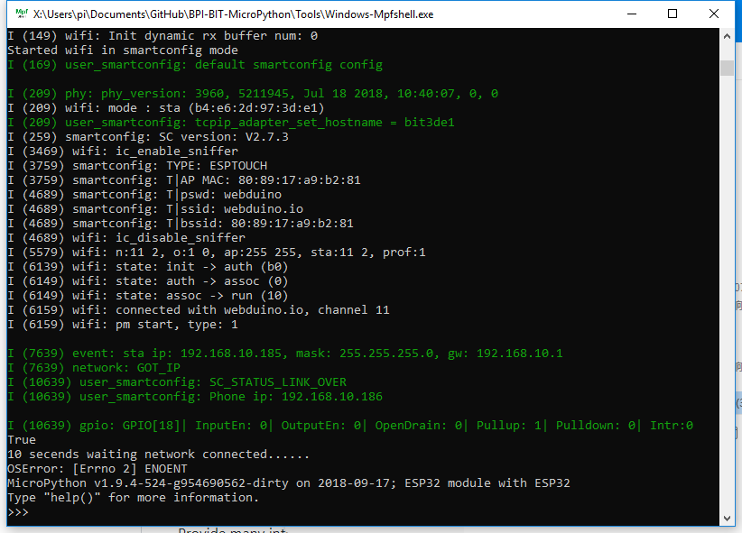

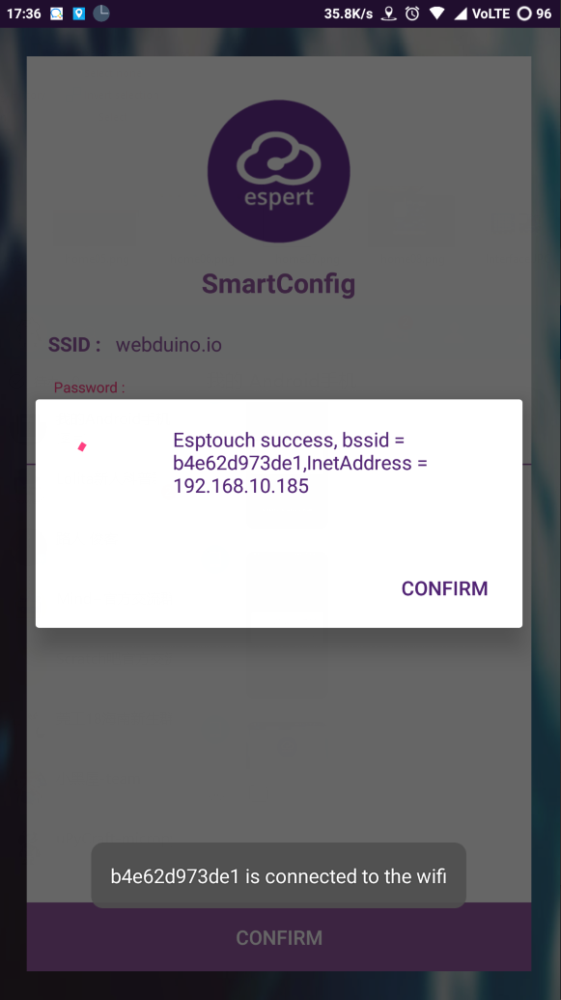

小提示：如果配网失败，请按以下流程排除问题。

-   确认进入了 配网模式（SmartConfig）
-   确认 WIIFI 热点密码无误
-   输入 wifi.isconnected() 返回 True
-   确认 WIFI 射频 是 2.4Ghz（重要）

修改联网配置文件
----------------

当你出现以上配网失败的时候，且找不到任何解决办法，你可以直接修改联网的配置文件，即手动创建或修改
WIFI 名称和密码配置文件 `wifi_cfg,py`。

（现在固件会在调用 wifi.start() 后自动生成 `wifi_cfg,py`）

准备一个 `wifi_cfg,py`, 其中内容为：

```python
WIFI_SSID = '你的WIFI热点名称'
WIFI_PSWD = '你的WIFI热点密码'
HOST_NAME = '你板子的网络名称' # 可选
```

（现在已经可以先 `get wifi_cfg.py` 取回配置）与 `mpfshell`
同一个目录中使用 `put wifi_cfg.py`, 将其替换掉现在的 WIFI 连接配置。

你也可以直接在 `repl` 中输入
‘wifi.smartcoinfig()’，来手动启动配网模式，而不是使用开机时的按键触发。

无线使用 REPL
-------------

注意，使用前确保允许应用通过网络防火墙，且电脑与板子连接处于同一网络下（同一个WIFI下）。

在这之前先进入 `repl` 输入`import webrepl_setup`启动网络配置流程。

根据步骤依次为（e、1234、y）

启动网络服务配置（启动输入 e，停止输入 d）
设置网络连接密码（不少于4位，需输入两遍，由自己决定，我只是为了省事）
是否需要重启板子（复位输入y，否则输入 n）

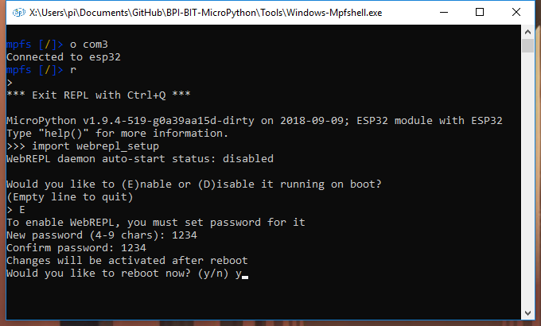

此前我已经知道了板子现在的 IP为
`192.168.10.185`，如果不知道可以重新上电查看，接着使用`mpfshell`
，输入`ws:192.168.10.185,1234`，其中`,1234`是我此前设定的连接密码（前一章），你也可以现在不输入，但待会也一样会提示你输入密码的。（注意是英文输入法的逗号）

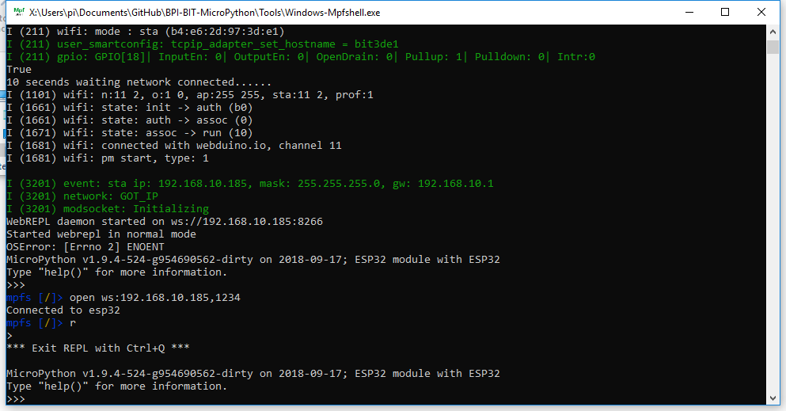

可以看到已经连接成功，此时板子也可以透过无线来操作了，你也可以重启复位再试一次。

连接失败会有以下两种提示：

连接远端无响应，提示`WebREPL Remote IP Does not respond`，分析的情况是一种可能是与板子不同属一个网络，另一种可能是各种软件或硬件防火墙挡住了。
连接密码错误，提示`WebREPL Password Error`，重新输入密码即可，也许你连到别人的板子了。
出现问题时的操作，假设连不上，先用有线进去按 Ctrl + D
软复位后核对连接，接着退出来换成无线连接。

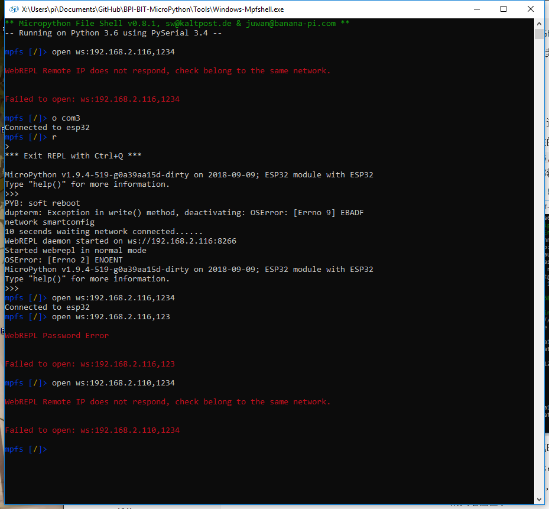
