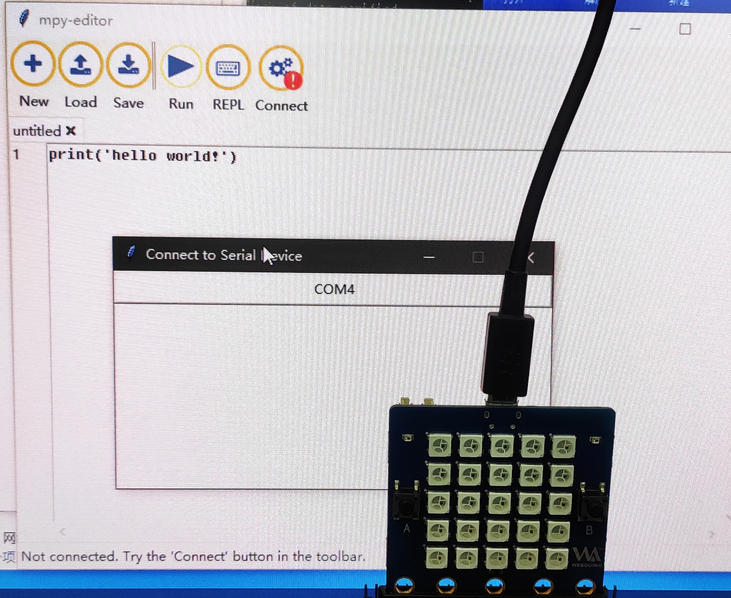
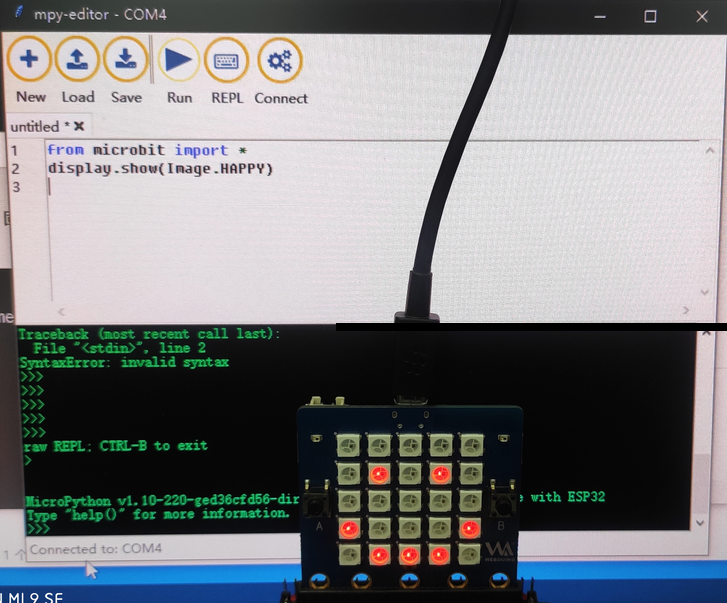

最简单的开始
============

工欲善其事，必先利其器
---------------------


请确保你已经准备好 BPI-BIT ，且已经 刷入 MicroPython 固件。

并从这里获取最简单的 MicroPython 编辑器 [mpy-editor](https://github.com/BPI-STEAM/mpy-editor)。

MicroPython是 Python 3 语言的精简实现 ，包括Python标准库的一小部分，经过优化可在微控制器和受限环境中运行。

如果你从没学过 Python3，建议你先在[Python 3 菜鸟教程](https://www.runoob.com/python3/python3-tutorial.html)进行学习 Python3 的软件基础知识，再过度到硬件部分会比较好。


在 Windows 下连接设备
---------------------

当你插入设备，打开软件后会提示你选择设备串口，如图点击 COM4 即可，如果断开设备了，你也可以继续点击 Connect（连接设备） 图标重连。



确认连接后，运行代码
--------------------

复制粘贴到编辑框中，点击 Run（运行），即可让板子显示笑脸:

```python
    from microbit import *
    display.show(Image.HAPPY)
```
如你所见，板子显示了一个笑脸，我已经成功了运行 MicroPython 代码。




> 固件已经兼容了 microbit 的 Python 代码，所以你可以直接调用大部分 microbit 功能。

本文展示了你如何使用工具进行编程，但还仅仅只是刚刚开始，还有很多基础要学，例如：学习使用更多的案例，或是改善所用的编程工具。