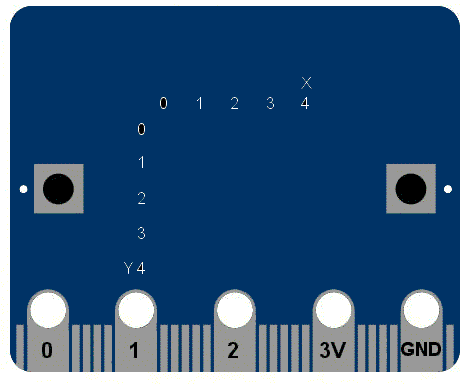
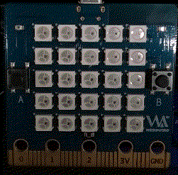
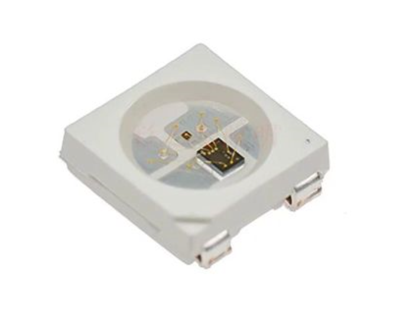
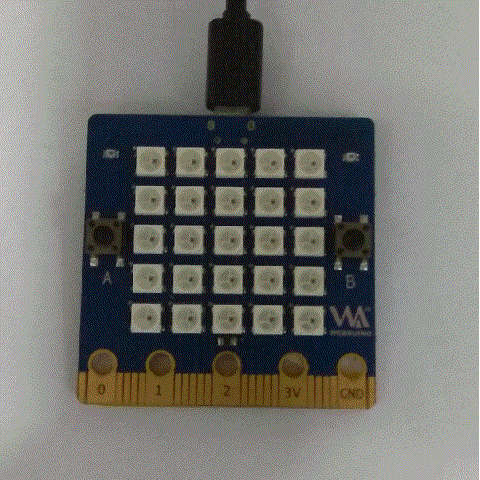

让LED矩阵显示 Hello, World!
=============

以一门新语言开始编程的传统方式是让计算机打印出“Hello，World！”。



这对于 MicroPython 来说很容易的 :

```python
    from microbit import *
    display.scroll("Hello, World!")
```

以上代码每一行都有其作用。

```python
    from microbit import *
```

告知 MicroPython 获取它所需的所有信息用于 BPI-BIT。所有这些都置于microbit模块中（一个模块是一个预先存在的代码库）。当你输入某信息时，就是在告诉MicroPython你要使用该信息。

另外，\* 是Python表示 所有信息 的方式。因此， from microbit import \*的意思是，我需要使用 microbit 代码库中的所有内容。

```python
    display.scroll("Hello, World!")
```

告诉 MicroPython 使用 display 命令去滚动 string 的 “helloworld”字符号，这个 display 是在 microbit中的一个模块，代表设备物理上的显示，显示的内容在引号之中（'）。

将 “Hello, World!”的相关代码复制进编辑器，并让设备显示这些字符。你可以试着改变一下显示的内容。

何不自己亲自试试呢？



报错与除错
------------

你写的代码可能会出错。但 MicroPython 会提供帮助。出现错误时，REPL会滚动显示一些错误信息，如果可以，它将会显示出错的行号。

Python 要求输入 完全 正确的信息。比如，对 Python 来说， Bpibit、bpibit 和 bpiBit 都是不同的东西。若 MicroPython 显示 NameError的错误注释，可能是因为输入的信息不准确。就像 “Nicholas” 和“Nicolas”，虽然名字很相似，却表示两个不同的人。

若 MicroPython 提示 SyntaxError ，这是因为你输入了 MicroPython无法识别的代码。检查下你是否忘了输入像 " 或者 : 一类的字符。这就像是在一个句子中间输入了句号，句子的意思就变得难以理解。

板子可能会停止响应：新的代码对它不起作用，没办法将新的命令输入到 REPL。如果发生这种情况，重启试试。拔掉USB线，如果连接了电源线，则需要同时拔掉电源线，然后重新插一下。你可能还需要退出并重新启动代码编辑器。

修改字符颜色
------------

相比于 microbit，bpibit 的 led 面板采用的是可编程的 RGB 灯(ws2812b)。



这种RGB灯通过编程理论上可以显示 255 \* 255 \* 255 种颜色的，也就是 1600万种颜色，是不是有点难以置信呢，那就让我们来开始我们的色彩 show 吧。

想要改变字体的颜色是很简单的，在固件中已经预置了8种颜色。

```python
black = [0, 0, 0]
Red = [2, 0, 0]
Orange = [2, 1, 0]
Yellow = [2, 2, 0]
Green = [0, 2, 0]
Blue = [0, 0, 2]
Indigo = [0, 2, 2]
Purple = [2, 0, 2]
```

分别是黑（灯熄灭）、红、橙、黄、绿、蓝、靛、紫。有了这几种基本的颜色就可以来修改我们的字体颜色了。

```python
from display import*
display = Display()
display.scroll("Hello, World!", Yellow)
```


板子默认显示的颜色是红色，只要在字符串(也就是上面的“Hello,World!”)后面添加其他颜色，就可以修改显示的字符的颜色。从上面那个图可以看到我们字符的颜色已经变为黄色了。到这里可能有的同学会发出疑问了?

那怎么让显示的每个字符的颜色都不一样呢？让我们来看一下下面的操作。

```python
from display import*
display = Display()
color = [Red, Orange, Yellow, Green, Blue, Indigo, Purple]
display.scroll("ROYGBIP", color)
```


我们新建了一个列表 color，里面按顺序存放着每个字符所需要的颜色，然后在scroll 函数的后面把 color添加进去就可以了，这样每个字符的颜色就不一样了。

自定义颜色
----------

到这里聪明的同学又要发问了，不是说好有 1600多万种颜色吗，怎么就这几种呢，嗯，不急，容我们慢慢道来。

说了那么久的 RGB ，那什么是 RGB呢？RGB色彩就是常说的三原色，R代表Red（红色），G代表Green（绿色），B代表Blue（蓝色）。自然界中肉眼所能看到的任何色彩都可以由这三种色彩混合叠加而成。在电脑中，RGB的所谓“多少”就是指亮度，并使用整数来表示。通常情况下，RGB各有256级亮度，用数字表示为从0、1、2…直到255 。注意虽然数字最高是 255，但0也是数值之一，因此共256级。按照计算，256级的RGB色彩总共能组合出约1678万种色彩，即256×256×256=16777216。通常也被简称为1600万色或千万色。也称为24位色(2的24次方)。在led领域利用三合一点阵全彩技术，即在一个发光单元里由RGB三色晶片组成全彩像素。随着这一技术的不断成熟，led显示技术会给人们带来更加丰富真实的色彩感受。

回到正题，我们要怎么控制我们的板子显示我们想要的颜色呢，前面我们用列表的方式来保存颜色的信息：

```python
Red = [2, 0, 0]
```

这里我们同样也可以按照这样的方式来定义我们的颜色。

那么Red为什么是[2, 0,0]呢，实际上列表中的三个数分别对应的就是我们R（红色）G（绿色）B（蓝色）的亮度，在前面有提到了每种颜色有256个级别的亮度，显而易见[2,
0 , 0]表示的就是红色的亮度是 2 ，绿色的亮度是 0 ，蓝色的亮度是 0。由此就可以推出其他颜色列表的含义。

下面我们来定义一个 mycolor = [1 , 2 , 3] 看看显示的效果：

```python
from display import *
display = Display()
mycolor = [3,3,3]
display.scroll("hello",mycolor)
```



是不是很有趣，相信此时你会有很多有趣的想法，那就赶紧来尝试一下吧。

> 每个颜色的亮度都有0- 255 总共256个数值可以选择，所以最小就是[0 , 0 , 0],最大就是[ 255 , 255 , 255 ] 亮度不要调得太高，太亮容易伤害眼睛。
