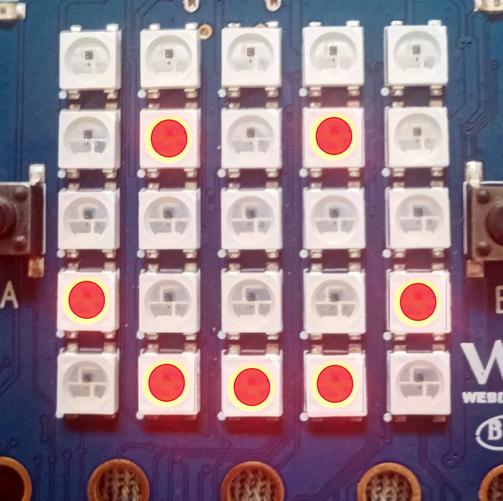
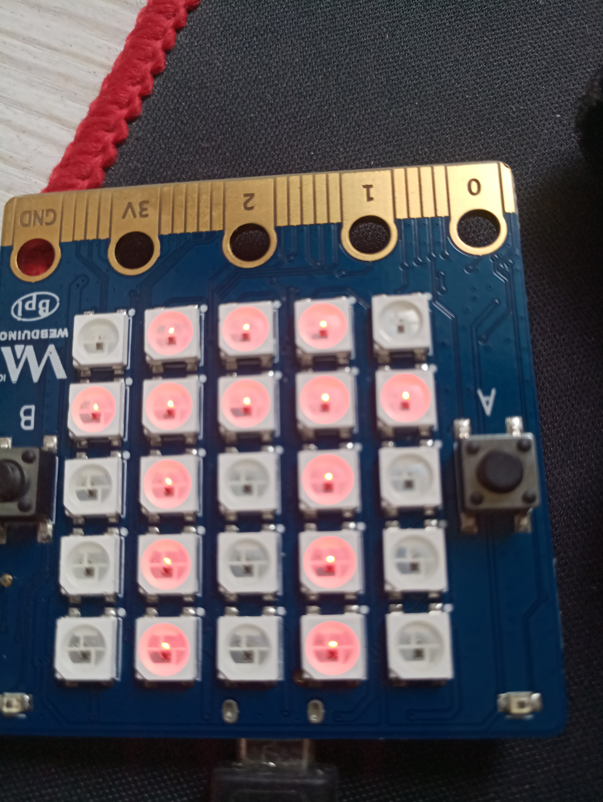
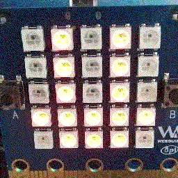

面板显示图像
============

在我开始项目之前，你可以知道 MicroPython
已经了内置的许多图片，如果你想要显示一个笑脸的话，那你只需要运行以下列代码。

```python
from microbit import *
display.show(Image.HAPPY)
```

运行效果如下



> 
>
> 通过先前的章节，我们想你应该知道了第一行的用途，那么第二行就是指通过了
> display 模块来显示内置的 Image 图片，我们展示的这个笑脸图案其实只是
> Image 的一部分，而它的名字叫做 Happy，并且我们要通过 show
> 并将它放置在括弧内，以使得它显示出来，所以写成
> `display.show(Image.HAPPY)`，动手试试吧。

内置的图片列表
--------------

```python
```

-   Image.HEART
-   Image.HEART\_SMALL
-   Image.HAPPY
-   Image.SMILE
-   Image.SAD
-   Image.CONFUSED
-   Image.ANGRY
-   Image.ASLEEP
-   Image.SURPRISED
-   Image.SILLY
-   Image.FABULOUS
-   Image.MEH
-   Image.YES
-   Image.NO
-   Image.CLOCK12, Image.CLOCK11, Image.CLOCK10, Image.CLOCK9,
    Image.CLOCK8, Image.CLOCK7, Image.CLOCK6, Image.CLOCK5,
    Image.CLOCK4, Image.CLOCK3, Image.CLOCK2, Image.CLOCK1
-   Image.ARROW\_N, Image.ARROW\_NE, Image.ARROW\_E, Image.ARROW\_SE,
    Image.ARROW\_S, Image.ARROW\_SW, Image.ARROW\_W, Image.ARROW\_NW
-   Image.TRIANGLE
-   Image.TRIANGLE\_LEFT
-   Image.CHESSBOARD
-   Image.DIAMOND
-   Image.DIAMOND\_SMALL
-   Image.SQUARE
-   Image.SQUARE\_SMALL
-   Image.RABBIT
-   Image.COW
-   Image.MUSIC\_CROTCHET
-   Image.MUSIC\_QUAVER
-   Image.MUSIC\_QUAVERS
-   Image.PITCHFORK
-   Image.XMAS
-   Image.PACMAN
-   Image.TARGET
-   Image.TSHIRT
-   Image.ROLLERSKATE
-   Image.DUCK
-   Image.HOUSE
-   Image.TORTOISE
-   Image.BUTTERFLY
-   Image.STICKFIGURE
-   Image.GHOST
-   Image.SWORD
-   Image.GIRAFFE
-   Image.SKULL
-   Image.UMBRELLA
-   Image.SNAKE

可见数量十分之多，看到这里，我们想你也可以多多尝试一下其他图片，玩的开心。

试试 DIY 图片吧
---------------

当然，你肯定不会止步于此，那么如何更进一步呢？比如创造自己的图片？

So Easy!!!

在每一个 LED
在物理显示上可以被设置为一个值，类似于高低电平，比如某个像素点被设置成 0
，那么它的亮度就是 0 .然而如果它被设置成 9，那么它就是指灯的亮度为 9
。所以记住这句话，从 0 到 9，亮度依次递增!
基于此，我们就可以很容易创造一个我们想要的新图片。

```python
from microbit import *

boat = Image("05050:"
             "05050:"
             "05050:"
             "99999:"
             "09990")

display.show(boat)
```



> 
>
> 运行时，你应该可以看到一张这样的图片！！

那么现在你已经了解如何画图，你应该注意到每一行的结尾有一个：然后于此同时二边被附上了双引号,里面仅仅是数值表示的亮度而已，所以创建一张image就是如此简单。

> 但实际上，你也并不需要写多行，如果你能保证每一行不出错，你也可以这样写。

```python
boat = Image("05050:05050:05050:99999:09990")
```

制作简单的动画
--------------

静态图片固然有趣，但是更多的乐趣是让它们动起来，这个是令人兴奋但在
Python 中很容易做到，仅仅是使用图片的列表\~！

假如这里有一些购物清单：

[Eggs, Bacon, Tomatoes]

然后你需要用一种方式在 Python 中表示这些玩意 XD。

```python
shopping = ["Eggs", "Bacon", "Tomatoes" ]
```

这种方式叫 list ，也就是列表，我们简单地创造了一个叫 shopping
的列表，然后它包含了3个元素，Python
知道它是一个列表，因为它有一对括号[]，在列表中的元素被逗号分隔，然后在这个实例中，items包含了三个字符串，“Eggs”.“Bacon”以及“Tomatoes”。我们要知道，它们都是字符串对象，因为它们用“”进行分割。

你可以用list在python中储存任何玩意，下面的案例将教会大家如何用列表创建数字。

然后你需要用一种方式在 Python 中表示这些玩意

```python
shopping = [2, 3, 5，11 ]
```

列表同样存放许多不同类型的变量：

```python
mixed_up_list = ["hello!", 1.234, Image.HAPPY]
```

注意到最后一个元素没有，它是一个 Image 对象，所以我们可以告诉 Python
去存放一个Image的list，不过在内置的方法中，有已经做好的二个对象。他们叫
Image.ALL\_CLOCKS 和 Image.ALL\_ARROWS。

```python
from microbit import *
display.show(Image.ALL_CLOCKS, loop=True, delay=100)
```

和单张 image 一样，我们使用 display.show
让它在设备上显示，然而，我们告诉 Python 使用 Image.ALL\_CLOCKS 这个列表
然后它会理解并按顺序展示这个 list 所有元素， 我们也可以告诉 Python
保持循环状态，通过
*loop=True*，另外，我们也可以设置这个动画切换图片的时间。通过下面一条代码。`delay=100`。

现在你知道怎么创造一个动画了吧，以及你了解如何避免一直循环下去了吗？包括如何改变动画播放的速度了么？如果你都理解了，就来试一试吧！\~

让我们创造一个自己的动画列表（list），在这个案例中，我们将制作一个小船下沉到底部的动画。

```python
from microbit import *

boat1 = Image("05050:"
              "05050:"
              "05050:"
              "99999:"
              "09990")

boat2 = Image("00000:"
              "05050:"
              "05050:"
              "05050:"
              "99999")

boat3 = Image("00000:"
              "00000:"
              "05050:"
              "05050:"
              "05050")

boat4 = Image("00000:"
              "00000:"
              "00000:"
              "05050:"
              "05050")

boat5 = Image("00000:"
              "00000:"
              "00000:"
              "00000:"
              "05050")

boat6 = Image("00000:"
              "00000:"
              "00000:"
              "00000:"
              "00000")

all_boats = [boat1, boat2, boat3, boat4, boat5, boat6]
display.show(all_boats, delay=500, loop=True)
```

> 
>
> 运行效果：
>
> 

修改图片的颜色
--------------

我们在前面的章节中修改字符了显示的颜色，那么怎么修改图片的显示颜色？让我们接着往下面看。

```python
from microbit import *
from display import *
display.show(Image.ALL_CLOCKS, color=Blue, loop=True, delay=100)
```

我们这里还是利用上面那个例子，通过简单的修改来改变它的颜色。我们可以看到与前面代码示例最大的不同就是在
show() 函数中添加了 color=Blue 。 这段代码要添加到Image的后面，也就是
show() 的第二个参数的位置。此时显示的颜色已经被我们修改了。


在前面的章节了也讲过了，我们如果要使用内置的颜色就要导入 display
模块，我们这里使用了内置的颜色Blue，所以在一开始就通过 from display
import \* 导入display模块。

当然，如果内置的几种颜色不符合要求怎么办呢？
同样可以参考我们上一章节中讲到的内容，我们可以自定义一个颜色。

```python
from microbit import *
mycolor = [3, 1, 1]
display.show(Image.ALL_CLOCKS, color=mycolor, loop=True, delay=500)
```


> 
>
> 那么最后就来解释一下代码是如何工作的吧。
>
> -   首先代码是创造了 6 个船的 image。
> -   然后用一个 list 存储了它们。
> -   接着用 display 去显示这些图片，并设置延迟为 500 毫秒
> -   最后，设置了 loop=True ,所以这这艘船会反复下沉。

