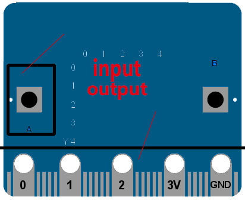
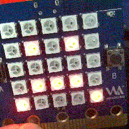
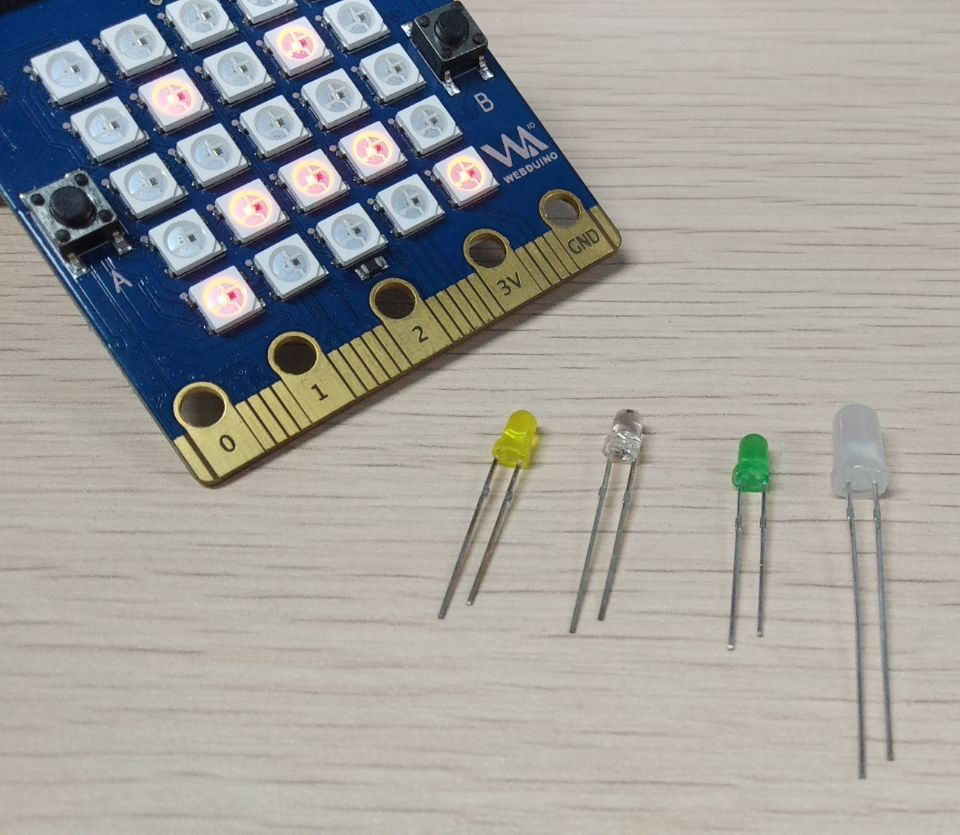

控制金手指 IO
=============

IO 在计算机中指 Input/Output ，也就是输入和输出，简称 IO 口。



各种 IO
接口都不尽相同，有些特殊的接口是要更大一些，而且一般来说，它附近也会印有标签方便用户理解，如这块板子的底部是按照
0/1/2/3V/GND 的顺序分布在金手指上（计算机中大多都是是从 0 开始计算的）。

如果你把金手指接上底座，那么其他更小的蓝白线条相间的引脚（pin）也就能够被用上了，这在第一章的硬件介绍的时候，是有特别指出的，忘了可以查看左侧的产品介绍。

在这个 microbit 的模块中，将板子的接口定义为 pinN 对象，其中 N
代表接口的数值，所以 0 号接口也就叫做 pin0
对象，如果你在之后觉得这并不好用，可以通过 import machine 的 Pin
重新定义成自己喜欢的引脚名称。

“害羞”的板子
------------

下面要写的一个案例，就非常有意思了。

我想要触摸板子的引脚并让它做出对应的反应，看起来这个板子就好像个害羞的小姑娘。

准备的代码如下：

```python
from microbit import *
while True:
    if pin1.is_touched():
        display.show(Image.HAPPY)
    else:
        display.show(Image.SAD)
```

这个时候你需要一只手触摸在 1 号标签的引脚上，就可以能看到板子由 悲 转 喜
了，如果你松开了，它又会改变表情了，是生气吗？XD

程序解释起来如下 1. 反复运行 `pin1.is_touched()`
来判断这个引脚是否有被触摸到。（原理是 ADC 采样） 2. 运行后返回了 True，
此时显示它为笑脸，否则一直显示苦脸，所以你不去摸它的时候，它会感到悲伤的。（等等！这是哪门子的害羞呢！！！！）

运行效果如下：



需要注意的是，因为我们人体（手）有静电，有可能会电到它，导致它的表情有时候会很抽搐。

灯的开与关
----------

最初上手的时候，我们早已学会了如何控制板子 LED
灯的变化，但那都是别人帮我们做好的，所以今天我们来亲自动手尝试一下，别人是怎么做到的，掌握它后成为别人常说的
别人家的孩子 吧。

为此我们准备了以下几个常见的 Led
灯，你会发现它们长短不一，这是为了区分它们的正负极，其中正极是长的那端，所以负极就是短的那端。

提示：区分正负极的意图是希望你在接线的时候，元件（LED）正极接电源正极（+），元件（LED）负极接电源负极（-）。



我们开始第一步吧，先普通的把灯点亮，也就是直接将其（LED）接到电源上，那么就把大的那家伙直接接到板子的
3V 和 GND 上吧，3V 指电源正极（3V），GND 指电源负级，也称接地。


这样就点亮了一盏灯（注意正负极），但这样点亮的灯是不可以控制的，它只会亮，不能灭。

本想拿另外一盏灯接上去做对比的，但我们发现一个问题，其他的灯都太短了，所以就交换了以下，用我们的大灯来控制了，可以看到此时接上去灯是不会亮的。


那么我们就通过下面的代码来控制它的亮和灭吧，可以看图中我们使用了 pin2
的引脚来控制。

```python
from microbit import *
pin2.write_digital(1)
```

可以看到它亮了起来，那就说明我们可以控制了它的亮，这是不是就和最开始入门教程的一致了？


那么我们这次就补充一个 Blink（闪烁）的效果吧，使用如下代码。

```python
from microbit import *

while True:
    pin2.write_digital(1)
    sleep(200)
    pin2.write_digital(0)
    sleep(1000)
```

运行效果如下：


> 
>
> 1.  使用 pin2 引脚进行输出 1 ， 这会让 LED
>     存在变成高电平，简单认为上就是这个引脚有电压了，效果相当于直接接了电源正极。（原理上应该理解为两个引脚之间形成电势差）。
> 2.  首先先将其点亮，即为 pin2.write\_digital(1)，之后使用 sleep(200) 
>     让板子休息 200 毫秒。
> 3.  然后就将其熄灭，也就是 pin2.write\_digital(0)，之后再休息 1000
>     毫秒，也就是 1 秒。
> 4.  将上述过程重新来一遍。

