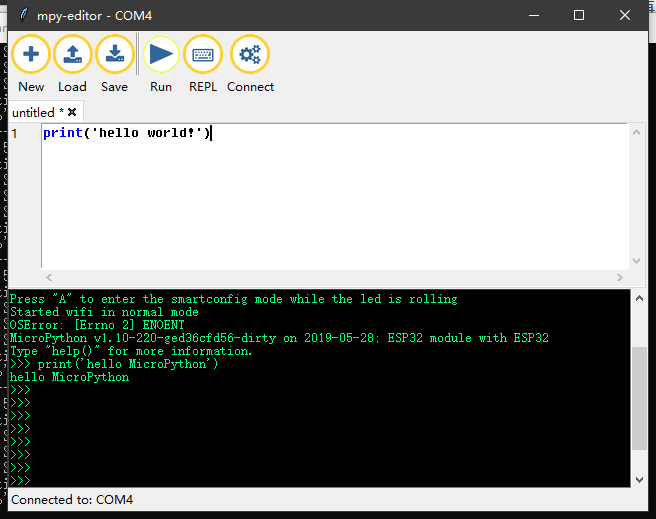
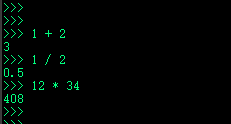

初识 REPL
=========

使用 MicroPython 的一个主要的优点是交互式的 REPL，REPL（read-evaluate-print loop）代表读取﹣求值﹣输出循环。 

REPL 对于学习一门新的编程语言具有很大的帮助，因为它能对初学者写的程序立刻做出回应，这意味着你执行代码，并能马上查看结果，而无需经过先编译再上传的繁琐步骤。

先连接串口
----------

要通过 USB-serial 访问，您需要使用串口终端软件。在 Windows 上如 MobaXterm 、 xshell 都是不错的选择。串口波特率设置为 115200，就可以开始玩 MicroPython 了。

通过串行端口建立连接后，您可以通过按几次 Enter键来测试它是否正常工作，如果正常工作，就能到看 Python REPL提示符 `>>>` 。

使用 REPL
---------

一旦有提示，您就可以开始尝试了！按Enter键后，可在提示符处键入任何内容。MicroPython将运行您输入的代码并打印结果（如果有的话）；如果输入的文本出错，则会打印出错误消息。

尝试在提示符下输入以下内容:

```
    >>> print('hello MicroPython')
    hello MicroPython
```

无需键入 `>>>` 箭头，它们表示应在此提示符后键入文本，其下一行是响应的内容。

> 实际上 mpy-editor 下方面黑框就是 repl 区域，可以在其中进行交互。



如果你已经了解了一些python，现在可以尝试一些基本命令。例如:

```
    >>> 1+2
    3
    >>> 1/2
    0.5
    >>> 12*34
    408
```
不妨实践试试？



输入行编辑
----------

你可以使用 向左 和 向右 箭头键 移动光标 来编辑当前输入的行；按 Home 键或 ctrl-A 将光标移动到行的开头，按 End 或 ctrl-E 移动到行的末尾；Delete 键或 退格键 用来删除。