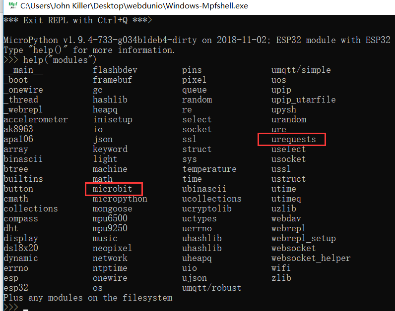

# 如何爬取城市天气

## 前提条件

- 1.首先确保当前固件依赖包是否完整

```python
help(“modules”)
```

- 效果如下图，若没有图上两个依赖包，请烧录最新固件。

- 

- 2.确保已经连上网络
详见：https://github.com/BPI-STEAM/BPI-BIT-MicroPython/wiki/how_to_wifi

## 准备天气api

- 1.这里我用到了国家气象局的API
`http://www.weather.com.cn/data/cityinfo/101200801.html    # 101200801为荆州市`
各城市ID详见：http://mobile.weather.com.cn/js/citylist.xml
- 2.请求返回Json数据样列

```python
{
  "weatherinfo": 
  {
    "city": "荆州",
    "cityid": "101200801",
    "img1": "n7.gif",
    "img2": "d2.gif",
    "ptime": "18:00",
    "temp1": "16℃",
    "temp2": "23℃",
    "weather": "小雨转阴"
  }
}
```


- 我们可以分析这些json文件写出下面这样的实例

## 实例分析

```python

import urequests
from microbit import *

def get_weather():
	url = "http://www.weather.com.cn/data/cityinfo/101200801.html"
	rsp = urequests.get(url)
	data = eval(rsp.text) # eval函数用于把字符串类型的json数据->转为python的字典类型
	weather = data["weatherinfo"]
	L = weather["temp1"] #最低温
	H = weather["temp2"] #最高温
	return "L:" + L[:-1] + " H:" + H[:-1] # 数据样例->  L:16 H:23

display.scroll(get_weather())

# L[:-1] H[:-1]去掉℃和℉两个特殊符号，否则会出现编码错误
```
