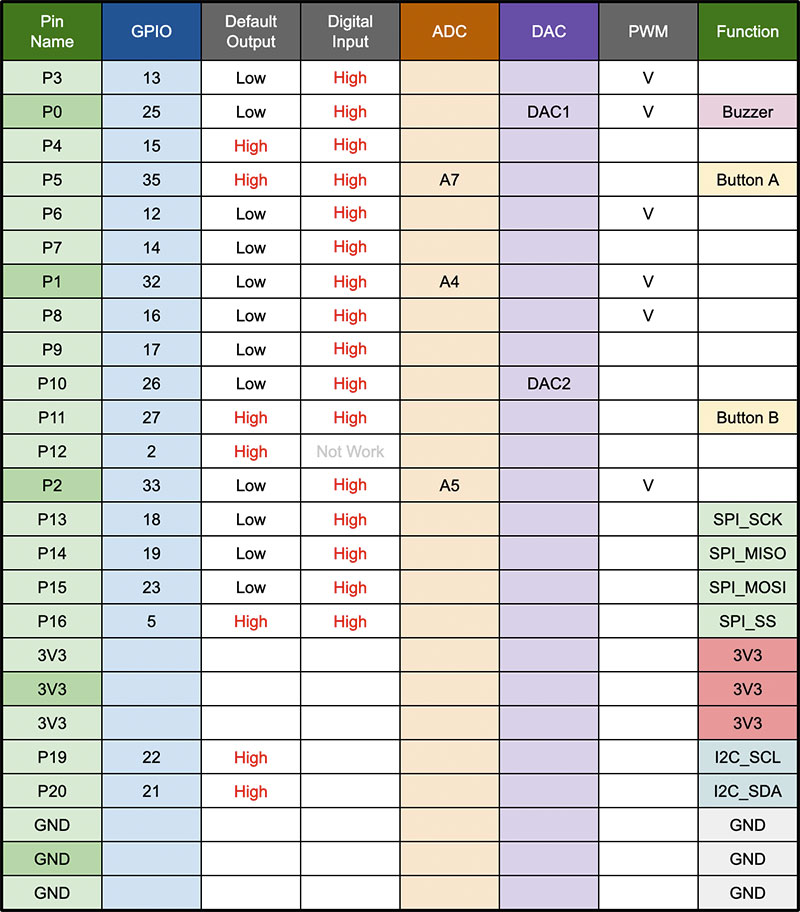
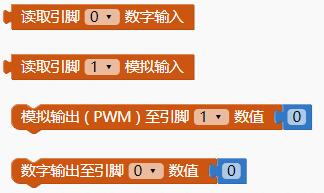
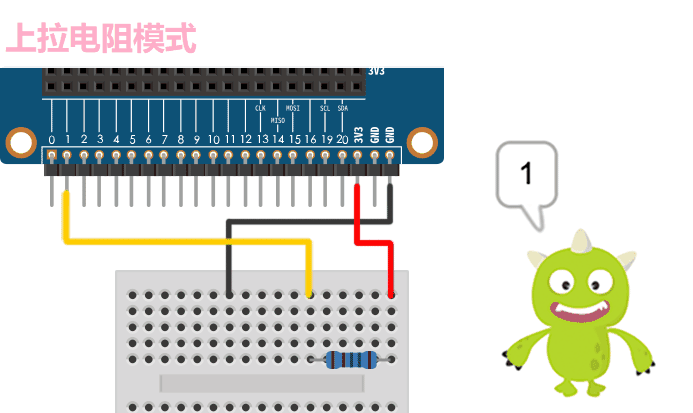
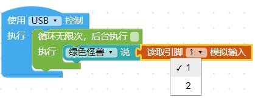
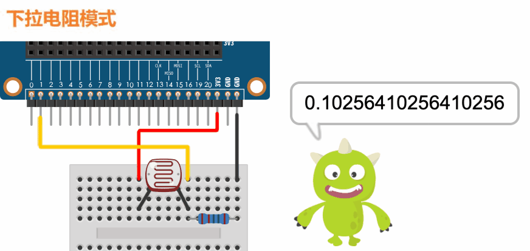
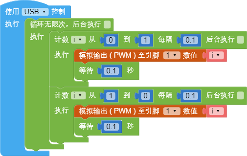
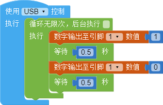
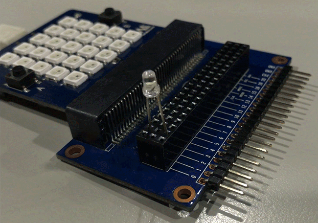

# 输入 & 输出

在 Web:Bit 开发板底部边缘有一排有 25 个金属接触点，这些金属接触点称为「引脚」，或通俗一点也可称呼「金手指」。 引脚包含了 5 个标注 0、1、2、3V 和 GND 的大引脚，以及其他 20 个未标示号码的小引脚，除了可以使用 鳄鱼夹 操作大引脚，也可以使用拓展板 搭配杜邦线操作小引脚，通过引脚的搭配，就能灵活的操作各种外接元件与传感器。

### I/O 引脚对照表（以下引脚均为 pin Name,例如1为P1）

### I/O 引脚积木清单

I/O 引脚积木包含模拟（Analog）与数字（Digital ）的相关「输入」和「输出」共四种积木。

> 「I/O 引脚」积木必须搭配「开发板」积木，且并不支持模拟器，只支持 USB 与 Wi-Fi 控制。

### 读取数值 ( 数字输入 )

使用「数字输入」的积木，读取的数值只会有 1 和 0 两种信号，预设在完全没有接传感器的状态下数值为 1 ，「程式」积木通过一个「无限循环」的积木，不断读取引脚信号。

可以使用「杜邦线 + 面包板 + 电阻」进行测试，并通过「上拉电阻」的方法，在程式执行后，将杜邦线连接指定引脚（如 1 ）和 GND ( 接地 )，程式便会收到 0 的信号。

### 读取数值 ( 模拟输入 )

使用「模拟输入」的积木，读取的数值为 0 ～ 1 之间的浮点数，程式积木通过一个「无限循环」积木，不断读取引脚信号。( 模拟输入仅支持 1 号和 2 号引脚 )

可以使用「光敏电阻 + 杜邦线 + 面包板 + 电阻」进行测试，下方范例并采取「下拉电阻」的方法，在程式执行后，程式便会收到 0 ～ 1 的模拟信号，光线越强数字越大，光线越弱数字越小。

### 输出数值

「输出」的积木分成两种，一种是 模拟输出 ( PWM )，可以输出 0 ～ 1 之间的浮点数，另外一种是 数字输出 ，仅能输出 0 和 1 两种数值，以下方的例子而言，通过一个循环的方式调用「模拟输出」积木，不断输出 0 ～ 1 之间的浮点数作为 LED 的亮度，就能做出呼吸灯的效果。( 直接将 LED 长的一端引脚接在拓展板的 1 号引脚，短脚接在 GND )

如果使用「数字输出」积木，虽然无法设计 LED 呼吸灯的效果，但仍然可以通过「无限循环」积木，设计出灯光闪烁的范例。

